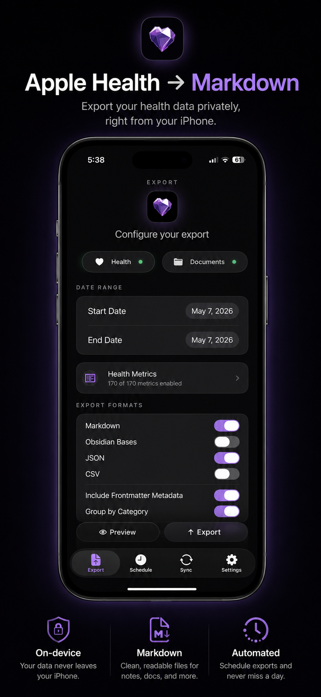
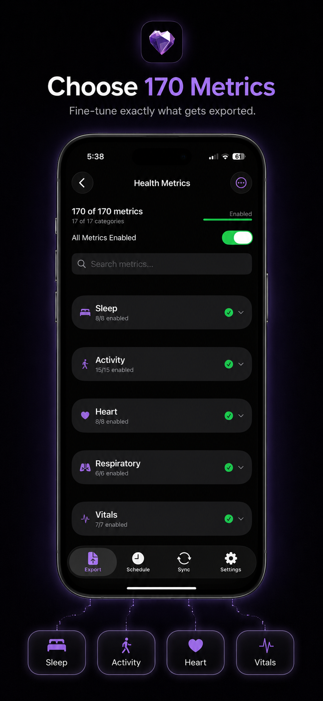
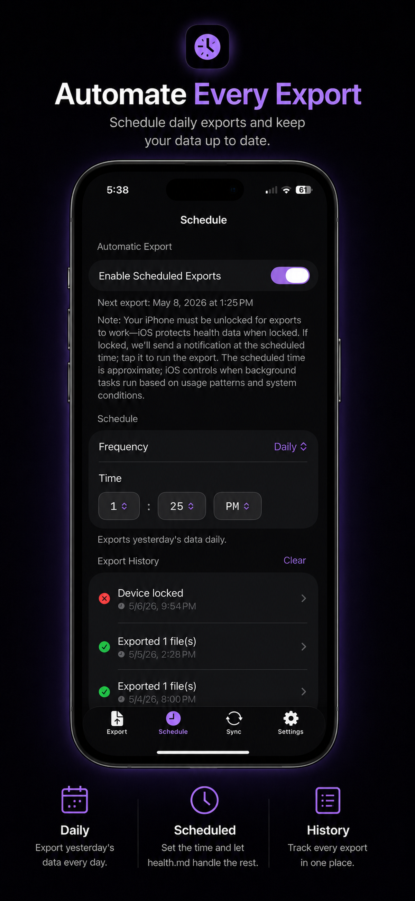

# Health.md

> **Apple Health to Markdown, JSON, CSV, and Obsidian Bases — private files you control.**

[](LICENSE)
[](#tech-stack)
[](#tech-stack)

Health.md turns Apple Health into a local-first health journal. Pick the metrics you care about, preview the output, then export clean Markdown, JSON, CSV, or Obsidian Bases YAML to Files, iCloud Drive, your Obsidian vault, or a nearby Mac. No accounts. No health-data cloud. Your health records stay on your devices and in folders you choose.

**[🌐 healthmd.isolated.tech](https://healthmd.isolated.tech)** · **[📲 Download on the App Store](https://apps.apple.com/us/app/health-md/id6757763969)** · **[📚 Docs](docs/index.md)** · **[🐛 Issues](https://github.com/CodyBontecou/health-md/issues)** · **[💬 Discord](https://discord.gg/jNRWSSSz4N)** · **[⭐ Star this repo](https://github.com/CodyBontecou/health-md)**

## Screenshots

<table>
  <tr>
    <td align="center"></td>
    <td align="center"></td>
    <td align="center"></td>
  </tr>
  <tr>
    <td align="center"><strong>Apple Health to Markdown</strong></td>
    <td align="center"><strong>Choose 170+ metrics</strong></td>
    <td align="center"><strong>Automate every export</strong></td>
  </tr>
</table>

## Features

### Apple Health Export

Read HealthKit data on iPhone and write it to plain files. Health.md supports 170+ selectable metrics across sleep, activity, heart, respiratory, vitals, body measurements, mobility, cycling, nutrition, vitamins, minerals, hearing, mindfulness, reproductive health, symptoms, medications, and workouts.

### Obsidian-Native Journaling

Export daily notes directly into an Obsidian vault, use date placeholders in folder paths, customize Markdown templates, inject health sections into existing daily notes, and emit Obsidian Bases frontmatter so your health data becomes queryable in database views.

### Multiple File Formats

Choose any combination of:

- **Markdown** — readable daily summaries with optional frontmatter
- **Obsidian Bases** — YAML/frontmatter-first notes for database queries
- **JSON** — structured payloads for analysis or automation
- **CSV** — one row per metric for spreadsheets and notebooks

One export action can write multiple formats for multiple days.

### Metric Selection & Formatting

Search metrics, enable categories, choose units, customize metric names, control filename templates (`{date}`, `{year}`, `{month}`, `{weekday}`), and organize exports into folders with placeholders like `{year}/{month}` or `{quarter}`.

### Individual Entry Tracking

Alongside daily summaries, Health.md can create timestamped files for individual records:

- **Mood / State of Mind** entries with valence, labels, and associations
- **Workouts** with duration, calories, distance, heart-rate details, splits, and form metrics
- **Vitals** such as blood pressure and blood glucose readings

Example output:

```text
vault/
├── Health/
│   └── 2026-02-05.md
└── entries/
    ├── mindfulness/
    │   └── 2026_02_05_1030_daily_mood.md
    ├── workouts/
    │   └── 2026_02_05_0700_workouts.md
    └── vitals/
        └── 2026_02_05_0900_blood_pressure.md
```

### Automation & Shortcuts

Schedule daily or weekly exports, retry from export history, and trigger exports from Apple Shortcuts. App Intents include Export Yesterday, Export Specific Date, Export Date Range, Export Last N Days, Get Health Summary, Get Last Export Status, and Set Scheduled Export Enabled.

### Mac Destination

Use the macOS companion app as a local destination for iPhone-configured exports. The iPhone reads HealthKit, applies your selected settings, and sends the export job directly to the Mac over local network / Multipeer Connectivity. The Mac writes the received files to a destination folder you choose and stays available from the menu bar.

macOS cannot read Apple Health directly, so the iPhone remains the source of truth for HealthKit data.

## Pricing

Health.md includes **3 free export actions** so you can verify permissions, folder access, formats, and your Obsidian workflow.

Unlimited exports are unlocked with a **one-time Full Access purchase** through StoreKit. No subscription. No recurring charge. The live price is shown by the App Store inside the app.

The free counter tracks export actions, not files: exporting Markdown + JSON + CSV for a date range still counts as one export action.

## Tech Stack

- **Language:** Swift 5
- **UI:** SwiftUI
- **Minimum iOS:** 17.0
- **Minimum macOS:** 14.0
- **Purchases:** StoreKit 2
- **Sync:** Multipeer Connectivity + Bonjour/local network discovery
- **Automation:** App Intents, BackgroundTasks, UserNotifications, APNs silent pushes
- **Storage:** UserDefaults, Keychain, security-scoped bookmarks, local files
- **Attribution / experiments:** AppsFlyerLib and privacy-safe pricing analytics metadata

### Frameworks Used

| Framework | Purpose |
|-----------|---------|
| HealthKit | Apple Health authorization and sample reads on iPhone |
| SwiftUI | iOS, iPadOS, and macOS interface |
| AppIntents | Apple Shortcuts actions |
| StoreKit | One-time Full Access unlock |
| MultipeerConnectivity | Local iPhone → Mac export jobs |
| BackgroundTasks / UserNotifications | Scheduled exports and retry notifications |
| Security | Keychain-backed unlock/quota/install state |
| ServiceManagement | macOS launch-at-login helper behavior |
| AppsFlyerLib | Release-build affiliate attribution |

## Project Structure

```text
HealthMd/
  iOS/
    ContentView.swift              # iPhone/iPad root UI
    AppIntents/                    # Shortcuts actions
    Components/                    # Shared iOS controls
    Views/                         # Export, schedule, settings, paywall, onboarding
  iPad/                            # iPad sidebar-oriented screens
  macOS/
    HealthMdApp+macOS.swift        # macOS app entry point
    Managers/                      # Mac export execution and local data store
    Views/                         # Mac destination, menu bar, settings, history
  Shared/
    Analytics/                     # Privacy-safe pricing/activation event model
    Export/                        # Markdown, JSON, CSV, Obsidian Bases exporters
    Managers/                      # HealthKit, vault, purchase, scheduling orchestration
    Models/                        # HealthData, metrics, export settings, history
    Notifications/                 # Export notification scheduling
    Protocols/                     # Health store and runtime seams for tests
    Sync/                          # Multipeer sync protocol and Mac export jobs
    Theme/                         # Design tokens
    Utilities/                     # Units, review, feedback helpers
  Assets.xcassets/                 # Shared app icons and assets
  *.entitlements                   # iOS and macOS capabilities

HealthMdTests/                     # Unit tests
HealthMdUITests/                   # UI tests
worker/pricing-analytics/          # Cloudflare Worker + D1 pricing analytics endpoint
metadata/                          # App Store metadata/localizations
screenshots/                       # App Store and marketing screenshots
docs/                              # Feature docs, QA notes, experiment runbooks
```

## Build Targets

| Target | Bundle ID | Platform |
|--------|-----------|----------|
| HealthMd | `com.codybontecou.obsidianhealth` | iOS / iPadOS |
| HealthMd-macOS | `com.codybontecou.obsidianhealth` | macOS |
| HealthMdTests | `com.codybontecou.HealthMdTests` | Unit tests |
| HealthMdUITests | `com.codybontecou.HealthMdUITests` | iOS UI tests |

## Setup

1. Open `HealthMd.xcodeproj` in Xcode.
2. Select the **HealthMd** scheme for iOS or **HealthMd-macOS** for macOS.
3. Set your development team and signing settings.
4. Run the iOS app on a physical iPhone for real HealthKit data.
5. Grant Health permissions and choose an export folder.
6. Optional: open the Mac app, choose a destination folder, then select **Connected Mac** from the iPhone Export tab.

### Build from CLI

```bash
# iOS build
xcodebuild -project HealthMd.xcodeproj -scheme HealthMd -destination 'generic/platform=iOS' build

# macOS build
xcodebuild -project HealthMd.xcodeproj -scheme HealthMd-macOS -destination 'platform=macOS' build
```

### AppsFlyer Dev Key

Debug builds disable AppsFlyer automatically. Non-Debug builds require a dev key and fail fast if it is missing:

```bash
bash scripts/set-appsflyer-dev-key.sh "<APPS_FLYER_DEV_KEY>"
```

## Testing

Run both iOS and macOS test suites:

```bash
make test
```

Focused commands:

```bash
make test-ios
make test-macos
make coverage
make check-apns-scheduling
```

The Makefile wraps the shared Xcode schemes:

```bash
xcodebuild test -project HealthMd.xcodeproj -scheme HealthMd-Tests-iOS -destination "platform=iOS Simulator,name=iPhone 16 Pro,arch=$(uname -m)" CODE_SIGNING_ALLOWED=NO
xcodebuild test -project HealthMd.xcodeproj -scheme HealthMd-Tests-macOS -destination "platform=macOS,arch=$(uname -m)" CODE_SIGNING_ALLOWED=NO
```

## Permissions & Entitlements

Health.md requests permissions only when a feature needs them:

- **Health read access** — required to export Apple Health data on iPhone
- **Health background delivery** — supports scheduled export wakeups
- **Notifications / APNs** — scheduled export triggers and retry prompts
- **Local Network / Bonjour** — optional iPhone → Mac destination discovery
- **User-selected files** — macOS destination folder access with security-scoped bookmarks

## Privacy

Health data stays local-first:

- HealthKit samples are read on iPhone and written directly to folders you choose.
- iPhone → Mac exports travel directly over local network / Multipeer Connectivity, not through a Health.md server.
- Scheduled exports register APNs token + schedule metadata so the server can send a silent push at the right time; health samples and exported files are not sent to that worker.
- Pricing/activation analytics are deliberately coarse and prohibit health values, metric names, dates, file paths, vault names, workout details, medication details, peer device names, and user text.
- Feedback diagnostics are user-initiated and can be edited before sending.

If you want the strictest local setup, use manual exports, keep Mac Destination off, and leave Scheduled Exports disabled.

## Documentation

- [Feature documentation index](docs/features/index.md) — canonical feature inventory and user-facing docs drafts
- [Privacy and local-first design](docs/features/privacy-local-first.md) — what stays local and what metadata may leave the device
- [Scheduled exports](docs/features/scheduled-exports.md) — APNs scheduling, locked-device retries, and QA notes
- [Testing guide](docs/testing/TDD.md) — test workflow and quality gates
- [Pricing analytics worker](worker/pricing-analytics/README.md) — Cloudflare Worker + D1 ingestion notes

## Contributing

Bug reports, feature ideas, docs fixes, and pull requests are welcome. Open an issue with the workflow you are trying to build, the export format you need, or the HealthKit category you want Health.md to support next.

## License

Health.md is licensed under the [GNU Affero General Public License v3.0](LICENSE). The AGPL ensures that modified versions — including hosted services — must also publish their source, preserving the local-first privacy promise.
