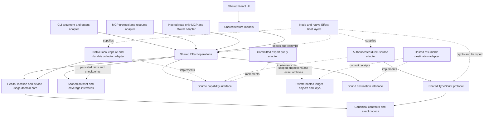

# Effect TypeScript and shared React design reference

- **Status:** Design and source-evidence baseline for the agent execution plan. Rust removal, Effect.ts, shared React UI/logic, unified health/location/screen-time and optional hosted storage/remote MCP scope are selected. Research observations and limitations below describe the pre-implementation baseline; current task progress and admission evidence live in the execution manifest.
- **Date:** 2026-10-07
- **Motivation:** Faster CI/local tests and a smaller generated-build footprint for local development with worktrees.
- **Scope:** Complete removal of maintained Health.md Rust implementations/tooling, including CLI/MCP and cloud consumers; shared Effect core/operations and React UI; iso.me location and time.md mobile/macOS acquisition in one Health.md dataset and combined/selected export system; optional hosted export destination, retained-data service and separately authorized remote MCP agents. macOS collectors first, including window titles; browser acquisition and Windows/Linux collectors later.
- **Changes:** Documentation only; no production implementation, schema, fixture, protocol, or rollout change.
- **Repository baseline:** `1b02fcc69f4706bca56de67698d2dc85996047b6`.

## How to use this guide

Use the [agent execution plan](javascript-unified-layer-research.md) to dispatch work. This document preserves the complete design, source evidence and acceptance obligations for the current native/Rust implementation and donor applications. Selected requirements and architecture rules govern new work. Proposed package paths, commands, schemas, budgets, and unresolved host choices are implementation targets; they do not describe installed dependencies or qualified behavior. Source evidence and the research sections explain the constraints behind the plan.

Start with the [unified product and data model](#one-product-for-health-location-and-screen-time), [optional hosted destination and remote MCP](#optional-hosted-exports-and-remote-mcp), [architecture decisions](#refactor-control-and-architecture-decisions), [target layout](#target-repository-layout-and-dependency-rules), and [phase plan](#implementation-phases-and-dependencies). Use the [contract coverage](#contract-and-compatibility-coverage), [migration scenarios](#persisted-state-and-upgrade-safety), and [validation gates](#validation-and-evidence) to define each work package. Finish through [release and rollback](#release-and-rollback), [Rust retirement](#rust-retirement-checklist), and the [final definition of done](#final-definition-of-done).

For each implementation change, read the nearest component instructions, identify the phase/work package and affected consumers, implement one reviewable slice, run its checks, and record evidence. Advance a gate only after its required behavior is demonstrated. A passing prototype or unit suite does not complete a platform migration. Keep this guide and the execution ledger current as source changes; preserve the original baseline and add the revision actually qualified.

Existing contract, privacy, release, and component instructions apply throughout. Phase 0 records a successor architecture decision and updates implementation-specific instructions before their corresponding Rust paths are retired. This guide authorizes planning the selected refactor; it does not itself publish releases, deploy services, mutate user health data, or certify pending capabilities.

## Assessment for Health.md

The selected target is one Effect-based application implementation used by a Node CLI/MCP and shared React interfaces. React Native is the target phone UI/runtime, with React Native Web for compatible browser interfaces and React Native macOS as the preferred desktop candidate pending integration evidence. Swift/Kotlin retain platform SDK access and OS execution. Effect supplies validation, typed failures, dependency composition, concurrency, and resource management around deterministic TypeScript algorithms. [Effect overview](https://effect.website/docs/v4/onboarding), [React Native platform support](https://reactnative.dev/docs/out-of-tree-platforms).

| Option | Effect on the stated goal | Main cost | Assessment |
| --- | --- | --- | --- |
| Improve existing Rust development builds | Could reduce immediate test/build friction. | Rust/UniFFI remain; actual speed gains need measurement. | Transitional improvement/control only. |
| Effect-based TypeScript core in existing native apps | Removes core cross-compilation and enables host-only logic tests. | Requires a JS execution seam and exact compatibility. | Useful migration stage. |
| Effect core/operations, Node CLI/MCP, and shared React interfaces | Eliminates Health.md Rust tooling at completion and shares application behavior and supported UI. | Native adapter, distribution, UI, and compatibility migration; native build costs remain. | Selected final target. |

These are architectural inferences from source and platform documentation. No build-duration or runtime comparison has been measured.

## Owner requirements and completion criteria

The owner clarified these requirements on 2026-10-07:

1. CI/local tests take too long, and accumulated local build output makes worktree development run out of disk.
2. Remove Rust completely, including CLI/MCP. Both adapters should invoke the same functions in the shared codebase that applications also use.
3. Share UI components and feature logic across as many supported interfaces as practical.
4. Keep Health.md as the core product and expand its acquisition/data model with iso.me location and time.md screen time. Reuse Health.md's strongest notification, scheduling, recovery and export logic across domains.
5. Support one combined export or explicitly selected domains/details at Health.md's current depth through the application, CLI and MCP.
6. Start desktop acquisition on macOS and include window titles. Windows/Linux collectors follow later; mobile acquisition is in scope and browser acquisition is deferred.
7. Retain full historical app sessions on macOS and pursue exact historical sessions on iOS. The owner permits the first iOS release to ship clearly labeled historical usage aggregates when supported APIs cannot supply exact sessions; exact iOS sessions remain a required follow-up.
8. Add an optional secure backend we host as an export destination and retained-data source for remote MCP agents. The initial interoperability targets are Meta Muse, ChatGPT dots, Grok Bot and Pi Durable at the exact links in the cloud compatibility matrix; each requires independent qualification.

Completion therefore includes CLI/MCP, protocol, native integration, shared UI, donor acquisition/state transition, the unified domain/query/export/scheduling model, and qualified optional cloud ingestion/query/authorization/lifecycle operations. Remove maintained Rust source/build requirements, Cargo workspaces/locks, UniFFI code generation, Rust native libraries, Rust-specific CI, and Rust release tooling from the active product path. Preserve repository and accepted donor history and published historical releases. Any temporary Rust comparator/process remains migration scaffolding with an explicit deletion gate. Audit dependencies for hidden Rust build requirements before claiming a Rust-free developer setup.

Keep shipped export/protocol bytes, source authorization, foreground/background behavior, persisted settings, destination guarantees, and current release identities intact unless a separately scoped product/contract change intentionally replaces them. The native extensions and isolated practice/wake components remain supported. Current unsupported capabilities stay unavailable until their own implementation and parity evidence exists.

## One product for health, location, and screen time

Health.md remains the product and application foundation. Its shared operation, notification, scheduling, destination, export, recovery, and release behavior becomes the common infrastructure for all three domains. Absorb iso.me's location acquisition and timeline vision and time.md's device/app usage vision into that foundation. The result is one application with independently authorized domains, one logical typed dataset, common feature models, and common operations available to UI, CLI, and MCP. It does not require a cloud account or a duplicate export engine per domain.

The first expanded release includes health; location points, visits, saved places and recording/outing history; and available mobile/device/app usage plus macOS app sessions, active/idle state and window titles. macOS is the first desktop collector. Windows/Linux collectors are later work with concrete ledger targets; their existing CLI/MCP support remains part of the refactor. Browser URLs, browser history, extension tracking and website/domain attribution are deferred. A browser's foreground app duration is ordinary app usage. Initial browser window titles are excluded under the deferred-browser scope; OS-level browser titles can be added by an explicit scope decision. Donor keystroke/cursor/input monitoring is also outside this initial target and cannot be enabled by title permission.

Use the [product glossary](../../GLOSSARY.md) for the distinction between observations, aggregates, annotations and inference. This scope intentionally adds capabilities and public contracts. Preserve the existing Health.md behavior through the language/UI rewrite; design the new personal-data contracts separately rather than claiming that this whole expansion is an implementation-only change.

### Donor baselines and accepted source

| Source | Audited baseline | What the source establishes | Source-selection requirement |
| --- | --- | --- | --- |
| Health.md | This guide's repository baseline | Existing health capture, exact exports, CLI/MCP, scheduling, notifications, destinations, native surfaces and release policies. | Retain its product identities and independently versioned historical contracts. |
| iso.me | HEAD 08029281f2e30df83e83d06ba08617ce79ed76bd; origin CodyBontecou/isome | iOS and independent watch location capture, visits/corrections/places, route points, outings, photo associations, Maps/timelines, eight export formats, scheduled delivery and webhooks. | Dirty source: Xcode project, Package.resolved and IsoMeApp.swift modified, plus untracked IsoMe/Debug. Select a clean revision and deliberate patches in M00; visible uncommitted changes are not an approved import. |
| time.md | Clean HEAD 2955ed07db9c649c77a128db59aed2ac0fef0bc5; origin CodyBontecou/time.md | macOS foreground-app tracking and device-state events, analytics/category assignments and related Projects/Rules views, local exports; iOS native usage aggregates and optional encrypted snapshot sync; a deferred Android prototype. | Pin accepted source and licenses. Its existing browser collectors, commerce, update channel and sync services do not automatically join the initial product. Window-title capture is new work. |

The donor audit read source, documentation and configuration only. No donor app, database, location history, usage history, photos or credentials was opened; nothing was copied, built, installed, released or changed there. Preserve imported history and accepted revision/patch maps under docs/migration when implementation actually imports source. [iso.me source-backed feature inventory](/Users/codybontecou/dev/iso.me/docs/FEATURES.md), [time.md product description](/Users/codybontecou/dev/time.md/README.md).

iso.me's README disagrees with its implementation about watch independence, dependencies and analytics. Use source-backed inventory: its iOS widget extension supplies a Live Activity, its watch captures independently, ExportKit/Notelet dependencies exist, and release onboarding analytics sends bounded events. time.md's mobile adapter can return empty arrays for unavailable authorization; the integrated app must replace that ambiguity with explicit availability and coverage. Neither donor's claims establish Health.md release or privacy qualification.

### Unified dataset and domain contracts

Use one Personal Data contract family with a common bounded envelope and tagged, independently versioned payloads. The proposed machine domain IDs are **health**, **location**, and **device_usage**; the UI label for device_usage is **Screen Time**. These IDs and the proposed **healthmd.personal_data v1** profile require C14 review before becoming public. Existing health profiles retain their current identities, exact bytes and version rules.

| Common concept | Required representation and meaning |
| --- | --- |
| Identity | Source installation/device namespace, stable source record ID where the API supplies one, record kind, payload revision and update/deletion revision. Repeated reads/imports do not manufacture new identities. An app bundle/package identifies an app on its platform; a display name or title does not identify it. |
| Time | Exact source instant or interval, timestamp precision, timezone/offset and explicit civil-date attribution. Observation time, collector receipt time and derived bucket time remain distinct. An open session/visit has an explicit open boundary; saved-place annotations need no invented interval. |
| Provenance | Source product/platform/API, original source identity, capture method, source-provided aggregate versus observed event, manual correction and derivation input/algorithm revision. Preserve native payload extensions and original numeric/unit semantics where the contract permits. |
| Availability and coverage | Independently report capture availability, granted detail, query availability, export availability, observed range, gaps, retention frontier and source freshness. A display-only result does not acquire export authority. Empty authorized capture differs from denied, unsupported, locked, expired, excluded and partially observed. |
| Quality | Location accuracy/precision and outlier status; interval boundary certainty; aggregate bucket/granularity; title observation completeness; sampling cadence where relevant. Missing values remain missing, not zero or a fabricated exact boundary. |
| Authorization | Domain, source/device, operation, time range, detail/fields, location precision and title access are explicit grants. Health trust/consent does not automatically authorize new location or usage data. Query/export rechecks current grants; the accepted request retains its scope identity. |

Keep domain payloads deep enough for Health.md's existing export standard. Health retains typed observations, workouts/routes, sleep, paired records, raw provider/source evidence and platform-specific branches. Location adds raw accepted points; detected/manual/imported visits and corrections; saved places; explicit recording sessions; inferred outings and route segments; source GPS distance; optional local photo associations. Device usage adds observed app sessions, device active/idle/locked/sleep intervals or transitions, source-provided app/device aggregates, title observations and user categories/app assignments. Domain details cannot be flattened into a numeric metric registry entry merely to reuse a chart.

Separate observed facts from derived or user-authored data. Preserve accepted GPS fixes when filtering a route; road snapping is a presentation inference. CLVisit, watch displacement visit counters and an Android inferred stay keep distinct source kinds. Source GPS displacement, route-length inference and HealthKit/Health Connect exercise distance are distinct statistics. Corrections annotate or revise the interpreted visit with original values and Undo history; reverse geocoding never silently overwrites a person's saved place. Photo associations reference native assets and state whether location came from photo GPS, nearby points or a containing visit; they do not copy photo bytes or establish a portable photo identity. [iso.me location capture](/Users/codybontecou/dev/iso.me/IsoMe/Services/LocationManager.swift), [visit/place model](/Users/codybontecou/dev/iso.me/IsoMe/Models/Visit.swift), [point model](/Users/codybontecou/dev/iso.me/IsoMe/Models/LocationPoint.swift), [session/inferred outing model](/Users/codybontecou/dev/iso.me/IsoMe/Models/RecordingSession.swift), [photo associations](/Users/codybontecou/dev/iso.me/IsoMe/Models/PhotoMoment.swift).

Each visit arrival/departure boundary records observed, inferred or unknown provenance. iso.me writes some inferred departures into the same field as observed departures without a certainty marker; migration cannot recover evidence that was never stored. Legacy boundaries without evidence remain unknown. New inference records its input/algorithm revision and preserves source timestamps; user-edited boundaries retain their annotation provenance.

For usage, macOS foreground sessions, iOS hourly/daily aggregates and Android UsageEvents-derived intervals are different facts. Store the source bucket and reducer; do not invent exact iOS launch/close times. Do not sum overlapping daily and hourly records for one source or alias app foreground duration to device active time. Multi-device app totals and the union of observed device-active intervals answer different questions; name the requested reducer. Simultaneous device use remains visible. An idle interval derived from a threshold records that threshold and boundary uncertainty; an unobserved gap does not become idle. time.md currently observes app activation and screen/session/sleep states and discards sessions under two seconds; general idle detection, like window titles, is new work. Preserve evidence of that historical loss on import and version new all-session capture semantics. [Mac foreground tracker](/Users/codybontecou/dev/time.md/time.md/Data/ActiveAppTracker.swift), [usage store](/Users/codybontecou/dev/time.md/time.md/Data/HistoryStore.swift).

Cross-domain joins are explicit bounded temporal associations. A workout during a recorded outing or an app interval near a visit can link their record references without changing the originals or asserting causation. Define overlap/clipping, timezone and source coverage in the request. A day view combines domain panels and an optional timeline while retaining aggregate-only rows, missing sources and overlapping devices.

### Local storage, capture and multi-device acquisition

One logical dataset has a source catalog and domain-owned partitions behind common transactional repository interfaces. It need not be one physical database, and it does not require importing the entire HealthKit/Health Connect corpus into a new cache. Native health stores remain source authorities. A durable local collector store is required for captured location and desktop/device usage facts, corrections, title observations, capture checkpoints and retention; choose the backend/encryption after schema-upgrade, protected-data, scale and crash-recovery proofs.

The shared core owns validation, normalized domain models, selection, derivation, query, planning and rendering. Native collectors acquire through supported APIs and persist bounded batches even when React/JS is suspended. The native acquisition inbox/checkpoint is crash-safe and versioned; shared processing is replayable/idempotent and marks its consumed frontier. It cannot lose data because a React screen is closed or publish a derived result twice after a restart. Clock discontinuities, suspend/resume and API retention gaps produce explicit coverage records.

Separate **capture control**, **capture reconciliation**, **export scheduling**, and **notification delivery**. A location tracking session or usage collector can run independently of an export. Scheduled exports select already observed/authorized facts and may request a supported bounded source refresh; they cannot guarantee continuous GPS, bypass a locked phone, or turn an iOS report extension into a background corpus collector. Pause/revoke stops new capture according to the native API, invalidates affected capabilities, and exposes gap/repair state. Deletion and retention remove raw records, relevant derived outputs, indexes and snapshots with a durable receipt; existing user exports require separately authorized deletion.

Sources may be local mobile/watch/macOS or paired devices. CLI/MCP execute the same operation with a local macOS source adapter or authenticated direct source adapter. A source can evaluate locally and return bounded records or a scoped artifact; pairing does not enable automatic whole-corpus replication. Combined multi-device requests freeze selected sources and individual snapshot/checkpoint identities. Report collection times and consistency per source; there is no implied globally atomic snapshot across offline phones and desktops. Source discovery/readiness describes freshness, authorization and detail support before an export is admitted.

Reuse Health.md trust, transport, spool, acknowledgement, quota and destination machinery, with separately negotiated personal-data capabilities. Older peers keep their existing health-only behavior. Do not transmit new domain payloads in an old health envelope or make a new grant implicit on upgrade. The optional hosted destination and committed-export source implement these same logical contracts with distinct enrollment/read authority. Bidirectional synchronization remains later work; donor CloudKit/Worker wiring is not a prerequisite for local combined exports or hosted delivery.

### Acquisition matrix and first-release boundaries

The table is a planning matrix, not a declaration that any new Health.md capability is shipped. In M00/C14, encode exact semantic capability rows in the existing machine-readable registry using **shared**, **apple_only**, **android_only**, **unavailable**, or **planned**, with independent platform availability/detail/destination conditions. Capture, display, query and export status are separate.

| Source | Initial target | Native authority and required proof | Truthful limitations |
| --- | --- | --- | --- |
| iPhone/iPad health | Preserve current qualified capability/profile behavior. | Existing HealthKit/provider source adapters and all historical health gates. | Existing read-authorization uncertainty, foreground direct query and native background limits remain. |
| Android health | Preserve current qualified capability/profile behavior. | Existing Health Connect/provider adapters and Play/F-Droid gates. | Existing Android query/rollup/provider gaps remain explicit. |
| iOS/iPadOS location | Native point/visit/significant-change capture, sessions, places/corrections and bounded map/timeline. | Port iso.me lifecycle into Health.md's signed targets; qualify hardware/API/precision per device plus permission, background, battery, auto-stop and migration. | Service/relaunch rules differ; permission never guarantees uninterrupted history. Unsupported hardware/API combinations are explicit consumer-only/unavailable sources. |
| Android location | Implement semantically compatible point/session acquisition in the first mobile expansion; qualify inferred visits separately. | Native APIs for both Play and F-Droid, approximate/precise/background grants, foreground-service/notification/reboot constraints and battery receipts. | No assumed CLVisit equivalence or Play-services dependency in F-Droid. An unqualified visit subtype is planned with its own target. |
| Watch location | Preserve iso.me's independent capture vision and acknowledged offline point queue. | Native watch collector, source namespace, WatchConnectivity/versioned batches, dedup/ack and phone import; old/new queue compatibility. | Watch visit counter is a heuristic; no phone-only rewrite or automatic phone/watch observation collapse. |
| iOS/iPadOS usage | Full available historical aggregates for the initial release; exact historical app sessions remain required under S06. | Family Controls/DeviceActivity entitlements/authorization, production eligibility, retained multi-day collection and permitted destinations; independently prove any future session API. | Owner accepts aggregate fallback. It never claims exact sessions or unlimited pre-install history; ordinary report contents remain in their extension and source gaps/limits are explicit. |
| Android usage | Qualify the deferred native prototype for app aggregates and available event-derived sessions. | Usage Access grant, query boundaries/retention/unlocked state, event pairing, checkpoint replay, reboot/permission loss and OEM cases. | System history is finite, bucket expansion/interval boundaries matter, and resumed activities do not prove a universal one-app foreground timeline. |
| macOS usage | First desktop collector: full retained foreground-session history, device state and window titles. | AppKit/device-state source, durable all-session storage/backfill from available donor records, separately qualified title adapter, signed login lifecycle. | Donor-discarded/crash-tail/unobserved sessions cannot be reconstructed. Titles have no pre-collector backfill; browser-title policy is separate and contents/input/images remain excluded. |
| macOS location | Consume/import/display location from authorized mobile/watch sources. | Common source adapter, Maps presentation and exports. | A new continuously recording Mac location collector is outside the initial target unless separately selected. |
| Windows/Linux usage collectors | Planned after macOS qualification. | Later native OS/session/Wayland/X11/permission/distribution design with concrete owners and milestone. | CLI/MCP clients retain all existing supported OS/architecture targets now. |
| Browser acquisition | Deferred. | Later independent consent, APIs, domain contract, source and consumer review. | No history database reads, URL/domain attribution, extension event collector or browser-specific sync in the first expansion. |

Apple differentiates background location authorization and relaunch by service; qualify the selected services rather than promising continuous capture after termination. Android requires the applicable permissions/service type and obeys restrictions on background service starts. [Apple location authorization](https://developer.apple.com/documentation/corelocation/requesting-authorization-to-use-location-services), [Android location foreground service](https://developer.android.com/develop/background-work/services/fgs/service-types#location), [Android background-start restrictions](https://developer.android.com/develop/background-work/services/fgs/restrictions-bg-start).

For iOS usage, ordinary DeviceActivityReport renders a privacy-preserving native view in a sandbox that prevents sensitive contents from leaving the extension address space. It is not a shared export repository; do not scrape it, extract through App Groups, read private Screen Time databases or substitute mock data. [Apple report contract](https://developer.apple.com/documentation/deviceactivity/deviceactivityreport).

The newer approvedWithDataAccess path permits DeviceActivityData access with the additional app-and-website-usage entitlement. The donor uses this path on iOS 26.4+; guard availability without raising Health.md's overall minimum OS requirement. Apple's production eligibility requires the device to be in the EU and the Apple Account country/region to be EU; development provisioning can behave differently. Only one app may hold this authorization at a time, which matters when migrating time.md to Health.md. A successful development build does not prove worldwide production availability. [Additional entitlement](https://developer.apple.com/documentation/bundleresources/entitlements/com.apple.developer.family-controls.app-and-website-usage), [authorization and eligibility](https://developer.apple.com/documentation/familycontrols/authorizationstatus/approvedwithdataaccess), [usage data API](https://developer.apple.com/documentation/deviceactivity/deviceactivitydata/activitydata(filteredby:using:)), [donor native adapter](/Users/codybontecou/dev/time.md/mobile/modules/scrollcost-screen-time/ios/ScrollCostScreenTimeModule.swift).

Apple's current Family Controls terms constrain primary purpose, use and sharing. Treat permission to call an API and permission to deliver its records to a destination as distinct qualification. M02/S01 records the agreement/entitlement revision and permitted local, file, paired-device, CLI/MCP and external/AI destinations for the exact feature. An in-process query is not automatically permission for an MCP host to forward records elsewhere. Until qualified, eligible display or local data access must not be advertised as arbitrary export; blocked source/destination combinations return a typed reason while other domains remain usable. This is an implementation admission rule inferred from the agreement, not a claim that Apple has approved this product. [Apple Developer Program License Agreement, Family Controls Framework](https://developer.apple.com/support/terms/apple-developer-program-license-agreement/).

Android UsageStats/UsageEvents require the supported Usage Access path; event history lasts only a few days and queries can return null while the user is not unlocked. Preserve source buckets and query coverage, and collect/checkpoint before retention expires where the OS permits. Do not convert permission failures or null responses into zero usage. [UsageStatsManager reference](https://developer.android.com/reference/android/app/usage/UsageStatsManager).

### Full historical usage and session history

The selected macOS outcome is durable complete history of all foreground app sessions actually observed, plus all available source-retained donor sessions on import. Do not truncate session storage to the donor's 365-day summary mirror, dashboard range or an arbitrary rolling year. New raw capture retains short sessions too; the donor's two-second discard policy remains a historical coverage loss, not the new collector default. Analysis may apply an explicit display/reducer threshold while the underlying sessions remain queryable and exportable.

Use indexed, paged, disk-backed records with exact observed boundaries, source precision, stable revisions and checkpoint/crash recovery. Full history is the default session-retention intent; user-requested deletion/retention and genuine storage failure have explicit outcomes and coverage receipts. Summaries, charts and cache pruning never delete source sessions implicitly. Import cannot reconstruct records never retained, a missing crash tail, events before capture started or historical window titles that were not collected. Combined/selected UI, CLI and MCP expose the full retained range, independent of summary cache windows.

Persist each observed app transition and a durable open-session checkpoint before final session closure. Recovery preserves an unknown end or an explicitly inferred boundary with its evidence; it cannot silently invent a complete crash interval. Source wall-clock timestamps and monotonic elapsed-time evidence stay distinct across clock changes. Title changes are observations within a session, not new application sessions.

For iOS the first release must fetch and retain all historically available permitted **usage aggregates** across selected past dates, rather than querying detailed data only for today or preserving only rounded daily charts. Keep daily/hourly source buckets and source freshness/completeness, reconcile changed recent buckets transactionally, and declare API lookback/eligibility/retention gaps. Durable collection preserves future available buckets before source history expires where native execution permits; it does not turn them into event sessions. Historical selectors and export/resume operate on the retained range with the same bounds as other domains.

Apple's documented segmentation is hourly/daily/weekly; per-app activity exposes totals and counts. Hourly filter boundaries discard sub-hour components, so repeatedly querying smaller windows cannot legitimately recover precise launch/close events. A segment's longest device activity interval is one device-level statistic, not a complete per-app session list. No supported exact historical per-app session source is established by this research. [Segment intervals](https://developer.apple.com/documentation/deviceactivity/deviceactivityfilter/segmentinterval-swift.enum), [hourly boundaries](https://developer.apple.com/documentation/deviceactivity/deviceactivityfilter/segmentinterval-swift.enum/hourly(during:)), [per-app data](https://developer.apple.com/documentation/deviceactivity/deviceactivitydata/applicationactivity), [segment fields](https://developer.apple.com/documentation/deviceactivity/deviceactivitydata/activitysegment).

The owner accepts these labeled iOS aggregates for the first release and keeps exact historical sessions as required follow-up S06. Record its supported-API gap and acceptance contract in M00, revisit with each native API/capability qualification, and implement it once a permitted source can demonstrate all required session identities/boundaries/history. This is future required scope, not an aggregate masquerading as a completed session feature. No polling inference, report escape, private database, mock result or longest-interval shortcut can satisfy that gate.

Apple's inspected APIs specify no numerical lookback or complete lifetime-history guarantee. Cached/live retrieval and missing-data outcomes need empirical coverage receipts; live retrieval may fill a cache miss without restoring unavailable history. DeviceActivity monitoring callbacks report cumulative thresholds or scheduled intervals, not a complete app lifecycle log. Preserve optional longest-device-activity and first-pickup facts under their exact meanings if selected. [Retrieval policy](https://developer.apple.com/documentation/deviceactivity/deviceactivitydata/policy), [missing data](https://developer.apple.com/documentation/deviceactivity/deviceactivitydata/error/missingdata), [threshold callback](https://developer.apple.com/documentation/deviceactivity/deviceactivitymonitor/eventdidreachthreshold(_:activity:)).

For macOS titles, first prove a narrow Accessibility adapter reading the focused window's supported title attributes, with explicit permission/status and bounded failure/timeouts. Missing/unsupported attributes, a hung app, rapid window changes and permission revocation cannot block app/session capture or produce invented titles. Window-title observations carry app/window source attribution, observed times, collector method and sampled/observed change semantics; continuous exact title history is not guaranteed. [Accessibility trust](https://developer.apple.com/documentation/applicationservices/1459186-axisprocesstrustedwithoptions), [title attribute](https://developer.apple.com/documentation/applicationservices/kaxtitleattribute).

Do not assume the alternative CGWindow metadata path avoids permission: Apple documents privacy restrictions on window names and Screen Recording preapproval. Health.md's current Mac target enables App Sandbox; Apple lists assistive Accessibility API use among sandbox-incompatible functionality, and an embedded CLI helper inherits its containing app's sandbox. The focused-window Accessibility approach is therefore a candidate requiring a distribution/host resolution, not an assumed drop-in adapter. M02 evaluates supported alternatives and, if necessary, a separately installed signed collector with explicit local pairing/permissions and shared operations. Resolve any actual distribution/support change before promising titles in that channel. time.md's Developer ID/unsandboxed collector does not establish this proof. [Health.md Mac entitlements](../../apps/apple/HealthMd/HealthMd-macOS.entitlements), [Apple sandbox restrictions](https://developer.apple.com/documentation/security/protecting-user-data-with-app-sandbox), [Apple window metadata/privacy discussion](https://developer.apple.com/videos/play/wwdc2019/701/).

### Combined and selected exports at Health.md depth

The common export planner accepts selected domains, source/device IDs, time range/timezone, record kinds, summary/raw/detail level, fields/redaction, profile/format, destination, split/merge mode and partial policy. A full personal-data export selects all **authorized and destination-permitted** domain families; its manifest declares unsupported/excluded/unavailable families and actual coverage. A strict request requiring all selected families fails admission or completion when any is unavailable. Explicit partial acceptance returns a partial receipt and per-source reasons; it never claims complete.

| Profile family | Required behavior |
| --- | --- |
| Existing Health.md profiles | Exact existing Apple/Android formats, schemas, units, ordered paths/bytes and consumer compatibility. Adding location or usage cannot append new fields to a frozen health-only profile. |
| Proposed personal-data summary | One combined daily/range document or bundle, with health/location/screen-time sections and independent coverage. JSON, Markdown/Obsidian, CSV tables and Bases-compatible projections use a reviewed v1 contract. One file is possible for appropriate bounded summary profiles; a lossless full export can be one archive containing partitioned files. |
| Proposed personal-data records/archive | Typed JSON/NDJSON records, domain/source partitions, raw supported evidence, annotations/corrections, versions, record references, coverage and a manifest of exact paths/lengths/checksums. Stream bounded partitions rather than collect the corpus in JS memory. Photos remain references unless separately authorized materialization is deliberately implemented. |
| Selected-domain/detail export | The same operation and profile rules with explicit selectors: health only, location only, usage only, selected devices/apps/places/kinds, range and allowed fields. Excluded sensitive fields are removed before rendering, transfer and artifact exposure, not only hidden in a screen. |
| Location interoperability | Preserve or deliberately transition selected iso.me JSON/CSV/Markdown/GeoJSON/GPX/KML/OwnTracks/Overland profiles with pinned fixtures and actual consumers. Coordinate order, time/units, nullable values, visits versus points and split/merge semantics are profile-specific. |
| Usage interoperability | Inventory time.md's JSON/CSV/YAML/Markdown/Obsidian/archive profiles and actual consumers; admit supported browser-free compatibility profiles with goldens. Existing archives containing browser history are not an allowed shortcut into initial scope. |

Choose source snapshots/checkpoints, validate grants and reserve storage; capture/read bounded facts; normalize/derive with pinned semantics; plan ordered artifacts; merge through existing destination rules; spool/digest/commit/acknowledge through Health.md operations; return one job/manifest with per-domain/source receipts. A combined job has one acceptance/accounting event and subordinate source outcomes, rather than three independent jobs that can duplicate quota or lose cancellation. Cancellation, unresolved-range retry, existing-note preservation, remote acknowledgements and crash recovery retain the established guarantees.

Scheduled requests freeze their domain/source/detail/privacy/profile selections and watermarks/cursor policy. Rolling schedules evaluate future occurrence windows using the established date math; changing the active UI filters cannot mutate an accepted job. Today Refresh, completed-day exports, append/rewrite and catch-up get explicit new-domain fixtures. Determine rewrite/append behavior for corrected visits, title revisions and updated usage buckets; immutable source IDs plus revisions prevent duplicate rows. Exported title text is properly escaped for its format and remains scoped sensitive content.

Location formats alone do not provide backup completeness. iso.me's exported visit/point JSON omits stable UUIDs and its existing importer assigns fresh IDs; sessions, places and photo associations are not fully preserved. Define a separate migration archive for full transfer, and label legacy imports with missing/reconstructed semantics. OwnTracks/Overland/GPX cannot invent full visits or correct missing source identity. [iso.me export options](/Users/codybontecou/dev/iso.me/IsoMe/Models/ExportOptions.swift), [exporters](/Users/codybontecou/dev/iso.me/IsoMe/Utilities/ExportService.swift), [legacy importer](/Users/codybontecou/dev/iso.me/IsoMe/Utilities/ImportService.swift).

Usage goldens preserve supported time.md field/format semantics while the new raw-history profile expands retention and selection. A summary projection is not the lossless session archive. [Mac export models](/Users/codybontecou/dev/time.md/time.md/Export/ExportModels.swift), [Mac format adapter](/Users/codybontecou/dev/time.md/time.md/Export/TimeMdExportKitAdapter.swift), [mobile usage-export.v3](/Users/codybontecou/dev/time.md/mobile/src/domain/exports.ts).

### Shared operations, UI and notification behavior

Add personal-data source/capability discovery, query/timeline/coverage, combined/selected export and domain configuration to the canonical catalog. Proposed CLI syntax is **healthmd data sources/query/export**, with matching MCP projections from the same schemas; exact names are C16 implementation decisions. Existing commands and the current 21-tool catalog remain compatible until an intentional versioned addition. Source-specific location capture control, visit/place correction and usage capture/title preferences are shared operations with explicit mutation/control grants, not a second CLI/MCP business layer.

Every interface selects the same domains, sources, bounds, detail and privacy options. Read-only MCP remains query/readiness-only; exports require an export-capable surface and domain/destination grants. It cannot dispatch hidden mutation tools or silently start capture. CLI remote capture control cannot grant OS permissions: an unavailable native grant returns readiness guidance for the source app. UI, CLI, MCP, intents and schedules all call the same complete program and return the same canonical source/coverage/job receipt.

time.md's local Swift CLI has 40 definitions spanning app/category/range distributions, sessions/focus/transitions, devices/provenance and other donor-only families. S00 maps each to preserved, merged, deferred or retired outcomes. Preserve useful app-usage analyses through bounded typed operations; browser/media/input outcomes require separate scope, and arbitrary SQL is not inherited. All accepted query kinds get strict date validation, source/caller-bound cursors, byte/page/time limits and source-aware reducers. [Donor CLI catalog](/Users/codybontecou/dev/time.md/timemd/Tools.swift), [handlers](/Users/codybontecou/dev/time.md/timemd/Handlers.swift), [current query access](/Users/codybontecou/dev/time.md/timemd/Database.swift).

Shared React features add source readiness, combined day/timeline, location map/visit/place/session controls, Screen Time apps/full history/aggregates/title detail, categories/app assignments, combined export/configuration/history and schedules. time.md's Projects screen groups apps by category and its Rules screen edits app-category assignments; preserve those outcomes rather than claiming an independent project hierarchy or matching-rule engine exists. Richer entities would be new product work. Preserve trends/transitions/heatmaps/report concepts through bounded source-aware models. Title access/exclusions remain separate. Native maps, permission/report views, photo pickers and extensions are adapters around shared controls/state/operations. [Projects view](/Users/codybontecou/dev/time.md/time.md/Features/Projects/TimingProjectsView.swift), [Rules view](/Users/codybontecou/dev/time.md/time.md/Features/Rules/TimingRulesView.swift).

Health.md owns schedule admission, occurrence math, missed-work recovery, cancellation, accounting, delivery and redacted notification status across domains. Capture reminders/status are separate notification kinds from export failures/completion and optional user-selected usage/location conditions. Derive conditions only from authorized data with coverage; no inferred diagnosis, automatic productivity judgment or exact real-time geofence promise. Lock-screen notifications and Live Activity snapshots default to safe status, with explicit local choices for sensitive detail. Coordinates, place names, app names, titles, health values, paths and payloads do not enter notification Workers or routine telemetry.

Port iso.me's selected ExportKit/ExportAutomationKit policy into the common Effect planner/workflow; retain native destinations instead of a permanent Swift-only location engine. Its watch queue and location Stop Live Activity remain native with reviewed app identity/deep-link migration. Do not copy its routing-only unauthenticated scheduler into Health.md's authenticated wake authority. Donor webhooks require explicit destination enrollment and secret rebinding; merging code never arms old endpoints or retransmits history. [iso.me export adapter](/Users/codybontecou/dev/iso.me/IsoMe/Utilities/IsoMeExportKitAdapter.swift), [scheduler](/Users/codybontecou/dev/iso.me/IsoMe/Services/DailyExportScheduler.swift), [watch sync](/Users/codybontecou/dev/iso.me/IsoMeWatch/WatchLocationSyncClient.swift), [Live Activity](/Users/codybontecou/dev/iso.me/IsoMeWidget/IsoMeLiveActivity.swift), [scheduler Worker](/Users/codybontecou/dev/iso.me/worker/scheduled-notifications/src/index.ts).

### Donor migration and integration work packages

Health.md keeps its installation/bundle/app-group/credential/store identities. iso.me and time.md cannot simply donate inaccessible sandbox stores, permissions, notification enrollment or purchases. Provide a reviewed donor migration release/export handoff and a validated Health.md import: preview scope and exclusions; retain original IDs/provenance; validate versions, manifests and bounds; stage transactional writes; resolve duplicate/conflict policy; commit once with recovery/Undo; rebind grants/destinations; leave the donor data readable. Repeating an import uses the same archive/record identity and does not duplicate observations.

Existing time.md archives and encrypted snapshot sync need browser-free extraction before import. Preserve categories/app assignments and settings with explicit assignment policy/revision; do not invent donor project/rule entities or import Stripe secrets, browser databases, analytics identifiers or sync credentials. Capture permission and Family Controls authorization must be re-established for Health.md. Define donor paid-entitlement recognition as a product/support policy; automatic cross-app StoreKit/Stripe transfer is not proven. Existing Health.md paid/free/channel policies remain the baseline until deliberately changed.

time.md's Mac database, 365-day summary mirror and mobile roughly 370-day daily-summary archive have different fidelity and retention. Its mobile manual exporter fetches fresh detailed usage only for today when selected; it does not establish a full past-session archive. New capture/history deliberately expands that behavior. Original Double epoch/duration and whole-second local strings cannot acquire fabricated timezone/nanosecond precision. Day-start aggregate remainders remain synthetic aggregates. Snapshot source/day replacement includes empty-day deletion and excludes imported rows from outgoing snapshots to avoid echo; legacy Mac overlap precedence remains in migration fixtures, without adding a new private-database collector. CloudKit payload encryption leaves some metadata visible, requiring an explicit egress decision. App-name lookup sends observed bundle IDs to Apple's endpoint; retain a local fallback and declare that capability. [Summary mirror](/Users/codybontecou/dev/time.md/time.md/Data/ScreenTimeAutoSaveWriter.swift), [mobile history/export flow](/Users/codybontecou/dev/time.md/mobile/App.tsx), [snapshot semantics](/Users/codybontecou/dev/time.md/time.md/Sync/TimeMdCloudSyncModels.swift), [sync design](/Users/codybontecou/dev/time.md/docs/cloudkit-sync.md), [mobile snapshots](/Users/codybontecou/dev/time.md/mobile/src/services/dailySnapshots/index.ts), [app-name resolver](/Users/codybontecou/dev/time.md/mobile/src/services/screenTime/appNameResolver.ts).

| Work ID | Deliverable | Required exit evidence |
| --- | --- | --- |
| P01 — Personal dataset and repository | Common envelope/domain payloads, source catalog, scoped transactional repository, coverage/tombstone/correction/derivation contracts and retention policy. | C14 fixtures; annotations without invented timestamps, mixed aggregate/event precision, stable IDs, replay/rollback/deletion, encrypted/protected-data failure, exact health compatibility. |
| P02 — Unified queries, exports and schedules | Common multi-source operations, independent profile negotiation, summary/record/archive renderers, selected fields/detail and frozen schedule requests. | C15–C16 fixtures and UI/CLI/MCP parity; strict/partial handling, overlap/reducer rules, bounded large exports, correct merge/cursors, one accounting/cancel/recovery authority. |
| P03 — Donor installed-user migration | Accepted source/history/license maps; complete migration archives/readers, preview/conflict/Undo, source grants/destination handoff and entitlement/support plan. | Exact donor-to-new round trips including IDs, corrections, sessions/places/category assignments/queues; unknown legacy boundary certainty, discarded sessions and time precision preserved; repeat/interrupted import, browser exclusions and actual sandbox/purchase limits. |
| L00 — Location source inventory | iso.me feature/state/consumer/egress mapping, historical formats and accepted source patches. | Every donor feature assigned to retained/replaced/explicitly deferred scope; stale README claims corrected; compatibility readers and source evidence pinned. |
| L01 — Mobile location capture and semantics | Native iOS/Android acquisition/inbox, common point/visit/session/outlier/outing/correction logic and separate platform kinds. | Physical lifecycle/battery/permission tests; jitter/open visits/observed-inferred-unknown boundaries/outliers/DST; precise versus approximate and Play/F-Droid API proof. Donor ≤100 m accuracy filtering is compatibility evidence, not a universal coarse-location rule; rejection reports quality/coverage rather than zero movement. |
| L02 — Location presentation and context | Shared timeline/maps/visit/place/session features, native Maps/photo/report adapters and local associations. | Bounded large ranges/downsampling; correction/Undo, native asset revocation, network Maps/geocoding disclosure and raw-versus-snapped evidence. |
| L03 — Wearable and location system surfaces | Independent watch capture/offline ack, compatible phone receiver, tracking Live Activity/Stop and supported intents. | Phone absent, watch offline/restart/retry, old/new queue/identity, dedup/ack, revoked capture, redacted lock screen and native lifecycle. |
| L04 — Location exports and delivery | Selected compatibility renderers/importers and Health.md scheduled/explicit destination/webhook integration. | Format/unit/order/merge fixtures, full migration versus legacy import disclosure, once-only delivery and destination/secret rebinding. |
| L05 — Location transition | Installed-user/permission/app-group/entitlement and scheduler enrollment transition. | P03 source-specific receipts and authenticated routing migration/decommission; Health.md service/data boundaries retained. |
| S00 — Usage source inventory | time.md features/state/export/sync/commerce mapping, accepted source and explicit browser exclusions. | Every retained feature has a shared successor; donor minimum-session filtering and missing/title/browser behavior documented. |
| S01 — Mobile usage | iOS eligible historical aggregate/report adapters, multi-day backfill/durable reconciliation and qualified Android UsageStats/UsageEvents checkpoints. | Exact entitlement/purpose/destination matrix, production EU/region/one-app authorization, display-only fallback, past-date/full retained-range exports and source lookback/gaps, no today-only detail or false sessions. |
| S02 — macOS app/device/title collector | Native login/background acquisition, durable full session/event history including short sessions; new idle detection and separately authorized window observations. | Multi-year paged queries/exports and complete available donor backfill, no summary-window raw pruning, switches/titles/idle/lock/sleep/reboot/crash/clock/exclusions/revoke/hung app, signed channel and energy/latency receipts. |
| S03 — Usage models and UI | Shared apps/trends/full-history/timeline/aggregate/detail/title views, categories/app assignments and source coverage. | No false iOS sessions/cross-device double counts; source-aware reducers and assignment revisions, missing versus empty titles, accessibility and bounded multi-year views. |
| S04 — Usage exports and migration | Browser-free typed/summary and full retained-history profiles, complete available donor import, common schedules and optional reviewed sync compatibility. | JSON/CSV/YAML/Markdown/Obsidian/archive fixtures, past-range/session detail, title escaping/redaction, daily/hourly replacement, retention/partial receipts, dedup and P03 recovery. |
| S05 — Later desktop collectors | Windows/Linux API, permission/session/display-server and distribution research after macOS qualification. | Concrete owner and successor milestone in M00; no first-release collector parity claim; portable CLI/MCP remains qualified on all current targets. |
| S06 — Required exact iOS historical sessions | Follow-up exact per-app session/history contract and supported-source feasibility; implement when a permitted API can supply it. | Public API/purpose/destination proof, true observed app-session identities/boundaries/coverage, backfill and retained-range parity. Initial labeled aggregates do not close this row; unavailable API is explicitly recorded. |

P01–P03, L00–L05 and S00–S04 are integrated into M00–M09 below. S05/browser acquisition are later scope; S06 is required follow-up with the owner's explicit aggregate-first release exception. Final refactor/first-release gates preserve this open row and never advertise exact iOS sessions as finished. Every target is proposed; this document claims no collector/import/export qualification.

## Optional hosted exports and remote MCP

Health.md Cloud is an optional destination for the same combined or selected exports produced by the common Effect operations. Users can retain those exports on a service we operate, inspect/download them, and separately connect authorized agents to a read-only remote MCP service. Local collection, queries, schedules and exports continue without an account. An account, paid plan, upload enrollment, or successful upload never enables an agent connection automatically. This is selected product scope; the architecture below is a proposed production target requiring H00–H09 evidence.

### Pilot evidence and decisions to reconcile

The supplied `feat/cloud-mcp-pilot` branch was audited at remote revision **`56611bc65c625f620b9920eeec7cff36908ecc79`**. It supplies useful source for write-only upload credentials, separate owner/read credentials, encrypted original exports, retained revisions, verified commitment, quota reservations, downloads and disable-before-delete reconciliation. Its Node/SQLite VM is a disposable single-owner pilot. Worker/D1/R2 production profiles exist in source with closed gates and placeholder resources; neither establishes a qualified multi-user service. Audit evidence came from source, without connecting to a running pilot or inspecting credentials or exports. [Cloud instructions](https://github.com/CodyBontecou/health-md/blob/56611bc65c625f620b9920eeec7cff36908ecc79/apps/cloud/AGENTS.md), [pilot README](https://github.com/CodyBontecou/health-md/blob/56611bc65c625f620b9920eeec7cff36908ecc79/apps/cloud/README.md), [readiness audit](https://github.com/CodyBontecou/health-md/blob/56611bc65c625f620b9920eeec7cff36908ecc79/apps/cloud/docs/production-readiness-audit.md).

The branch accepts historical health API envelopes, rather than the new personal-data profiles. Its typed reader covers reviewed Apple daily v8/v10 summaries; full-export byte access does not establish typed Android/location/usage parity. Admission accepts daily versions 4/5/6/7/8/10 with source constraints; H02/H08 inventories every retained profile, including Android v4/v5. Preserve accepted originals and reviewed historical readers, qualify their typed adapters or label them archive-only. Reading retained v10 does not promote a new v10 native writer or change this guide's active v8 baseline. The current-day replacement key is account/date, so another device or a narrower export can change which fields appear current. Its 25-MiB whole-envelope admission and whole-object decryption/parsing cannot transport or query full location/session history merely by paging the output. Its MCP uses bespoke bearer credentials with aggregate/full-export scopes, rather than public OAuth onboarding. Preserve these routes as explicit compatibility adapters while replacing their limitations through independently versioned contracts. [Admission](https://github.com/CodyBontecou/health-md/blob/56611bc65c625f620b9920eeec7cff36908ecc79/apps/cloud/src/envelope.ts), [daily replacement](https://github.com/CodyBontecou/health-md/blob/56611bc65c625f620b9920eeec7cff36908ecc79/apps/cloud/src/exports.ts), [reader](https://github.com/CodyBontecou/health-md/blob/56611bc65c625f620b9920eeec7cff36908ecc79/apps/cloud/mcp/reader.ts), [large-export research](https://github.com/CodyBontecou/health-md/blob/56611bc65c625f620b9920eeec7cff36908ecc79/apps/cloud/docs/native-subscription-and-large-export-research.md).

Donor documents disagree about production scope. ADR-0007 describes the unbacked pilot; ADR-0008 proposes recoverable invite-first production and defers general-user MCP. Later planning instead records public self-service, US-only storage, no backups, essential remote MCP, passkeys/recovery codes, continuing All grants and specific capacity/billing choices, while acknowledging unresolved qualification. H00 must replace those competing authorities with one successor ADR. The current request selects optional hosted storage and remote agents; it does not select the donor's region, prices, loss waiver, billing, shared credentials or channel exclusions. The branch also contains unrelated newer health-profile changes; accepting cloud source does not change this guide's frozen health baseline. [ADR-0007](https://github.com/CodyBontecou/health-md/blob/56611bc65c625f620b9920eeec7cff36908ecc79/docs/architecture/adr-0007-healthmd-cloud.md), [ADR-0008](https://github.com/CodyBontecou/health-md/blob/56611bc65c625f620b9920eeec7cff36908ecc79/docs/architecture/adr-0008-multi-user-healthmd-cloud-production.md), [later roadmap](https://github.com/CodyBontecou/health-md/blob/56611bc65c625f620b9920eeec7cff36908ecc79/apps/cloud/docs/production-experience-roadmap.md).

### Product journey and authority

Use shared React feature models/components for account enrollment, the Cloud destination, upload history, storage/retention, archive browsing and agent connections. A hosted dashboard is a separate authenticated app served by `apps/cloud`; it can reuse `healthmd-ui`. The static website remains a public documentation surface. Native clients use system authentication/presentation and protected credential storage; browser sessions never receive a device's upload secret.

1. The user creates or recovers an account, chooses the offered region/policy, and explicitly enrolls a source device. The enrollment receipt binds account, service environment, region, device/source installation, profiles, selected domains/detail, retention and grant revision. H00 resolves passkey/recovery-code policy, identity-provider choice and loss/compromise support. Recovery preserves ownership and never silently restores revoked device or agent authority.
2. The Cloud destination preview shows source/range/detail, precise location, app/session/title inclusion, gaps, expected size, destination/account and retention. Upload scope and independent recipient access are visible. A frozen schedule invokes the existing export program with that destination; switching account/region/credential cannot reroute prepared work.
3. The common job captures permitted facts, renders the selected deliverable and a canonical query payload from the same frozen input when needed, then streams a resumable upload. The receipt distinguishes transferring, stored, indexing, query-ready, archive-only, rejected and unavailable. Stored data can be downloaded while indexing is pending. A query projection failure does not erase a successfully stored original.
4. The user connects an identified agent through the qualified authorization flow and previews its domains, devices/sources, dates, detail/precision, titles and access duration. Existing exports and future uploads are separate choices. A continuing grant to future uploads is explicit, bounded by the approved selections, and does not automatically include new domains, devices or more sensitive fields.
5. The connection view shows effective grants, last access, expiry and safe audit events; it supports narrow/change/revoke. Disconnect stops future hosted reads. Hosted deletion and deletion of information already copied by an external agent are distinct actions and outcomes.

Use separate authority for device upload, owner account administration/download/deletion, agent read, and any future device repair. A device credential cannot query the corpus; an agent credential cannot upload, delete, configure destinations, pair, capture, wake a device or approve a repair. New source/device/detail authority requires enrollment or consent rather than copying legacy donor pairing/sync tokens. Existing pilot reader grants and historical operator consent never widen or become new users' grants on migration.

### Trust, source restrictions and regions

The initial queryable service is **server-readable**: authenticated encryption protects stored payloads and transport, while authorized service workloads decrypt data to answer offline queries. We and the chosen infrastructure/subprocessors remain in the trust boundary. This is not end-to-end encryption or zero knowledge. A future client-encrypted storage-only option would need a separate product/contract design; it cannot be advertised as server-queryable without explaining where decryption occurs. The consent and privacy UI disclose this before upload and before agent sharing.

Permissions remain source-specific. HealthKit authorization does not itself authorize third-party disclosure: Apple's documentation requires express permission and a recipient providing a health or fitness service. App Review requires explicit permission for sharing personal data with third-party AI and prohibits storing personal health information in iCloud. Keep the proposed health backend outside CloudKit/iCloud Drive. FamilyControls/DeviceActivity eligibility and permitted purpose constrain usage routes independently; exportable activity data does not prove every hosted AI recipient is allowed. A generic agent's successful OAuth connection is insufficient qualification. [HealthKit privacy](https://developer.apple.com/documentation/healthkit/protecting-user-privacy), [App Review data sharing](https://developer.apple.com/app-store/review/guidelines/#data-use-and-sharing), [Apple program agreement](https://developer.apple.com/support/terms/apple-developer-program-license-agreement/).

Extend `SourceDestinationPolicy` and the capability ledger with producer/provenance, OS/API/version/authorization/region, data class, intended purpose, destination and recipient qualification. Check it before local spool/upload and again before hosted disclosure. Preserve display-only, forbidden, unavailable and partial outcomes. Do not silently drop rejected fields from a requested combined export or relabel their absence as zero. Browser acquisition stays deferred; the existing browser-title exclusion applies to cloud payloads, indexes, metadata and derivatives. Window titles and fine coordinates remain separately selectable.

The initial storage/processing region is **pending the owner's EU/US choice**. Prefer one qualified region initially, with a documented path to explicit region migration. H00 inventories compute, TLS termination, object/SQL stores, keys, replicas, backups, identity, billing, logs, email, support access and subprocessors. Global edge routing or a storage placement hint is not a residency guarantee. Agent providers' own computers/model processing/copies need separate disclosure; choosing our region cannot constrain their infrastructure. Region migration is an authenticated verified copy/re-encryption/cutover/purge operation, with no automatic cross-region replication of personal data.

### Hosted service and shared Effect implementation

The reference candidate is a Node 24/Effect service with managed PostgreSQL, private object storage and managed KMS in the selected region. It fits streamed history, indexed multi-source queries and durable transactions without a native Rust build path. H01 compares it with the pilot's Worker/D1/R2 implementation using actual residency, SQL/query limits, streaming authentication, recovery, cost and Effect/runtime evidence. This is a proposed topology, not a selected provider or provisioned account. Keep `apps/cloud` independently locked, built, tested and deployed with component instructions and immutable source/bundle provenance.

Compose separate account/authorization, ingest, query/MCP and lifecycle/projection workloads with least-privilege identities. The ingest role creates committed export objects but has no agent read credential. The reader has scoped ledger/projection/object/key access and cannot mint grants or admit uploads. Lifecycle jobs perform narrowly authorized projection, retention and deletion. IAM, database roles, queue permissions and network routes enforce this separation; putting code in one repository does not give every process every secret. Practice, Wake, pricing analytics and the existing OAuth broker do not become storage or proxy paths for health/location/usage.

`QuerySource` gains a committed-export adapter. It supplies the same typed facts, exact codecs, reducers, coverage and evidence used by local/direct operations, limited to what the user actually uploaded. CLI can explicitly select a hosted source; local MCP can use that authenticated source; hosted MCP invokes the same functions in-process with read-only policy. Local/direct/hosted selection is explicit, with no silent cloud fallback for an unavailable phone. Common cloud lifecycle programs sit in the portable operations module; Node/database/KMS/OAuth/object SDKs remain in host Layers. There is one interpretation of a metric, visit, session, export selection and query result across hosts.

### Upload, archive and commit protocol

C18 defines a new authenticated resumable bundle protocol alongside the unchanged legacy API endpoint. Each bundle binds an immutable operation/export identity, source installation/generation, profile/schema/reducer pins, selected domain/kind/field/precision/range, coverage/checkpoints and an ordered manifest of logical artifact paths, lengths and exact digests. Rendered originals and the independently versioned canonical query payload carry their own provenance; the latter cannot contain more data than the chosen export scope. A Markdown-only upload without source facts remains archive-only or exposes only qualified decoded detail. Source signatures, if adopted, establish enrollment/integrity rather than medical truth or proof of permitted native acquisition.

The common operation freezes destination/account/grant and source input before delivery. The managed destination uses HTTPS with exact service binding and no unsafe redirects. Preserve saved generic API endpoints and their frozen retry contracts; enrolling Cloud is a separate choice. Do not forward device pairing/provider/wake secrets to the cloud. No payload or grant/token appears in notifications, routine logs, URL queries or command arguments.

The ingest state machine is **reserve → receive → verify → seal → commit → project**:

- Authenticate/account-policy/quota checks happen before accepting payload bytes. Reserve bounded total/part/object/record capacity with an expiring upload intent and idempotency key bound to tenant, device, grant and manifest identity. Reuse returns the same status/receipt; mismatched reuse fails.
- Receive bounded ordered chunks through authenticated streaming encryption into private staging. Resume validates accepted offsets/digests rather than recapturing or rerendering. Set finite chunk, job, record, decompression, memory, concurrency, deadline and orphan-retention ceilings. Pilot limits remain on its legacy route; new full-history limits must be qualified, with explicit volume splitting if necessary rather than truncated history.
- Verify all digests/lengths/framing/schema/detail/purpose and complete authentication before visibility. Reject corrupted, reordered, unexpected or oversized data without whole-object JS buffers. Seal immutable object versions using conditional creation; an ETag is not the Health.md content digest. [S3 conditional creation](https://docs.aws.amazon.com/AmazonS3/latest/userguide/conditional-writes.html), [multipart integrity](https://docs.aws.amazon.com/AmazonS3/latest/userguide/mpuoverview.html).
- Recheck current account/grant/deletion generation and source frontier, then transactionally commit ledger references, accounting and outbox intent. Object storage and SQL are not one transaction. Sealed orphans remain invisible and are reconciled; an ambiguous response is resolved against the durable ledger, never unconditional overwrite. A committed receipt acknowledges durable storage under the published durability policy, rather than merely HTTP acceptance.
- Project idempotently under pinned codecs/reducers into a separate query model. Publish its verified frontier only after completing its transaction. The original manifest/bytes do not change when a parser/index changes; unsupported projections remain truthfully archive-only. Stored and query-ready are separate receipts/states.

Before commitment, cancellation closes the upload and durably releases staging/reservations. After commitment, stopping local waiting cannot claim the stored export never existed; deletion is a separate authorized operation. Source job journals retain upload identity, offsets, destination/grant pins and receipt through restart/upgrade. Retry has one accounting outcome. Network/storage/index failures leave an inspectable local delivery outcome and follow existing explicit destination policy. A cloud schedule processes uploaded facts; it cannot acquire missing phone data or bypass native permissions. Missing-export repair remains later, separately enrolled/device-approved work with an actual native consumer and receipt; the pilot's disabled drafts do not establish that capability.

Cloud delivery uses the same schedule occurrence, retry/catch-up, accounting and redacted notification models as other destinations. Deduplicate notifications by occurrence/job/receipt; distinguish upload failure, stored, query-ready, quota/retention warning and security events. Optional cloud-side scheduled reports evaluate only committed permitted data and disclose freshness. Email/push carry safe status and an authenticated navigation link, never exported content, titles, coordinates, health values or reader credentials. Notification preferences and quiet hours remain explicit. Any new cloud alert delivery component is isolated from the existing notification-only Wake service and cannot widen its RFC-0005 payload authority.

### Dataset identity, history and query projections

Start with immutable exports and complete snapshots scoped by account, source installation/device, domain/record kinds/profile/detail and interval/checkpoint/selection lineage. A narrower selection is a separate scope; replacing it cannot hide another device/domain or delete excluded fields. A valid complete empty snapshot replaces only that scope; partial/unavailable capture never implies deletion. Use source generations and compare-and-swap frontiers rather than wall clocks or arrival order. A late older export remains retained evidence without becoming current. Reinstallation establishes a new namespace or an explicit migration receipt.

Overlapping broad/narrow/range snapshots require a deterministic effective view, not a union of artifact copies. C19 defines deduplication by proven source-record identity/revision, aggregate bucket/semantic identity and qualified selection/field precedence. Multiple snapshots of one fact never add to its total; a newer narrow snapshot updates only its declared authoritative scope. A source without proven stable identity/replacement semantics remains separately queryable with an explicit ambiguity, rather than a guessed merged reduction. Fixture broad-then-narrow, narrow-then-broad, overlapping intervals, valid empty scopes, revisions and late/repeated uploads in H04/V11.

Incremental changes are admitted only for proven stable source IDs, revision/order, tombstones, reset/gap and checkpoint semantics. Missing bases pause projection until a qualified snapshot repairs coverage. Corrections, observed sessions/events, SDK aggregates and inferred outings remain distinct; imported donor/server snapshots do not echo as new native facts. Existing legacy account/day heads remain compatibility projections and never become the unified dataset authority. Raw macOS sessions retain full uploaded history; cloud cannot reconstruct discarded donor sessions, pre-collector activity or exact iOS sessions from aggregates.

Keep exact-byte artifacts and a rebuildable typed read model. Minimize readable SQL selectors and encrypt typed bodies/derived bodies under the accepted key design; selectors such as dates, app/metric IDs and source associations are themselves sensitive. Fine coordinates, title text and arbitrary source bodies are not routine log/search indexes. Any later readable sensitive index is explicitly included in custody, consent, retention and security review. Bound CPU/decrypt/rows/bytes for each query; large reductions use qualified materializations or a durable bounded job rather than an unrestricted corpus scan.

Each result identifies `retained_export`, source and original schema/profile, export/revision IDs, derivation revision, capture time, last successful upload, coverage/gaps, granted detail, projection frontier and excluded/unuploaded/unsupported kinds. Capture age differs from receive/project time; offline devices can leave usable yet stale exports. Pin a query frontier across pages. Opaque cursors bind tenant, grant revision, query, selected sources/detail and frontier, expire predictably and fail after revocation/deletion/incompatible reindex. Reindex beside the active projection, verify it, and atomically select the new frontier with deletion suppression applied throughout.

### Account, encryption and security boundary

Use an audited streaming authenticated envelope format with versioned framing, data keys and KMS wrapping, plus private storage encryption. Qualify algorithm/key commitment, complete-stream verification, corruption/truncation/reorder and unknown-suite rejection before exposing plaintext. Bind authenticated context to service/environment/object identity; KMS context is logged plaintext, so it cannot contain emails, health dates/values, coordinates, titles or filenames. Key rotation/rewrap retains old-envelope readability until permitted expiry. JavaScript buffer clearing does not prove zeroization; decrypted data exists in authorized process memory. [Encryption SDK verification and framing](https://docs.aws.amazon.com/encryption-sdk/latest/developer-guide/configure.html), [KMS context](https://docs.aws.amazon.com/kms/latest/developerguide/encrypt_context.html).

C18 pins the authentication unit for bounded range reads: independently authenticated bounded encrypted chunks whose identity, order, lengths and digests are bound by the verified committed manifest are the preferred design to qualify. If the chosen suite requires an artifact's trailing authentication/signature, verify the entire artifact into private quota-bound disk spooling before any disclosure; output paging or whole-artifact JS buffering is insufficient. No prefix plaintext is released before its complete required authentication succeeds. V11 requests small ranges from truncated/wrong-final-signature objects and measures multi-gigabyte range memory/CPU/spool cost.

Tenant authority comes only from verified identity and server-owned bindings. All object/ledger/grant/job/cursor/quota/audit keys include tenant; caller-supplied IDs never prove ownership. SQL constraints and application authorization enforce that identity, with PostgreSQL row security as defense in depth under a non-owner/non-superuser/non-BYPASSRLS runtime role and safe transaction-scoped pooled context. Migrations/support roles are separate. Buckets block public access; downloads pass through authorized bounded operations with no-store responses. Do not use public URLs or globally visible content hashes/deduplication that reveal another user's data. [PostgreSQL row security exceptions](https://www.postgresql.org/docs/current/ddl-rowsecurity.html), [private object storage](https://docs.aws.amazon.com/AmazonS3/latest/userguide/granting-public-access.html).

Strong account actions require appropriate reauthentication/step-up: credential/recovery changes, broad grants, source enrollment, portability and deletion. Recovery, lost devices, compromised agents, account takeover and exceptional support access have explicit workflows. Routine support sees safe status and counts; payload access is disabled. Exceptional access needs a separately approved bounded reason/scope/time, audit and notification policy. Never copy customer exports into development, CI or support fixtures. Security audit stores restricted access/grant/commit/delete/key events with sensitive identifiers minimized; it is private metadata, not anonymous analytics. Routine telemetry excludes payloads, query bodies, dates, coordinates, app/title/place text, private paths, tokens and raw parser/Effect failures.

### OAuth and the remote MCP surface

Pin SDKs and protocol revisions. The current published MCP revision, **2026-07-28**, replaces initialization/session lifecycle with per-request metadata and changes HTTP stream/cancellation behavior. **2025-11-25** clients need their own qualified initialization/session adapter. Serve supported revisions through thin adapters around the same operations. Validate per-request capabilities; the 2026 adapter checks MCP-Protocol-Version, Mcp-Method, applicable Mcp-Name and declared Mcp-Param headers against the body, including encoding, with the specified 400/HeaderMismatch response for missing/malformed/mismatched required headers. Reject a present unapproved Origin with 403, qualify trusted Host/proxy boundaries, and bound requests/streams. Tasks and other extensions require independent negotiation. Do not change current CLI interoperability just to adopt a latest hosted SDK. [Current HTTP transport](https://modelcontextprotocol.io/specification/2026-07-28/basic/transports/streamable-http), [2025 transport](https://modelcontextprotocol.io/specification/2025-11-25/basic/transports).

Use a supported OAuth authorization server and resource-server implementation, protected-resource metadata/challenges, issuer discovery, authorization-code PKCE S256, exact redirects, canonical resource/audience binding, short-lived access tokens and securely stored rotated refresh tokens when unattended access is granted. Validate issuer, audience, account/client/grant, expiry and effective scope before dispatch; never pass an MCP token upstream. Offer both metadata discovery mechanisms for interoperability. Qualify preregistration/CIMD and older DCR clients explicitly; constrain metadata fetching against SSRF, redirects and oversized responses. A universal embedded client secret is not permitted. OAuth clients require discovered S256 support, bind issuer/state/PKCE before redirect, and reject mismatched authorization-response iss or an absent iss when its support is advertised before exchanging a code. [MCP authorization](https://modelcontextprotocol.io/specification/2026-07-28/basic/authorization), [registration](https://modelcontextprotocol.io/specification/2026-07-28/basic/authorization/client-registration), [authorization security](https://modelcontextprotocol.io/specification/2026-07-28/basic/authorization/security-considerations).

Server-owned grants narrow token scopes by domain, source/device, time, summary/records, location precision, app/session/title fields and existing/future exports. Check account/grant/deletion status on each page and before continued disclosure, including streams/tasks/caches. Define a numerical bounded revocation SLA at H02/H07 and test it across all replicas; refresh revocation or short JWT expiry alone does not provide immediate revocation. Exact-byte/raw-artifact routes require authority over every field in the original. Narrow grants receive a separately identified derivative with provenance or a separately scoped artifact; filtered bytes never masquerade as the original. [Revocation coordination](https://www.rfc-editor.org/rfc/rfc7009.html).

Expose the read-only projection of O01/O02/O08/O13: capabilities, coverage/freshness, typed health/location/usage queries, historical session/aggregate evidence, comparisons and bounded permitted artifact access. OAuth scope does not turn every CLI operation into a hosted tool. Reject guessed writer/control/admin names before execution. Release-controlled schemas/tools/routes cannot be modified by exported text. Do not annotate personal query parameters for mirrored routing headers; those values and authenticated identities remain outside proxy access logs. Titles, places, annotations and imported content are untrusted data, returned as typed provenance-labeled values rather than instructions; they cannot widen grants, fetch arbitrary URLs, execute SQL/files/shell, or mint credentials. Test malicious synthetic content independently of whether an agent obeys its prompt.

Baseline work is bounded synchronous queries and pinned pagination. Add durable query/index tasks only where necessary, with owner/grant-bound IDs, deadlines, restart/cancel and ordinary polling fallback for clients lacking the Tasks extension. Headless service credentials or a fixed installed stdio-to-hosted bridge are optional client-specific routes after qualification; the client-credentials extension is currently draft. Every credential remains per account/client/grant and independently revocable, stored outside transcripts/arguments/URLs. Agent restart/replay must reauthorize and preserve snapshot identity; "safe to replay" is not permanent permission. [Tasks extension](https://tasks.extensions.modelcontextprotocol.io/specification/2026-07-28/tasks), [draft machine authentication](https://github.com/modelcontextprotocol/ext-auth/blob/main/specification/draft/oauth-client-credentials.mdx).

### Named agent interoperability matrix

These exact products were selected by the owner. All rows remain **unverified integration targets**, even where a related product documents MCP. H06 records exact product/client/package version, plan/workspace/admin setting, protocol/transport, qualified authentication and credential expiry/renewal/revocation, OAuth registration/PKCE/refresh where applicable, secret custody and source-purpose eligibility before claiming support.

| Target | Primary-source evidence as of 2026-10-07 | Required connection proof |
| --- | --- | --- |
| Meta Muse | Its product page describes connected apps and user-controlled permissions/background work. No arbitrary custom-MCP onboarding/authentication contract was established by this audit. [Muse](https://ai.meta.com/muse/) | Confirm the supported connector route with vendor documentation or a synthetic end-to-end client test. Do not infer direct MCP support from a past pilot credential or permission UI. |
| ChatGPT dots | Dots uses connected apps proactively; disconnecting an app does not erase information it already obtained. ChatGPT documents custom remote MCP apps separately. Those documents do not establish that every dots plan/workspace accepts that same custom app. [Dots](https://openai.com/index/introducing-dots/), [dots controls](https://help.openai.com/en/articles/20001530-getting-started-with-your-dot), [custom MCP apps](https://help.openai.com/en/articles/12584461-developer-mode-and-mcp-apps-in-chatgpt) | Prove custom-app availability, admin approval, tool visibility, background refresh, scoped query/paging/revocation and handling of retained dot information in the actual account/workspace. Do not substitute legacy ChatGPT agent-mode claims. |
| Grok Bot | Grok Bot has a persistent cloud computer shared across the user's bots. Grok's connector documentation describes custom MCP endpoints; its Bot documentation does not itself establish that connector path. [Bot](https://docs.x.ai/grok-bot/overview), [Grok connectors](https://docs.x.ai/grok/connectors) | Prove Bot-specific connector/auth/tool routing. A reviewed installed CLI bridge is an alternative if supported. Model per-user shared-computer credential exposure accurately; per-bot isolation requires an actual separate client/grant mechanism. |
| Pi Durable | Durable is experimental and persists tool/state history with replay rules. The separate `@earendil-works/pi-mcp` client documents HTTP/stdio, OAuth and protocol 2025-11-25; Durable does not automatically install or wire it. [Durable](https://github.com/earendil-works/pi/tree/main/packages/durable), [MCP client](https://github.com/earendil-works/pi/blob/main/packages/mcp/README.md) | Pin compatible package commits/versions; implement a thin Durable extension invoking that client or the shared CLI bridge. Keep refresh secrets outside durable transcripts; test restart, concurrent refresh, revoked grants, pinned pagination and safe read replay. Qualify newer MCP revisions separately. |

For each target, use two synthetic tenants and narrow/full/denied grants. Exercise the qualified authentication route, expiry/renewal and OAuth metadata/issuer/PKCE/refresh where applicable, onboarding, discovery, typed queries in all admitted domains, archived byte authority, multi-page history, account/device offline, stale/partial/unuploaded detail, future-upload selection, restart/reconnect, revocation and deletion. Verify the actual recipient/purpose/policy and downstream copy behavior; no private exports or credentials are needed to build the compatibility harness. A pending target does not block local use or a qualified connector, but cannot be advertised as supported. H00/H06 assigns each pending target a concrete follow-up owner/milestone and evidence gap; the general remote MCP service cannot close its product-specific row.

### Retention, deletion, portability and commercial lifecycle

Hosted retention is independent of local full-history retention. Users see the selected policy, limits and any impending expiration before enrollment, can export all retained originals/manifests and a readable combined or scoped deliverable through the common renderers, and receive coverage for anything already expired. Signing/download authority and a portability receipt are bounded owner operations, not an automatic full-account agent grant. Removing an agent, canceling payment, revoking a device, deleting hosted data and deleting local data are separate workflows.

Deletion first commits a durable suppression/revocation generation that blocks new queries/downloads/projection and prevents pending uploads resurrecting the scope. An idempotent job then purges all selected live object versions/manifests, rows/indexes/materializations, wrapped keys, staging/temp files, queued work and caches/replicas. Mixed immutable artifacts require deleting the containing artifact or creating a verified redacted successor; deleting a SQL row alone cannot erase its original bytes. Show the actual collateral artifact scope before confirming a selected erasure. A receipt distinguishes blocked, live-purged, backup-expired, completed and retry/pending states.

Backups and restores retain suppression evidence, with an authoritative deletion/revocation journal through the latest acknowledged events preserved outside the backup or rollback lineage being restored. Restore into isolation and replay that current journal through a verified frontier before admitting reads; the old backup's own journal is insufficient for later erasures. If current suppression evidence is unavailable, restored reads remain blocked. Retain these minimized records for at least the longest restorable copy lifetime and qualify their independent durability. Inventory all retained/manual/final snapshots, stopped-instance backups, replicas and support copies when publishing maximum erasure deadlines. An object delete marker is not version erasure; do not default to undeletable Object Lock for personal exports. Shared wrapping keys plus backed-up wrapped data keys do not establish immediate cryptographic erasure. Independently copied agent/user data is outside our purge receipt. [Object versions](https://docs.aws.amazon.com/AmazonS3/latest/userguide/troubleshooting-versioning.html), [key deletion limits](https://docs.aws.amazon.com/kms/latest/developerguide/deleting-keys.html), [backup lifecycle](https://docs.aws.amazon.com/AmazonRDS/latest/UserGuide/USER_WorkingWithAutomatedBackups.Retaining.html).

A recoverable production service with bounded regional backups is the proposed default; H00 explicitly reconciles the donor's no-backup/permanent-loss model before selecting policy. Define numerical durability/availability, backup expiry, RPO/RTO, projection lag and deletion/revocation targets for the chosen tier. Test archive/key/ledger consistency and restore before beta; replication is not a backup, and account recovery is not data recovery. Never promise either model until actual deployed controls and customer disclosures match.

Capacity/billing is independently scoped Cloud service authority, while current native Health.md entitlements remain intact. H00 resolves whether/how Cloud is paid, native/web checkout and channel rules, cancellation/grace/retention/downgrade and included capacity. No donor price or plan is silently adopted. Count logical retained bytes/reservations exactly once, separately from physical objects/indexes/backups and compute/egress costs. Never delete excess history silently on a downgrade or uncertain payment event; use explicit reduction/portability and a disclosed recovery/grace policy. Evaluate F-Droid access and dependency exclusions deliberately rather than importing the pilot's unfinished exclusion policy.

### Operations, rollout and hosted work packages

Name service, security/privacy, identity, storage, operations/on-call, release and client-integration owners. Measure regional provider costs for compute/database, objects, indexes/backups, KMS, identity, requests, query/projection CPU, egress and support using full health/location/title histories. Admission bounds tenant/global rates, CPU/decrypt/rows/bytes, objects/reservations, concurrent uploads/projections/queries and backlog. Return safe Retry-After/status and preserve resumability under overload. No "unlimited history" or sustainable-price claim follows from cheap object storage alone.

Build runbooks for account/credential compromise, suspicious access, wrong-tenant exposure, ingest ambiguity, malformed data, index mismatch/backlog, key/provider/region outage, failed deletion, recovery and schema rollback. Service telemetry is content-free; restricted per-user audit and freshness status are separate. Stop enrollment, upload admissions, reads and individual clients independently, preserving accepted ledger/key/format readers and local operation. Security review and provider fault/load/restore/erasure evidence apply to the actual deployed revision before real-data rollout.

| Work ID | Scope and dependencies | Required completion evidence |
| --- | --- | --- |
| H00 — Product, source and policy reconciliation | M00; pin accepted pilot source/history/licenses and successor ADR. | Region/custody/subprocessors, recovery/retention/deletion, identity, scope/future-upload defaults, billing/channel/support and named client matrix resolved; no inherited token/data or deployment approval. |
| H01 — Hosted feasibility | M01–M02; compare isolated Node/PostgreSQL/object/KMS and pilot alternatives. | Bounded authenticated streaming and Effect graph, regional controls, tenant isolation, storage/key recovery, cost and initial protocol/auth client proofs with synthetic data; concrete provider/topology decision. |
| H02 — Cloud contracts and authorization | M03 C14–C17; H00–H01. | C18–C22 fixtures, source/purpose admission, enrollment/frozen grants, issuer/resource/registration/refresh/revoke, source/selection identity and numerical limits/SLAs. |
| H03 — Durable ingestion and archive | M04 O12; H02. | Resumable chunk/manifest verification, invisible staging, atomic ledger/accounting/outbox, exact originals, retry/cancel/ambiguous commit, quota/chaos and legacy-envelope compatibility. |
| H04 — Retained queries and shared source | M03–M04 K05/K06/O02/O08/O13; H03. | Typed health/location/usage and full-history coverage, source snapshots/changes and overlap/dedup/selection precedence, pinned frontier/cursors, archive-only detail, versioned reindex and same-operation parity across UI/CLI/MCP. |
| H05 — Account, destination and lifecycle UI | M05–M07 U17–U18/O14; H02–H04. | Native secure enrollment, explicit upload/agent grants, frozen schedules, account switches, recovery/compromise, audit/storage/portability/deletion and source/channel permission qualification. |
| H06 — Named agent connections | M06–M08; H04–H05. | Each selected exact client independently qualified for transport/authentication/expiry/renewal/restart and OAuth/PKCE/refresh where applicable, admitted purpose/data, paging/restart/future uploads and revocation; pending clients remain visibly pending. |
| H07 — Production qualification | M08; H03–H06 for admitted surfaces. | Two-tenant adversarial suite, deployed security/privacy assessment, actual region/keys/restore/erasure/provider faults, capacity/memory/cost/SLO/on-call and exact artifact/migration/rollback evidence. |
| H08 — Pilot/user transition and rollout | M08–M09; H07. | Verified voluntary archive migration and complete source/coverage receipts, separately rebound devices/agents, staged consented cohort, truthful product/store claims, support and prior-service rollback/decommission. |
| H09 — Final cloud retirement/maintenance | M10 after admitted H08 rollout. | No Rust registry/runtime/tooling dependency, one common operation/query/export authority, independent service CI/deploy/runbooks and durable retained-data compatibility. |

Sequence synthetic portable/provider prototypes, isolated staging, tested recovery/deletion/security, a separately authorized limited real-data cohort, then the qualified public service and named connectors. Cloud can roll out independently of native store releases once its producer/profile dependencies qualify; service deployment cannot imply a native source or agent is supported. The first rewrite milestones remain local/synthetic. Finish the cloud option's H00–H09 gates as part of the selected end-to-end scope; an unqualified pilot or documentation does not satisfy them.

## One shared operation implementation

The existing Rust design already shares operation definitions and input normalization, but `HealthOperations` currently implements query traversal only. Several CLI export/job workflows and MCP application workflows still execute separately. Port those behaviors into a complete operations module, rather than translating the two adapters independently. [Shared query service](../../apps/cli/crates/healthmd-operations/src/service.rs), [CLI dispatch](../../apps/cli/crates/healthmd-cli/src/main.rs), [MCP application workflows](../../apps/cli/crates/healthmd-mcp/src/application.rs).

| Logical module | Ownership | Dependency direction |
| --- | --- | --- |
| Contracts | Existing semantic IDs, versions/profiles, runtime schemas, exact codecs | Language-neutral `packages/contracts` remains authoritative. |
| Core/domain | Selection, normalization, typed evaluation, reducers, rendering, merge, artifact planning | Imports contracts; exposes deterministic algorithms and coarse workflows. |
| Protocol | Wire envelopes, canonicalization, transcripts, fingerprints, frames, negotiation | Imports contracts and explicit byte/crypto capabilities. |
| Operations | Complete query/export/extract/pair/status/resume/cancel programs, limits, capability/authorization policy, request freezing, retries/wake waiting, durable state-machine decisions | Calls core/domain and a source interface; source adapters use protocol and host capabilities. |
| Feature models | User actions, validated configuration, progress, availability, and presentation state | Calls operations; keeps React/native rendering outside the model. |
| Shared UI | React feature components, design tokens, compatible primitives, accessibility and localization projections | Consumes feature models; uses platform presentation adapters. |
| CLI/MCP adapters | Arguments or JSON-RPC, caller grants, discovery, output envelopes, progress, signals, exit codes, resource negotiation | Calls operations directly. |
| Hosted service adapters | OAuth/account principal, resumable ingress, ledger/object/key/query layers and read-only MCP transport | Composes the same operations/core with explicit hosted grants and isolated service capabilities. |

Contracts/domain/protocol/operations/feature models are logical modules within the portable TypeScript package. The shared UI package has its own presentation entry points so Node consumers never import React Native. These two packages have distinct host-neutral and presentation dependency graphs; split further only when bundling or ownership warrants it. Avoid introducing a repository-wide build framework as part of this port. Existing component build/release scopes and practice/wake lockfiles remain independent.

CLI and MCP should normalize their own surface syntax into the same canonical command, invoke the same operation function, and adapt the same receipt. Generate shared descriptions/schema projections from one operation catalog. MCP calls the library in-process; it does not spawn a CLI subprocess. Surface permissions still govern catalog visibility and execution: local, local-read-only, and remote-read-only consumers may expose different operations while sharing their implementation. Retain local discovery without opening credentials/network work. [Current catalog/normalization](../../apps/cli/crates/healthmd-operations/src/registry.rs), [caller interface](../../apps/cli/crates/healthmd-operations/src/backend.rs), [MCP request policy](../../apps/cli/crates/healthmd-mcp/src/jsonrpc.rs).

Keep one installed `healthmd` identity with `healthmd mcp serve` alongside CLI commands. Pairing, trust, and credential ownership belong to this executable; a compatibility launcher can delegate. A Node executable/package must prove Keychain/Secret Service/Windows Credential Manager access and signed upgrades early. Preserve race-aware destination binding and atomic commits through native capabilities where Node primitives cannot prove equivalent behavior. [CLI identity](../../apps/cli/crates/healthmd-cli/src/mcp/mod.rs), [credential implementations](../../apps/cli/crates/healthmd-client/src/credentials.rs), [destination implementation](../../apps/cli/crates/healthmd-client/src/file_receiver.rs).

Shared code retains source-local execution. Today the CLI requests a bounded query from the foreground iPhone, which captures and evaluates on-device; the desktop receives bounded pages. The new phone uses the common core evaluator through a local native-source adapter, while CLI/MCP use the same operation through a direct-source adapter. Installing core code on the desktop does not implicitly download a phone corpus or move its evaluation there. An explicitly selected hosted adapter evaluates only separately uploaded/authorized facts and returns retained-export coverage/freshness; it never silently replaces direct-source execution. Android typed direct query remains unavailable until separately implemented and qualified. [Direct query client](../../apps/cli/crates/healthmd-client/src/direct.rs), [phone query coordinator](../../apps/apple/HealthMd/iOS/IPhoneDirectQueryCoordinator.swift).

CLI/MCP parity tests should compare normalized commands, source requests, authorization decisions, bounds, retries, durable transitions, and domain receipts. Test their presentation envelopes separately. Each adapter must also retain its own protocol behavior, including CLI raw-byte output and MCP concurrent ping/cancellation, duplicate-ID rejection, bounded requests, and negotiated Apps/PNG fallbacks.

## Shared React interfaces

Share feature models, actions, metric selection, export configuration, progress/status views, metric cards, compatible chart data/presentation, localization keys, and design tokens first. React Native handles phone rendering; React Native Web can render compatible primitives through React DOM. Keep native permissions, pickers, navigation/window conventions, charts requiring platform-specific implementations, and accessibility behavior behind presentation adapters. React integration starts operations from user actions/lifecycle entry points and subscribes to model snapshots; rendering remains free of operation side effects. [React Native Web](https://necolas.github.io/react-native-web/docs/), [external store subscription](https://react.dev/reference/react/useSyncExternalStore).

| Existing interface | Target sharing | Native/platform work retained |
| --- | --- | --- |
| iOS/iPadOS and Android phones/tablets | Shared React Native features/components and Effect programs | HealthKit/Health Connect, entitlements, permissions, background work, secure storage, destinations, transport, purchases, and platform navigation. |
| macOS app | React Native macOS candidate using the same features/models/tokens | Menu bar/windows, login items, security-scoped bookmarks, connection services, and local encrypted context; verify dependency/version compatibility before replacing its host. |
| Website interactive tools and MCP Apps | React/React Native Web features with browser adapters | Existing public content/SEO/docs pipeline; sandboxed Apps communication, CSP, negotiated capabilities, and fallback resources. Browser UI has no direct credential/filesystem/health-store authority. |
| CLI and MCP on macOS/Linux/Windows | Same Effect operations/core; MCP Apps can reuse browser UI | Terminal/JSON-RPC envelopes and OS-specific credentials, filesystem safety, distribution, and signing. No new desktop GUI is required for the existing Windows/Linux interfaces. |
| Hosted account/dashboard and remote MCP | Same cloud/account/archive/connection feature models and compatible React components; same retained-source Effect operations | Authenticated cloud app, issuer/resource/grant enforcement, server keys/storage, bounded downloads and read-only transport. Static website and MCP App sandbox gain no account/data-store authority. |
| Watch app, widgets, Live Activities, Wear tiles/complications | Shared semantics, contract-derived tokens, configuration, and snapshot projections where valid | Existing native renderers/capture/lifecycle. Review each target before adding a JS VM; phone React Native support alone does not prove support for these surfaces. |
| App Intents and native automation entry points | Invoke common programs when a supported host is available; otherwise project compatible contracts to the native entry point | OS registration, permissions, lifecycle deadlines, and native intent/entity types. |

This is a migration surface matrix, not a new capability classification or an assertion that every interface can execute JavaScript. RN documents macOS/Windows and Web as separately maintained targets. Apple's widgets use WidgetKit; Android Glance and Wear Tiles have separate rendering models. Preserve independently acquired Watch HealthKit facts and phone-authoritative Wear snapshots. [RN target inventory](https://reactnative.dev/docs/out-of-tree-platforms), [RN macOS](https://github.com/microsoft/react-native-macos), [WidgetKit](https://developer.apple.com/documentation/widgetkit/creating-a-widget-extension), [Glance](https://developer.android.com/develop/ui/compose/glance), [Wear Tiles](https://developer.android.com/training/wearables/tiles), [repository surface inventory](../features/feature-inventory.md).

MCP Apps are sandboxed HTML resources and can use React. Reuse appropriate presentation components through the existing tool/resource bridge; keep tools and their authority on the MCP side. UI sharing with the website does not imply moving health processing or credentials into the website. `apps/practice` retains its independent clinical boundary and synthetic-only runtime; `apps/wake` remains notification-only. Any shared static UI assets need scoped dependency review under those components' instructions, and neither joins a shared health-data runtime/store. [MCP Apps specification overview](https://modelcontextprotocol.io/extensions/apps/overview), [practice instructions](../../apps/practice/AGENTS.md), [wake instructions](../../apps/wake/AGENTS.md).

## CI, local tests, and worktree footprint

A read-only `du -sk` audit on 2026-10-07 measured selected generated directories in the primary checkout:

| Non-overlapping scope | Allocated usage |
| --- | ---: |
| CLI Cargo target | 26.13 GiB |
| Shared-core Cargo target | 12.33 GiB |
| Android shared-core build | 9.13 GiB |
| Android app build | 2.40 GiB |
| Android project cache/other build directories | 0.86 GiB |
| Apple build output | 14.76 GiB |
| Apple core XCFramework and selected Swift build directories | 0.85 GiB |
| Selected Node dependency directories | 1.31 GiB |
| **Selected total, from unrounded sizes** | **67.57 GiB** |

Android's 7.50 GiB Rust target is included in its 9.13 GiB shared-core build. Combined with the CLI/shared-core targets, Rust compiler output accounts for **45.96 GiB**, about **68%** of the measured scope. Git lists 46 registered worktrees, whose sizes were not measured. These are accumulated allocated directory sizes, not clean-build measurements or guaranteed reclaimable physical bytes. The audit excludes other worktrees, `.git`, global caches/toolchains/DerivedData, SDKs, simulators, and health payloads. No builds, tests, cache mutation, or cleanup were performed.

Source inspection supports a layered testing model. Root `make test` runs every component; binding checks regenerate both languages twice. Apple CI already caches/prepares its Rust framework once and distributes it to native jobs. Android has separate native/debug/release/binding host targets and repeats preparation across test/instrumentation/F-Droid jobs; no explicit Rust target cache was found in that workflow. CLI CI reduces debug/incremental output already, while local profiles lack those reductions. Native Apple output is also large, so Rust removal needs a companion native-artifact retention policy. [Root test commands](../../Makefile), [Apple CI](../../.github/workflows/apple-ci.yml), [Android CI](../../.github/workflows/android-ci.yml), [Android target directories](../../apps/android/healthmd-core/build.gradle.kts), [CLI CI](../../.github/workflows/cli-ci.yml).

| Test tier | Purpose | Expected developer/build dependencies |
| --- | --- | --- |
| Portable default | Core/operation behavior, protocol vectors, exact fixtures, CLI/MCP adapter parity, and shared feature/component tests | Node/TypeScript; test host layers; no Xcode/Gradle/simulator setup for this command. |
| Platform adapters | Real credentials, filesystem identity/atomic commits, capture, transport, background cancellation | Relevant OS/native host; focused integration suites. |
| Native UI and consumers | Cross-platform feature wiring, permissions/accessibility, deployment bundle and ABI compatibility, website/external consumer behavior | Affected native/browser hosts and pinned compatible artifacts. |
| Release qualification | Supported platform/distribution matrix, physical/background/interoperability evidence, consumer gates | Full release toolchains and retained evidence. |

Shared core/contract changes still run every affected consumer gate. Factor common portable assertions into one suite, then verify each consumer's integration; retain native compatibility tests even when reusing a host binary whose native inputs are unchanged. Reuse requires a complete host fingerprint covering source, native bridge/codegen, lockfiles, RN/runtime versions, toolchains, target/configuration, and entitlements. Release artifacts must contain the exact qualified source/bundle. UI-only and adapter-only changes use their affected path graph without weakening the required aggregate gate.

For worktrees, share immutable package-download/content stores and properly keyed reusable artifacts. Keep mutable Metro/Gradle/Xcode/test outputs isolated by checkout or fingerprint. Avoid one universal writable output directory or hardlinked writable products across parallel branches. Build only the active development target by default, preserve full release matrices, and bound retained native test results/old artifacts with explicit scoped cleanup. Track global cache usage separately from per-worktree output. These are design requirements; no cache configuration or deletion has been applied.

The first spike should record cold/warm portable tests, affected-test latency, core/UI edit-to-device time, clean/warm native builds, cache hit rates, one non-native worktree's output, and a three-worktree concurrent scenario. Provisional goals are a warm affected TypeScript test loop within 10 seconds, a warm complete portable suite within 60 seconds, and less than 1 GiB of generated output for a non-native worktree, excluding shared immutable caches. Calibrate these targets with the measured corpus; choose separate native-output/CI budgets from that baseline. They are proposed acceptance budgets, not measured promises.

## Refactor control and architecture decisions

### Decisions that direct implementation

| ID | Decision | Implementation consequence |
| --- | --- | --- |
| D01 | Remove maintained Rust completely. | The final developer, test, build, generation, and release paths require no Cargo, rustup, UniFFI, Rust helper process, or Rust-backed native add-on. Historical releases and Git history remain available. |
| D02 | Use Effect for the common TypeScript layer. | Pure algorithms remain ordinary functions; Effect composes operations, validation, capabilities, failures, cancellation, and resources. Runtime dependencies are pinned and qualified per host. |
| D03 | CLI/MCP call one complete operation implementation. | Keep adapters responsible for surface syntax, caller identity/grants, protocol/output presentation, and process lifecycle. Neither adapter owns a second export/job/query implementation. |
| D04 | Share feature logic and React UI wherever targets support it. | React Native is the phone host, React Native Web/React serve compatible browser interfaces, and RN macOS is the preferred Mac candidate. Platform rendering differences are explicit. |
| D05 | Retain existing native product hosts during migration. | Integrate RN into the existing Apple and Android projects, preserving target IDs, signing, extensions, platform stores, and release channels. Avoid creating a competing replacement app or moving the whole repository. |
| D06 | Native/OS capabilities remain native. | Capture, permissions, background entry points, secret custody, secure destinations, sockets, and native extensions satisfy explicit interfaces. RN screens are not prerequisites for background execution. |
| D07 | Preserve historical contracts while versioning the selected expansion separately. | Port active health source and frozen fixtures. New personal-data records/profiles/grants are deliberate contract work; daily-v9 health convergence, new providers and unrelated Android query/rollups remain separately governed. |
| D08 | Improve the measured development loop. | Portable tests run without native toolchains; native checks remain for affected integrations/releases. Cache reuse and artifact retention have explicit identity and disk budgets. |
| D09 | Keep component and clinical/service isolation. | Product releases/lockfiles remain independent. Practice, wake, OAuth broker, and pricing analytics retain their existing authority and data restrictions. |
| D10 | Keep one Health.md product with separately authorized health/location/device_usage domains. | Common identity/time/provenance/coverage surrounds distinct typed payloads; one logical dataset does not force one physical store or duplicate native health corpora. |
| D11 | Reuse the full Health.md operation/export/schedule/delivery engine. | Combined and selected-domain requests, CLI/MCP/UI/intent/schedule flows use common programs, frozen scope/profile pins and one durable job/accounting authority. |
| D12 | Capture through native sources independently of React lifecycle. | Durable collector inboxes/checkpoints preserve facts through suspension/crash; portable logic processes bounded records. macOS app/device/title collector is first; Windows/Linux collectors and browser acquisition are deferred. |
| D13 | Preserve observed, aggregated, corrected and inferred meanings. | No aggregate-to-session fabrication, GPS-to-health-distance alias, watch-counter-to-visit alias, implied cross-device atomic snapshot or zero-for-missing data. |
| D14 | Import donors deliberately and retain rollback. | Select exact source/patches, preserve history/licenses, use complete transactional migration archives and rebind grants/destinations. Donor entitlements, analytics, commerce, Workers and release channels are not transferred implicitly. |
| D15 | Offer optional hosted storage through the common destination/source model. | Local use requires no account; cloud uses C18–C22 and H00–H09, one common operation authority and an isolated service component. No silent fallback or implicit bidirectional sync. |
| D16 | Disclose server-readable custody and qualify actual regional controls. | Envelope encryption/TLS do not establish E2EE. Source-purpose/recipient policy, region/subprocessors, key/recovery/retention and deletion evidence govern admitted data. |
| D17 | Separate upload, account and agent grants. | Remote MCP is read-only, with explicit domain/source/time/detail/future-upload authority, current revocation and no inherited capture/wake/admin permissions. |
| D18 | Qualify named clients and cloud lifecycle before claims or rollout. | Product-specific protocol/OAuth/secret/purpose tests, full-history streaming, tenant isolation, restore/erasure/load/cost and voluntary pilot migration are exact-source gates. |

Phase 0 records a successor to [ADR-0001](adr-0001-shared-rust-uniffi-core.md) using the repository's ADR convention. It preserves the existing exact-byte, platform-truth, coarse-interface, and rollback principles while replacing Rust/UniFFI ownership and adding operations/UI scope. Update the root and relevant component `AGENTS.md`, developer skills, and current architecture/build documentation in the changes that introduce or retire those paths. Until then, the two Cargo workspaces remain independently locked and checked. Historical milestone documents retain their historical facts and gain a successor link rather than being rewritten as if TypeScript had shipped earlier.

### Execution ledger and ownership

Maintain an implementation ledger under `docs/migration/` as the first implementation deliverable. One row covers one operation, profile, feature family, host capability, generator, or release path. Use stable work IDs from this guide and link the current source, successor, tests, and evidence. An assigned owner is a role until a person accepts it; a missing owner is visible work, not implicit completion.

Each row records: work ID; responsible role; dependencies; source platform/capability classification; public/internal contract and profile revisions; current authority; candidate authority; rollback route; persisted-state impact; affected consumers; test/qualification receipt; deletion gate; and implementation status. Capability/phase rollup status values are `not_started`, `in_progress`, `blocked`, `qualified`, and `retired`. Executable task state, review and qualification evidence are separate records in the [agent execution plan](javascript-unified-layer-research.md#task-and-gate-states). `qualified` applies to an exact revision/host/profile matrix. `retired` means its replacement is qualified and the old maintained path is removed. An unavailable or planned capability cannot become qualified merely because its UI was ported.

The guide is complete as a plan only when the ledger covers every current inventory row and runtime/build/release dependency. The refactor is complete only when its final gates pass. At this document revision, the selected-directory footprint audit is recorded; no implementation phase is qualified.

## Effect execution topology

Keep React, Node, and native SDK dependencies outside the domain/protocol/operations implementation. The target dependency graph is:



The solid arrows show implementation dependencies; dotted arrows show interface implementations and host composition. The portable source interface has no dependency on its native, direct or committed-export implementations. Applications, CLI, and MCP invoke the same operations with explicit source/destination selection and independently validated authority. Hosted uploads and query workloads retain separate credentials/roles despite the shared diagram node. React Native hosts the shared phone UI; React/browser adapters serve compatible web, authenticated cloud dashboard and MCP Apps surfaces. Web/Obsidian can continue consuming exported data and registry assets without executing the full core. Platform cryptography, transport, credentials, and storage satisfy explicit host interfaces.

The authoritative execution sequence is [M00–M10](#implementation-phases-and-dependencies), including the P/L/S domain and H hosted packages. Full cutover passes Apple, Android, core replacement, CLI/MCP, contracts, location/usage acquisition and migration, cloud source/destination/lifecycle, website/API/automation, and pinned external-consumer gates. A language change alone does not justify a historical health schema/protocol bump; the selected personal-data/cloud expansion has independently reviewed profiles, capability/grant negotiation and protocol changes where its new messages require them. [Cross-platform contract policy](cross-platform-unification-policy.md#contract-and-version-policy).

In addition to the platform hazards below, preserve the existing binary64-bit/integer-string DTOs, explicit seconds/nanoseconds and civil owner dates, exact profile number lexemes, ordered bytes, hashes, streaming bounds, and Unicode NFKC/full-casefold collision rules. JS lowercase alone does not implement the current path collision algorithm. [Exact values](../../packages/contracts/semantic-input/v1/contract.md#exact-numbers-and-units), [artifact path rules](../../packages/healthmd-core-rust/crates/healthmd-core/src/render/artifact_plan.rs), [exact render contract](../../packages/contracts/render-input/v1/contract.md).

## Target repository layout and dependency rules

The following is the intended layout, with new paths to be created during implementation. It keeps existing product roots and introduces two shared packages because the portable library and React/native presentation have different dependency graphs.

```text
packages/contracts/                  existing language-neutral authority and fixtures
packages/healthmd-core-ts/            independent TypeScript build and lockfile
  src/contracts/                     reviewed runtime schemas and exact codecs
  src/core/                          shared exact values, semantics, rendering, planning
  src/domains/health/                existing health/query/evidence algorithms
  src/domains/location/              points, visits, places, sessions and inference
  src/domains/device-usage/          sessions, aggregates, device state, title models
  src/dataset/                      source catalog, selection, coverage, repository contracts
  src/migration/                    bounded donor archive validation and import policy
  src/cloud/                        portable upload/grant/retained-source contract policy
  src/protocol/                      wire models, transcripts, frames, negotiation
  src/operations/                    canonical catalog and complete Effect programs
  src/feature-models/                React-free actions and immutable view snapshots
  src/host-interfaces/                coarse source, crypto, storage, and lifecycle interfaces
  tests/                             synthetic contract and behavior suites
packages/healthmd-ui/                 independent presentation build and lockfile
  src/features/                      health, location, usage and combined React features
  src/primitives/                    compatible components and platform projections
  src/theme/                         tokens, localization keys, accessibility conventions
  src/web/                           browser/MCP Apps presentation adapters
apps/cli/                            existing CLI product, rewritten in place
  src/cli/                           arguments, guidance, output, exit codes
  src/mcp/                           stdio/HTTP transport, resources, grants, Apps
  src/host/                          Node/native capabilities and runtime composition
  scripts/                           installers, verification, signing, distribution
apps/apple/                          signed targets; health/location/watch/Mac usage adapters
apps/android/                        phone/flavors/Wear; health/location/usage adapters
apps/cloud/                          proposed independent service component and lockfile
  src/account/                       account sessions, OAuth resource/issuer integration
  src/ingest/                        resumable destination and admission composition
  src/query/                         committed-export source and read-only MCP composition
  src/lifecycle/                     projection, reconciliation, deletion and recovery
  src/host/                          SQL/object/KMS/queue/identity runtime Layers
  src/dashboard/                     authenticated React account/archive/connection app
  migrations/                        versioned ledger/account/grant/schema migrations
  tests/ and scripts/                synthetic isolation/fault suites, deploy/restore checks
apps/website/                        existing content/build plus compatible interactive UI
apps/practice/ and apps/wake/         existing independently governed runtimes
```

Core exports are explicit entry points for contracts, domain, protocol, operations, and feature models. They import no React, React Native, Node filesystem/network/crypto modules, native SDK, database/object/KMS/identity SDK, process environment, or DOM global. Host entry points compose the actual layers. A test layer crosses the same operation interface as a real host. UI consumes snapshots/actions and does not reach past operations into capture, credentials, journals, file commits or cloud stores. Cloud's internal roles/deployments share its qualified source and service contract while keeping permissions and runtime composition distinct.

Use Node 24/npm as the initial portable toolchain, consistent with existing Node components, and pin the exact minor/patch used for qualification. Effect starts from the researched 4.0.1 baseline. Pin TypeScript, test/bundle/generation tools, and the React/RN/Hermes/Web/macOS compatibility set before the host spike; this guide does not invent a version combination. React/RN stay presentation peer dependencies with one compatible instance per host. Ensure the bundler also resolves one Effect/contract module identity per VM so service keys and model classes do not split across duplicate package copies.

Each package/product keeps a component-scoped lockfile and commands. Development can resolve the same-checkout shared sources through explicit Metro/TypeScript aliases; CI and release packaging consume a built package/bundle bound to the exact source digest. Prove both resolution paths with a fresh checkout and concurrent worktrees. Generated `dist`, Metro caches, native binaries, and test artifacts are ignored outputs. Do not add a root workspace/build orchestrator just to link two packages; add it only if measured cross-language value justifies a separate decision.

The existing native projects remain authoritative for entitlements, manifests, target membership, privacy declarations, signing, deployment targets, app groups, extensions, and store flavors. Add the JS bundle and capability bridge there. Expo Modules may be used when they provide a tested native capability; selecting RN does not require regenerating these projects with prebuild or changing their signing identities. Native-module changes trigger a native rebuild; compatible JS/UI edits use the already qualified development host.

### Registry and generated assets

The canonical registry currently lives inside the Rust workspace. Preserve it byte-for-byte for the first ports. Once consumers are ready, relocate that same asset to a language-neutral path such as `packages/contracts/metric-registry/v1/metric-registry-v1.json` in a dedicated change. Update manifest paths, validators, native projections, TypeScript imports, local/hosted MCP resources, cloud projections, website copies, developer commands, and generator provenance together. The cloud pilot reader also loads this Rust-workspace registry and must join this consumer cutover. A path relocation may change provenance metadata; it does not change the registry's canonical bytes, digest, semantic IDs, persisted selection IDs, output keys, or public version.

Keep independent contract validation, including Python validators where useful. Rust removal is not a requirement to rewrite every existing Python/shell tool. Replace generation that actually executes Cargo or reads retired Rust implementation source. Generators must support deterministic write/check modes, reject stale/extra files, and produce the same artifacts twice from identical inputs. Contract relocation and registry generation are separate from any public schema extraction/change. [Current generator ownership](../../packages/healthmd-core-rust/scripts/generate-registry-adapters.py), [manifest and validator](../../packages/contracts/manifest.json), [MCP asset generator](../../apps/cli/scripts/update-mcp-shared-assets.py).

## Contract and compatibility coverage

Use [the contract manifest](../../packages/contracts/manifest.json), active source, and component fixtures as the canonical inventory. The table below identifies required work families; it does not replace the complete path/digest list in the ledger.

| Work ID | Contract/work family | Required successor evidence |
| --- | --- | --- |
| C01 | Product capabilities and metric registry | Unchanged canonical bytes/IDs/order, truthful exact/alias/distinct classifications, native and website projection equivalence, unsupported/default selection persistence. |
| C02 | Semantic input/result v1 and profile revisions | Strict bounded decoding, exact numbers/timestamps/owner dates, native SDK aggregate retention, selection/units/reducers/BMI, ordered batches, cancellation, rollup revision admission. |
| C03 | Render input/artifact plan v1 | Ordered paths, exact bytes/media types/lengths/hashes/write modes, extension-token attribution, stream sequences and limits, Unicode path collision checks and managed Markdown merge. |
| C04 | Apple active daily v8 and historical readers/fixtures | Every shipped format and native extension, lossless source archives, individual entries/Daily Note edits, provider sections, existing historical compatibility without writing a new daily schema. |
| C05 | Android frozen v4 and analytical v5 | Historical quirks/aliases and API-v1 profile binding, all selected formats, raw values/provenance and platform-specific extensions. |
| C06 | Apple calendar rollups and range summary v9 | Civil ISO week/month/year, partial windows and coverage, range capability revisions, exact JSON/CSV/Markdown/Bases fixtures. Android planned rollups remain planned. |
| C07 | Direct iOS v1, Android v2, foreground iOS query v3 | Exact canonical envelopes/fingerprints, capability admission, pagination, transfer frames/digests/acknowledgements, old/new peer interoperability. |
| C08 | Shared pairing selector 3 plus legacy selectors | Shared 20-digit/QR grammar, transcript/proof/key derivation vectors, explicit legacy negotiation/fallback rules, wrong-peer/replay/malformed-input rejection. |
| C09 | Health corpus v1, raw snapshot/change/archive families | Scope, source/provider selection, completeness, partial acceptance, truthful retention/spool loss, JSON/NDJSON/extraction and bounded artifact resources. |
| C10 | Shared Setup v2 | Review/Add/Replace/Undo transactions, unsupported meaning retention, blocked destination rebinding, field coverage and canonical fixture identity; v1 remains unsupported. |
| C11 | CLI guidance/error/result and MCP catalogs/resources | Surface envelopes and exit behavior, local discovery, existing command/tool identities, Apps/PNG negotiation, concurrency/cancellation and authorization. |
| C12 | Native local API/automation, encrypted Mac context/evidence, wake | Existing authentication, schema/profile selection, health-free wake HMAC/policy, durable routing and external API behavior. |
| C13 | Typed query/context/evidence grammar and evaluator | Current Swift request/result/cursor contracts, exact typed numeric/canonical output, query/context projections, scope filters, sleep/training alignment, coverage/comparison and bounded evidence pagination. |
| C14 | Personal Data envelope/domain/store/capabilities | Independently versioned health/location/device_usage payloads, source/device identity, exact time/quality/provenance, annotations/inference/tombstones, capture/display/query/export status, independent domain/detail/destination grants. |
| C15 | Combined/selected export profiles and donor compatibility | New summary/records/archive manifests and selection, per-source coverage/snapshot identity, strict/partial rules, location/usage format fixtures, frozen historical health bytes and actual pinned consumers. |
| C16 | Multi-source operations/protocol/catalog/schedules | New typed operations and negotiated wire capabilities, CLI/MCP/UI parity, source-local evaluation, mixed old/new health-only peers, caller/cursor binding, accepted scope/accounting/cancel and revision-aware merge/catch-up. |
| C17 | Donor migration archive and settings/state handoff | Complete IDs/precision/lineage/settings/annotations/queue schema, manifests and safe import, browser exclusions, overlap/replacement/empty-day rules, rollback and inaccessible-grant/entitlement disclosure. |
| C18 | Hosted enrollment, bundle ingestion and receipts | Account/region/source/device/grant binding, exact ordered manifests/originals/canonical payloads, resumable chunk/framing/digest limits, immutable generation/selection, idempotency/quota/cancel and stored-versus-ready receipt; frozen legacy API compatibility. |
| C19 | Committed-export source and query projection | Source-scoped snapshots/changes/tombstones, explicit legacy heads, coverage/freshness/provenance, pinned codec/reducer/frontier, archive-only status, tenant/grant/query-bound cursors and reindex suppression. |
| C20 | Account, OAuth and device/agent grants | Identity/recovery/step-up, issuer/resource/audience/registration/S256 metadata/state/response-iss/PKCE/refresh/revoke, independent upload/read/admin, concrete domain/source/range/detail/future-upload consent, source-purpose/recipient policy and numerical revocation SLA. |
| C21 | Hosted MCP/client compatibility catalog | Explicit 2025/2026 adapters and negotiated extensions, same read operation schemas/receipts, filtered discovery/guessed dispatch, hosted Origin/Host/metadata-header validation, bounded artifacts/derivatives and exact named product/client/secret/purpose qualification. |
| C22 | Hosted retention, erasure, portability and service lifecycle | Suppression/frontier receipts, containing-artifact scope, live/version/index/key/backup/copy limits, isolated restore/revoke replay, regional migration, capacity/accounting and chosen billing/grace/support/SLO policy. |

Every family needs positive, negative, empty, unavailable, partial, malformed, oversized, cancellation, and version/profile-rejection cases where applicable. Compare complete bytes before parsing, with synthetic frozen inputs and explicit clock/calendar/locale/identifier/source order. Never trim, normalize, tolerate floating-point differences, or regenerate a frozen fixture to make the port pass. Add new synthetic cases for uncovered behavior while preserving their independently reviewed expected result.

Initially run the native/current Rust reference and TypeScript candidate from the same captured input. Current production native authority is the reference where the Rust port is incomplete or staged. The existing Rust suite is not proof of coverage for every native exporter, query/report, provider, UI, or job path. Before deleting a comparator, retain reviewed fixtures and independent contract assertions that establish behavior without compiling it. A source-language change alone advances internal implementation/bundle revisions, not public export/protocol versions. [Semantic contract](../../packages/contracts/semantic-input/v1/contract.md), [render contract](../../packages/contracts/render-input/v1/contract.md), [health corpus](../../packages/contracts/health-corpus/v1/contract.md), [Shared Setup decision](adr-0006-shared-setup-v2-only-contract.md).

## Core and protocol implementation work packages

M03 completes portable implementation/fixture conformance for K01–K05. Their application admission is recorded separately: O02 adapter parity in M04, phone/system integration in M05, Mac/remaining consumer integration in M07, and exact release qualification in M08. A portable work row can pass without marking its native/product admission row qualified.

### K01: shared contract codecs and build identity

Create one runtime-neutral TypeScript contract entry point, with no React, Node filesystem, platform SDK, network, or logging imports. Keep the checked-in language-neutral schemas and historical fixtures authoritative. Implement exact decoding and encoding for semantic input/result, render input/artifact plan, direct messages, and operation receipts; Effect Schema validates boundary shape, while explicit codecs preserve wire/profile bytes and numeric lexemes. Include a documented unknown-field policy per existing contract rather than adopting one global schema policy.

Preserve independent versions. The current core API is 4, semantic input/result model and registry are 1, render input and artifact plan are 1, renderer revision is 2, and persisted-state is 1. The immutable semantic-result v1 bytes embed core API 3. Do not globally replace that embedded value with the new implementation API revision. Source: [current version constants and build information](../../packages/healthmd-core-rust/crates/healthmd-core/src/lib.rs), [independent render versions](../../packages/healthmd-core-rust/crates/healthmd-core/src/render/mod.rs), and [contract versions](../../packages/contracts/manifest.json).

Replace Rust package/build metadata with an implementation-neutral `EngineBuildInfo` carrying exact TypeScript package version, source revision, bundle digest, registry digest, contract versions, and renderer revision. Version the new native host adapter separately. A host verifies these values before accepting a persisted operation or snapshot; a mismatch produces a stable error or an explicit compatible migration. Preserve the registry's exact semantic IDs, classifications, availability, units, profile projection keys, and ordering. Generation remains deterministic and checked in CI, with native/website mirrors updated from one authority. The existing import/generation scripts are useful migration inputs, not justification to silently change authority or classifications.

Exit evidence: every existing contract fixture decodes and re-encodes to its specified bytes; invalid/unknown versions and extra-field cases retain their existing acceptance/rejection semantics; equivalent registry snapshots have the same digest and native/website projections; health-free self-test and build identity succeed in Node and both chosen mobile JS hosts.

### K02: deterministic semantic engine

Port the semantic session as a bounded state machine rather than a convenience reducer over unbounded arrays. Preserve explicit owner dates, epoch-seconds/nanoseconds ordering, source ordinals, stable record identity across rechunking, profile selection, direct/dependency attribution, unit normalization, reducer dispatch, BMI dependency retention, paired blood-pressure selection, workout duration weights, platform extension retention, empty captured dates, and Apple period/range roll-ups. Native acquisition still supplies SDK aggregation, deduplication, calendar offset resolution, permissions, and provider evidence. Sources: [semantic implementation](../../packages/healthmd-core-rust/crates/healthmd-core/src/semantic.rs) and [semantic-input normative contract](../../packages/contracts/semantic-input/v1/contract.md).

The input/output representation retains finite binary64 bits including negative zero, canonical signed/unsigned decimal integers beyond JavaScript's safe range, and exact time tuples. Decode binary64 explicitly for reviewed arithmetic with the original reduction order; retain integer strings/`bigint` and seconds/nanoseconds rather than rounding them through `number` or `Date`. Exact rendering remains its own codec. Preserve configured bounds and transactional batch advancement. Cancellation is idempotent, checked before parsing, every 64 records, and before reduction; observed cancellation clears retained records and returns a terminal cancelled result with no days. Effect interruption must connect to this state transition, with bounded JS yields to let interruption be observed.

Exit evidence: the shared semantic differential fixture and profile-revision fixture pass without fixture edits; invalid batches do not advance indexes; rechunking preserves identity/output; sequential ordering, empty-day coverage, missing/zero, dependencies, cancellation, session bounds, and terminal calls match current behavior. Compare outputs with current Rust and relevant Swift/Kotlin reference paths while both implementations remain available.

### K03: profile rendering, merging, and artifact planning

Port every renderer currently present: Apple daily v8; historical Apple roll-up v7/v8 compatibility paths; Apple requested-range roll-up summary v9; Android frozen v4; Android analytical v5; ordered JSON with numeric lexemes; JSONL, RFC 4180 CSV, Markdown/Bases/frontmatter; profile-specific Markdown merging; deterministic destination-neutral artifact plans; and lossless streams. Current native render fixtures include historical v7 naming and must be preserved as provenance; that naming does not mean the current daily profile is v7. Sources: [renderer inventory](../../packages/healthmd-core-rust/crates/healthmd-core/src/render/mod.rs), [render contract](../../packages/contracts/render-input/v1/contract.md), and [range v9 contract](../../packages/contracts/rollup-summary/v9/contract.md).

Preserve escaping, key ordering, lexemes, separators, line endings, numeric formatting, profile-specific settings, extension placement, checksums, write modes, and semantic-output-key attestation. Retained extension documents are presentation facts, not finished artifacts that evade shared rendering. Path validation and collision keys retain Unicode NFKC plus full case folding, duplicate detection, component/length limits, traversal rejection, and profile-specific relative names. Do not move destination identity/security into the pure planner.

Preserve bounded streaming: current stream item limit is 1 MiB and stream total limit is 2 GiB; these are distinct from larger desktop receiver quotas. Keep pull/acknowledgement between rendering and the native spool so a bounded JS queue cannot hide an unbounded native callback backlog. A cancelled or malformed batch cannot commit partial semantic state or advance the batch sequence.

Exit evidence: exact byte/hash comparisons for all profile formats, Markdown merges and native request fixtures; artificial chunk boundaries, cancellation, duplicate/colliding paths, and malformed presentation attestations; large synthetic streams show bounded memory and identical output to unsplit input. Preserve the external Obsidian consumer gates.

### K04: transport-independent protocol

Port all pure protocol modules: models and tagged enums, Foundation-compatible encoding/default/null/range policies, exact time/UUID formatting, canonical request JSON and fingerprints, profile policy, message/envelope canonicalization, pairing proofs/transcripts, session-key derivation, transfer capabilities/negotiation, binary frame encoding/decoding, partition hashes, and bounded validation. The current selectors/versions are separate: pairing selector 1 for legacy Apple, 2 for legacy Android, 3 for shared pairing; application v1 for iOS exports, v2 for Android, and capability-gated query v3 for iPhone. Sources: [protocol constants](../../packages/healthmd-core-rust/crates/healthmd-protocol/src/lib.rs) and [normative protocol specifications](../../packages/contracts/direct-protocol/README.md).

Cryptographic byte transcripts and algorithms remain unchanged. Define a host cryptographic capability for approved primitive implementations, secure randomness, and secret handling; keep transport sequencing and nonce/session lifecycle in the host secure channel. Validate the same primitive vectors in Node and each native host. A convenient crypto library with a Rust-backed native dependency is incompatible with the final Rust-removal criterion. Negotiation must fail closed rather than inventing a compatible version, selecting a different source/product, or falling back to a weaker pairing selector.

Exit evidence: Apple v1, Kotlin v2, shared pairing v3, iPhone query v3, and both profile-policy fixture families match exactly; packet/frame size and enum rejection cases survive malformed input; replay/sequence, authenticated reconnect, and negotiation cases pass through synthetic peers and real approved device qualification. The rewrite does not introduce a protocol/schema bump by itself.

### K05: typed query, context projections, and evidence

The current query evaluator is a separate Swift business implementation, not part of the Rust semantic/render engine. Port its request/result models, typed values, canonical serializer, post-capture context projection, evaluator, sleep-session/window calculations and workout/sleep alignment into the shared core. Cover charts/metric series, workouts, comparisons, factual training alignment/evidence, coverage, raw detail and evidence packets. Preserve precision and decimal/count aggregation, authorization/evidence scope, source/owner-date/time-window rules, missingness, record/provenance relationships and stable evidence IDs. Existing scope exclusions and limitations remain factual; shared UI does not imply new health interpretations.

Preserve signed cursor payload/canonical bytes and binding to the logical query, dataset and caller/source authorization, with bounded page/packet accounting and explicit continuation. A new transport request UUID for each page is valid; a cursor from an incompatible query/dataset/caller/source is not. Native adapters supply authorized capture, authenticated snapshot/context access and cursor-key crypto. The pure evaluator operates on frozen bounded facts; the Effect operation coordinates capabilities, interruption and pagination.

Use the same evaluator on the foreground phone and the Mac's authorized encrypted context. The portable direct CLI/MCP still receives phone-produced pages; it does not acquire a fallback corpus. Android direct typed query remains unavailable until its separately scoped native capability is qualified. Before deleting native business algorithms, extract/retain synthetic independent fixtures for every query kind, typed precision/overflow, signed/tampered/stale cursors, clipping/coverage, interval overlap, aggregate-only sleep, missing evidence, scope isolation, cancellation and byte limits.

Sources and reference tests: [QueryContracts](../../apps/apple/HealthMd/Shared/Query/QueryContracts.swift), [typed values](../../apps/apple/HealthMd/Shared/Query/QueryTypedValue.swift), [canonical serializer](../../apps/apple/HealthMd/Shared/Query/QueryCanonicalSerializer.swift), [evaluator](../../apps/apple/HealthMd/Shared/Query/QueryEvaluator.swift), [context projector](../../apps/apple/HealthMd/Shared/Query/HealthMdQueryContextProjector.swift), [sleep/training projection](../../apps/apple/HealthMd/Shared/Query/HealthMdSleepSessionQuery.swift), [query foundation tests](../../apps/apple/HealthMdTests/Query/QueryFoundationTests.swift), [projector tests](../../apps/apple/HealthMdTests/Query/HealthMdQueryContextProjectorTests.swift), and [Mac executor tests](../../apps/apple/HealthMdTests/macOS/EncryptedHealthContextQueryExecutorTests.swift). Contract extraction, where needed, is a dedicated reviewed change, separate from repository/registry relocation. Portable exit evidence belongs to M03; full K05 admission adds the O02 matrix in M04, phone integration in M05 and Mac integration in M07. Export/Rust fixtures alone cannot qualify this query work.

### K06: personal dataset and new-domain semantics

Implement P01/P02 and L01/S03 portable responsibilities alongside K01–K05: tagged domain codecs, source catalog/coverage, scoped selection/repositories, location correction/session/outlier/outing algorithms, usage bucket/session/device/title models and reducers, explicit cross-domain association, and independently versioned summary/record/archive planning. C14–C17 fixtures cover exact source precision, corrections/deletions, overlap/replacement, aggregate boundaries, title escaping/redaction, source/destination admission and migration identity.

Keep these inside the same portable package and operation catalog. A location ExportKit adapter, Swift usage CLI analytics implementation or mobile TypeScript exporter may supply source evidence, but none remains a second permanent business authority after qualification. Native durable capture/storage, entitlement/report views and privileged OS calls remain host interfaces. Retain golden source fixtures plus independent invariants rather than using a new implementation to approve its own outputs.

## End-to-end workflow design

### Canonical operations and caller authority

One catalog defines canonical commands, strict input grammars, output/receipt schemas, capability requirements, caller grants, bounds, and whether an operation starts or mutates durable work. The complete programs cover discovery/doctor/status, device/trust/pairing, bounded queries, generated exports, raw exports, extraction/artifact reading, job status/resume/cancel, and setup/integration configuration. CLI syntax and MCP tool names project this catalog without changing their existing public identity.

Caller context is explicit per invocation and includes the source/device selection and validated permission profile. MCP adapters verify caller/session identity before dispatch; the operation also enforces the capability policy. UI user actions use the appropriate local grants. The same function can return unavailable for Android direct query and run on iPhone without fabricated parity. Local discovery uses the catalog/registry only and never opens credentials, starts a listener, requests permissions, or contacts a device.

The default CLI product preserves the local-first stdio MCP surface and compatibility launcher. Existing experimental direct-source Streamable HTTP/OAuth profiles remain explicit opt-ins. Keep loopback binding, Host/Origin checks, request limits, protocol negotiation, token issuer/audience/owner/scope validation, bounded JWKS retrieval, revision-appropriate session ownership, and read-only catalog filtering. Guessed omitted tools fail before dispatch. That relay does not store health results or create a query fallback when a phone is unavailable. The new hosted reader is a separate explicit retained-export source and authenticated public service under C18–C22; its endpoint is not an expansion of relay authority. [CLI architecture](../../apps/cli/docs/architecture.md), [remote MCP contract](../../apps/cli/docs/remote-mcp.md), [current QA](../../apps/cli/docs/qa.md).

| Work ID | Existing public entries | Common operation ownership |
| --- | --- | --- |
| O01 | `healthmd_status`, `healthmd_doctor`, `healthmd_capabilities`, `healthmd_metrics`; CLI status/schema/guidance | Readiness, safe recovery guidance, source capabilities, local catalog discovery. |
| O02 | `healthmd_metric_chart`, `healthmd_sleep_sessions`, `healthmd_training_alignment`, `healthmd_workouts`, `healthmd_coverage`, `healthmd_compare_periods`, `healthmd_training_evidence`, `healthmd_query`, `healthmd_evidence_packet`; CLI `query` | Planning/evaluation, canonical detail, bounded traversal, continuation, coverage and chart/evidence models. |
| O03 | `healthmd_pairing_start`, `healthmd_pairing_status`; CLI direct pair/devices/unpair/reset-trust | Explicit source selection, permitted pairing lifecycle, trust mutation and short-lived QR handling. |
| O04 | `healthmd_export_files`; CLI generated export | Frozen request/profile/destination, durable state transitions, stream/commit/acknowledgement. |
| O05 | `healthmd_export_raw`, `healthmd_raw_artifact_read`; CLI raw/full-corpus/export/extract | Raw scope/manifests, selectors, partial policy, bounded completed-job artifact access. |
| O06 | `healthmd_export_job_status`, `healthmd_export_job_resume`, `healthmd_export_job_cancel`; CLI status/resume/cancel | Durable reconstruction, immutable frontier, wake/retry and explicit acknowledged cancellation. |
| O07 | CLI `setup codex` and existing native local integration setup | Narrow locked configuration transaction and same-executable identity, with unrelated settings preserved. |
| O08 | Proposed personal-data source/query/coverage/timeline CLI and MCP projections | P01/P02 source selection, bounded domain-aware records/reducers, independent availability/export grants, explicit cross-domain associations and coverage. |
| O09 | Proposed combined/selected data export; shared existing job lifecycle | P02/C15 capture snapshots, detail/field/precision selection, manifests, subordinate source receipts, once-only accounting, spool/commit/ack, resume/cancel and new-domain schedules. |
| O10 | Proposed location capture/session/place/visit actions and usage capture/title/category/rule configuration | Explicit native permission readiness plus validated control/mutation grants; shared semantics and transactions; read-only callers cannot dispatch these. |
| O11 | Proposed donor import/preview/commit/Undo and retention/deletion | P03/C17 bounded archive validation, stable identity, transactional conflict/replacement, recovery, source-store preservation and exact domain privacy scope. |
| O12 | Proposed Cloud destination upload/status/resume/cancel | H03/C18 common frozen export delivery, admission/reservations, bounded authenticated chunks, digest/ledger reconciliation, durable receipt/accounting; no new capture on transport retry. |
| O13 | Proposed explicit hosted source queries/coverage/archive access | H04 invokes O02/O08 with a committed-export adapter and C19 provenance/frontiers; C21 read-only MCP/CLI/UI use the same programs, bounded grant-matching originals or labeled derivatives. |
| O14 | Proposed cloud account/device/connection/lifecycle actions | H05/C20/C22 owner enrollment/consent/revoke/recovery/audit/portability/retention/deletion programs and transactions. Thin authenticated native/dashboard/CLI adapters; hosted agent MCP cannot invoke them. |

The source catalog currently contains 21 tools; the read-only projection contains 13. Preserve catalog output and per-mode authorization from active source, rather than stale counts in older QA prose. CLI-only entries do not automatically become new MCP tools. Regenerate catalog/schema/resource projections from this authority and test both listing and guessed-name dispatch. [Operation registry](../../apps/cli/crates/healthmd-operations/src/registry.rs), [MCP assets](../../apps/cli/crates/healthmd-mcp/assets/mcp-tools-v1.json).

Port the existing bounds centrally without conflating their scopes: query pages default to 250 items/256 KiB and cap at 1,000 items/1 MiB; traversal caps at 4,096 pages/2 MiB; raw artifact reads cap at 64 KiB; export timeout is 5–900 seconds and MCP pairing timeout 30–600 seconds. Durable desktop ceilings include 36,600 dates, 100,000 files, 16,384 partitions, and 64 GiB per job, with 64 retained jobs, 128 GiB retained private storage and a 512 MiB free-space reserve. These are disk-backed ceilings, never JS buffer sizes. Preserve the seven-day job lifetime, concurrent reservations and future materialization accounting. [Operation bounds](../../apps/cli/crates/healthmd-operations/src/limits.rs), [storage reservations](../../apps/cli/crates/healthmd-client/src/limits.rs), [protocol lifetime](../../packages/healthmd-core-rust/crates/healthmd-protocol/src/lib.rs).

### Query flow

Normalize and validate the command; freeze authorized source/capability selection; open an operation scope; request bounded pages; validate page attribution, cursors, coverage and limits; return the canonical receipt plus the adapter's presentation. For a local phone query, native capture supplies the facts and the common evaluator runs on-device. For CLI/MCP direct query, the authenticated foreground phone executes that work and returns bounded pages. Preserve maximum page/record/byte/time limits, cursor-cycle rejection, logical-query/dataset/caller/source binding, and the existing partial/completeness meaning. Page requests may have distinct transport request IDs while continuing the same logical query.

Feature models subscribe to immutable progress/outcome snapshots. Rendering a React component does not start a query. Cancelling an interactive query interrupts its scope and native capture/transport; it does not mark a separate durable export cancelled. Cache reuse, if already permitted, retains the existing source, authorization, revision, freshness and revocation rules rather than becoming a general health-data cache.

### Generated export flow

Freeze selected profile/settings/destination identity and source authorization before capture. Native capture reports truthful completeness and bounded facts/extensions. The shared core validates/reduces/renders an ordered artifact plan. The destination adapter validates every path/write mode and obtains any existing content required for approved merge behavior. Stream output to a private spool with bounded memory and incremental digests; acknowledge chunks only after acceptance. Commit through the bound destination capability, persist the commit receipt, then confirm/acknowledge the job.

The common operation owns ordering, retries, accepted-input identity, and durable decisions. Native adapters own actual journal transactions, private file handles, destination authorization and safe commits. A destination race, permission loss, low disk, cancellation, or process death has a specified safe outcome. Do not charge an action twice on retry/resume, write a partial deliverable as success, or rerender an accepted job with a newer profile/settings revision.

### Raw export, extraction, and artifact access

Preserve provider/source selection, selected/all-available scope, opaque source bytes, pagination disclosure, raw snapshot/change formats, completeness and explicit `allow_partial` meaning. Extraction applies the same reviewed selectors/object/JSON Pointer rules and emits no retained partial values when acceptance is absent. Bounded artifact access validates job/source identity, byte ranges, content hashes, expiry and grants; MCP resources do not become unrestricted file paths. Preview/report/chart paths consume reviewed bounded projections rather than implicitly exporting the entire corpus.

### Pairing, reconnect, wake, and cancellation

Pairing/trust use shared protocol models and canonical proofs with host crypto and secret stores. Maintain version/capability negotiation and explicit downgrade rules; transport failure or cancellation must not trigger a legacy pairing fallback. Native transport owns authenticated sessions, sequence counters, replay protection, socket/lifecycle recovery, and credential persistence.

The existing wake window remains bounded and returns the original in-flight operation after the phone becomes ready. The wake Worker receives only the existing doorbell registration/proof fields; no health request is sent to it. Keep iPhone APNs opt-in/enrollment truthful and Android push wake planned. Local interruption closes its scope without persisting remote cancellation. Explicit durable cancellation first persists the pending marker, attempts delivery, and reports pending until the device acknowledges it. Scope finalization cannot manufacture acknowledgement. [Wake contract](rfc-0005-direct-cli-agent-wake.md), [notification-only Worker](../../apps/wake/AGENTS.md).

## Required host capability interfaces

Declare these as explicit Effect services with narrow operations and owned results; modules using them must not call global platform APIs directly. Node, Swift, and Kotlin Layers implement the permitted capabilities. An absent capability is unavailable, never a silent fallback.

| Port | Responsibilities and required contract |
|---|---|
| `SourceCapture` / `QuerySource` | Native authorized capture/evaluation or direct bounded source requests, capability discovery, progress, cancellation acknowledgement; no shared SDK calls |
| `CryptoProvider` | Exact protocol primitives and vectors, secure randomness, bounded secret handles/buffers, no secret logging; source/session sequence authority stays with host |
| `DirectTransport` | Listener/socket lifecycle, deadlines, bounded packets/frames, authenticated peer binding, interruption, close acknowledgement, explicit product/version routing |
| `CredentialStore` | Desktop CLI preserves service `com.codybontecou.obsidianhealth.direct-cli-trust` and account `trust-state-v1`, legacy mappings and owner identity through Keychain/Secret Service/Windows Credential Manager. Mobile/provider/Mac adapters preserve their own existing namespaces, stores and principals. Bounded operations fail closed when unavailable. |
| `IdentityStore` / `JobJournal` | Existing per-user root/identity and separate v1/v2 job records, validated atomic private publication, cross-process job execution lock and durable cancellation marker, exact persisted versions, migration transaction/recovery |
| `PrivateSpool` / `StorageQuota` | Disk-backed chunk validation, private permissions/ACLs, hash/size validation, quotas/free-space reservations, bounded reads and streams, crash recovery and retention |
| `DestinationCommit` | Open/bind existing authorized directory capability, reject unsafe paths/symlink/reparse changes, stage/fsync as required, compare expected destination identity/content, native atomic install/exchange with recovery evidence |
| `WakeClient` | Bounded authenticated foreground-readiness wait and health-free opt-in P2 request; no payload/request contents; timeout/backoff; interruption ends only local wait |
| `Clock` / `Entropy` / `HostLifecycle` | Exact wall time where persisted, monotonic deadlines, test clock/randomness, foreground/background constraints and work restoration; finalizers are not crash durability |
| `HostConfiguration` | Narrow supported-host config transaction with lock, size/schema bounds, unrelated-field preservation, safe command quoting and atomic replacement |
| `SettingsProfiles` / `SetupTransaction` | Existing native defaults/profile/store revisions, frozen setting reads, atomic validated updates and v2 Add/Replace/Undo; preserves IDs and blocked destination rebinding. |
| `PermissionAdmission` | Native domain-specific health/location/Photos/usage/title/camera/notification/document readiness and permission requests; separate precision, background/detail/eligibility and revocation; no fabricated HealthKit denied-read knowledge or report-export authority. |
| `EntitlementLedger` | Native StoreKit/Play/F-Droid admission, authoritative prices/restore/family state, once-only action accounting/reservations and safe recovery. |
| `SchedulerRegistration` | Existing OS schedule/worker/intent identity, register/update/cancel and cold launch, native admission/expiry/reboot recovery; common occurrence and request decisions stay in operations. |
| `ProviderAuthorization` | Native secure provider tokens, authorized browser/callback/deep-link admission, replay/revoke/refresh and bounded provider capture through the source interface. |
| `ReportArtifact` / `SharePresentation` | Native tagged PDF rendering, private temporary files, cancellation cleanup and user-driven share/preview; shared code supplies the factual report and configuration. |
| `ContextSnapshotStore` | Authorized encrypted Mac context generations, authenticated reads/purge/retention and native extension snapshot publication; distinct stores/grants remain separate. |
| `NativePresentation` / `Diagnostics` | Platform-owned prompts/pickers/navigation/system affordances and allowlisted health-free diagnostics. Typed user actions cross the feature/operation seam; rendering does not invoke capture or credential work. |
| `PersonalDataRepository` / `SourceCatalog` | Scoped domain/source partitions, bounded reads/snapshots, versioned transactional corrections/import/replacement/tombstones, protected-data/encryption and retention; native health authority remains separate. |
| `CollectorInbox` / `CaptureControl` | Native persistent bounded batches/checkpoints, idempotent drain/replay, collector lifecycle/permission status and pause/start/stop; no dependency on React being open. |
| `LocationCapture` / `LocationPresentation` | Authorized native GPS/visit/watch APIs and Maps/geocoding/photo-reference capabilities, precision/egress and lifecycle status; pure correction/inference stays common. |
| `DeviceUsageCapture` / `WindowTitleCapture` | Native app/device events or permitted aggregates; independently granted focused-window title observations, exclusions before persistence and typed unavailable reasons. No implicit input/browser/content capability. |
| `SourceDestinationPolicy` / `NotificationPresentation` | Source-purpose/entitlement/destination admission, field redaction before transfer/materialization, native local sensitive-detail choices and safe notification projections. No data in wake/analytics. |
| `HostedDestination` / `HostedQuerySource` | Bound resumable upload/receipt/status capability and committed-export query/coverage/frontier capability; explicit separate writer/reader grants, no silent device-source fallback. |
| `AccountAuthority` / `GrantRepository` | Verified tenant/client/device principals, scoped consent/registration/current policy/revocation and account lifecycle transactions; identity SDK and token custody stay in host adapters. |
| `HostedExportRepository` / `ArtifactObjectStore` | Tenant/source/selection ledger, quota reservation and atomic outbox/frontier transactions; private bounded staging/range/version streams and reconcile/commit evidence. Object and database writes remain separate. |
| `EnvelopeKeyCustody` / `ProjectionLifecycle` | Qualified authenticated framing/wrapped keys/rotation plus leased idempotent projection/reindex/deletion/suppression/restore programs under least-privilege roles. No SDK crypto or raw SQL in portable algorithms. |
| `ServiceAdmission` / `SecurityAudit` | Per-tenant/global bounded compute/bytes/concurrency/backlog, retry/status and private minimized access/security events; no personal content in routine telemetry. |

Credential and destination ports may require small native Swift/Kotlin/C/C++ implementations when Node lacks equivalent APIs. The target removes Rust, not native security primitives. Do not replace cross-process file locks with an in-memory Effect semaphore, descriptor-relative filesystem authority with string-based `realpath`/`rename`, or native credential custody with plaintext files. Sources: [credential helper](../../apps/cli/crates/healthmd-client/src/credentials.rs), [trust ownership](../../apps/cli/crates/healthmd-client/src/trust.rs), [job locks](../../apps/cli/crates/healthmd-client/src/job.rs), and [destination security](../../apps/cli/crates/healthmd-client/src/file_receiver.rs).

## Native and UI migration

This is a proposed implementation plan. The existing SwiftUI and Compose apps are the behavior reference until each feature is accepted; this guide does not claim React Native integration or installed-user migration has already been verified. The baseline is the full [feature inventory](../features/feature-inventory.md), [parity ledger](../features/feature-parity.md), [Apple feature index](../../apps/apple/docs/features/index.md), [Android feature index](../../apps/android/docs/features/index.md), and [machine-readable capability inventory](../../packages/contracts/product-capabilities.json). Reconcile these against production source at the start of implementation. For example, `docs/features/feature-parity.md` currently retains a stale Apple subscriptions description: current [Full Access documentation](../../apps/apple/docs/features/full-access-unlock.md) and [PurchaseManager](../../apps/apple/HealthMd/Shared/Managers/PurchaseManager.swift) describe lifetime Individual/Family/upgrade products, not subscriptions.

### Host ownership and runtime admission

Maintain existing Apple and Android app identities, signing relationships, entitlements, URLs, document associations, app groups, permission declarations, distribution variants, and deployment targets during the refactor. An RN prerequisite that raises the minimum supported OS is a separate product compatibility decision, not a silent build fix. Extract and record the currently supported device/OS matrix from the Xcode project and Android Gradle files before choosing exact React Native, Hermes, native-module, and React Native macOS versions.

The main iPhone/iPad and Android activities host shared React feature components and Effect operations. Native capabilities retain health SDK access, consent UI, foreground/background admission, credential storage, durable journals, destination authority, PDF rendering, and system presentation. React screens receive opaque capability handles and sanitized status models; they do not turn folder strings into authority or copy secrets into React props/global stores.

Before broad UI migration, build a host feasibility receipt for each existing platform: signed Release startup, JS bundle packaging, BigInt/runtime globals, bounded native-to-JS capture and export streams, cancellation acknowledgement, app suspend/resume, process death, permission callbacks, file-provider access, and offline operation. Development Metro success alone does not admit a release host. React Native macOS must prove sandbox/bookmark/Keychain/helper/service integration before the main Mac UI is replaced. Existing macOS support remains a required outcome; if the selected desktop runtime is blocked, resolve the desktop host choice before retiring its working implementation.

Headless execution is a separate host path. Effect fibers cannot grant iOS background time or keep an Android process alive. Existing native scheduler, worker, direct service, notification, and App Intent entrypoints must either start a proven bounded JS operation host or invoke the same shared operation package through a tested host-specific entrypoint. An operation cannot depend on a mounted React tree, Metro, a development server, UI navigation, or a warm main-app JS runtime. Record startup cost and native suspension/expiry behavior for each entrypoint.

### Shared visual and accessibility baseline

Use [Apple DESIGN.md](../../apps/apple/DESIGN.md) and [DesignSystem.swift](../../apps/apple/HealthMd/Shared/Theme/DesignSystem.swift), plus [Android DESIGN.md](../../apps/android/DESIGN.md), [DESIGN.dark.md](../../apps/android/DESIGN.dark.md) and [native tokens](../../apps/android/app/src/main/java/com/healthmd/presentation/theme/DesignSystem.kt), as the starting authorities. Map named colors/brand accents, spacing, typography, radii, elevation, focus, motion and responsive sizes into shared tokens with explicit platform projections. Preserve bundled Geist Sans/Mono families, weights, registration and license/source metadata. Android follows system light/dark and excludes Material dynamic color under its [component instructions](../../apps/android/AGENTS.md). Resolve conflicting/undocumented token values from actual current UI and governing specifications; record intentional changes in the design documents before applying them.

M01 establishes the token/font/theme map and synthetic reference states; M02 renders the first feature in both themes on phones/tablets and browser, then the admitted Mac host. Qualification includes token/visual comparisons, responsive and large-text layouts, RTL/long translated labels, keyboard/IME/focus/Back/modal behavior, screen readers, contrast, reduced motion and touch targets. Screenshots support layout/token checks; accessibility and action semantics need interaction and manual evidence. Preserve platform conventions with shared feature components and thin presentation adapters rather than forcing identical navigation or system prompts.

### Workstream acceptance ledger

Create one migration row for every baseline feature, with stable feature ID, current surfaces/status, shared outcome, retained platform differences, source links, native capability dependencies, persisted state, operation/feature-model/component target, tests, rollout unit, and acceptance receipt. Group implementation into the workstreams below, but do not mark a group complete while a constituent feature is unassigned. Preserve deferred/planned status unless its pre-existing qualification work is explicitly completed.

| Workstream | Shared implementation and native seams | Minimum acceptance evidence |
|---|---|---|
| U01: Setup, onboarding, permission education, navigation | Shared readiness model, sample preview, destinations, capability-aware step labels and screen state. Native HealthKit/Health Connect authorization, Android rationale/activity alias, notification/camera/document prompts, and OS settings links. Preserve current tab/sidebar/deep-link outcomes and configuration protection. | Fresh install and already-onboarded upgrade; permission revoke/return, Health Connect absent/outdated, denied vs unavailable states, skipped folder, first preview and offer timing, Back/predictive Back, cold/warm URL/document/notification opens, iPad adaptation, keyboard/focus/VoiceOver/TalkBack. |
| U02: Metric selection and health capture | Shared registry, categories/search/selection, capability descriptors and capture-status projection. Native public API querying and special permissions. Preserve source timestamp precision, provenance, paired records, workout graph/route/ECG/clinical/attachment branches and granular-versus-summary distinction. | Existing registry ordering/IDs and semantic fixtures; partial capture, cancellation, revoked access, unsupported metrics omitted honestly; Apple denied reads never presented as proof of no records; Android exercise-route consent exercised. |
| U03: Export configuration and previews | Shared profiles, date ranges, immutable setting snapshots, format/unit/date/time preferences, templates, frontmatter, path planning, output selection, rollups, entry tracking, zip where currently supported, write-mode and daily-note merge models. Native chooser/preview/share/access authority. | Same bytes/paths for all historical profiles and every format; previous defaults preserved; profile destination binding and overlap rules; preview cannot spend quota/write files; existing notes keep unrelated content; timezone/DST, empty/partial, collision, merge and large day cases. Android rollups and other planned parity do not become available by assumption. |
| U04: Export execution, destinations, history and recovery | One Effect operation and progress/cancel/result model across screens/automation/direct callers. Native file provider/SAF, atomic commit, network TLS/custom headers, awake/foreground coordination, private spools and history stores. | Files, API Endpoint and Connected Mac destinations with failures/partial outcomes; retained history details; exact unresolved-date retry; no overwrite outside granted destination; restart/resume, quota once per accepted action/job, low disk, unavailable provider, cancelled publication cleanup, source/job/engine/protocol pins. |
| U05: Scheduling and automations | Shared occurrence/date-window math, frozen requests, idempotent admission/accounting and recovery decisions. Native alarms/WorkManager/foreground notifications, iOS scheduling/push/local recovery, Mac lifecycle and OS intents. | Scheduled completed-day lookbacks and Today Refresh, delayed-after-midnight/DST/clock-change, missed-date recovery, reboot/update, duplicate triggers, disabled schedules and stale workers, cancellation preserves completed dates and frozen residual dates. Shortcuts/Siri and Android automation action names/arguments/results remain compatible. Locked iOS and unavailable direct phone never gain imaginary background health authority. |
| U06: Direct CLI/MCP and connected Mac | Shared protocol, operation catalog, progress, durable job and transfer policies. Native service discovery/listening, trust, frame crypto/sequences and journals. Keep iPhone query execution on the foreground phone; Mac destination/agent and portable client are separate source capabilities. | New/old pairing and application protocol fixtures; manual IP/Tailscale and reconnect; bounded page/artifact/raw reads; resume at acknowledged frontier; peer-bound checksums, expiry, explicit cancel; source authorization and request grants. Android typed query remains unavailable until its separate capability target is implemented. APNs wake remains health-free; Android FCM/F-Droid limitations retain planned classifications. |
| U07: Mac companion, agent API, helper and encrypted context | Share supported connection/readiness/jobs/settings/CLI views and Effect service operations. Retain sandbox bookmarks, menu bar/window lifecycle, bundled helper identity, loopback API authorization, encrypted context store and atomic generations, deletion/retention confirmation. | Current Home/CLI/Settings destination-agent behavior, background/menu-bar lifecycle, process/helper startup, port binding/auth and discovery privacy, existing encrypted store readability, stale/tampered cursor and concurrent-generation fail-closed tests, explicit crypto-erasure. Do not reinstate historical Mac exporter/onboarding flows solely because inventory pages mention them. |
| U08: Provider integrations and raw archives | Shared provider status, OAuth orchestration policy, bounded raw-corpus/export models and provenance; native secure token stores, browser callback, durable raw/change journals and API capture. Keep Apple typed WHOOP sidecars separate from Android provider-native snapshots. | Refresh/revoke/offline, callback replay/cold launch, bounded authorized scope and truthful completeness, JSON/NDJSON/manifests/checksums, raw changes/deletion chains, interrupted resume; feature flags and Play-only provider availability preserved. No provider fills the primary health summary without a reviewed semantic mapping. |
| U09: Share My Setup | Shared v2 decode, review, transactional profile mutation, rebinding gate and Undo models; native document/share/open routes and existing persistence transaction seams. | All frozen v2 fixtures; no health values, credentials, purchases, device grants or runtime state in portable file; bounded input, future version rejection, cold/warm incoming file, rollback and Undo; imported destination stays blocked until local rebinding. Existing `planned` status remains until physical interoperability and accessibility receipts are complete. |
| U10: Clinician PDF reports | Share configuration, pinned time window, factual normalized report, metrics/coverage/missingness and preview models. Retain native tagged PDF renderers and atomic temporary artifact/share capability. | Existing 11-metric v1 spec and properly paired BP; DST-safe coverage, no diagnosis/risk interpretation, display name ephemeral and absent from filename, cancellation removes partial file, readable logical PDF structure and local-only sharing. No export-history, Practice protocol, networking or analytics side effect. |
| U11: Purchases, free-use ledger and channel policy | Shared capability/entitlement presentation and operation admission interfaces; native StoreKit/Play Billing, legacy entitlement verification, purchase sheet/product price authority and idempotent ledger. Capability table preserves channel-specific accounting. | Existing paid/legacy/family/upgrade/restore outcomes, pending/revoked/offline entitlement, no quota reset/double count on upgrade/retry, first-preview and 3rd/7th prompts where currently used. Apple quota covers accepted workflows; Play manual free quota and paid automation policy remain distinct. F-Droid has full access with no billing/counter/paywall. Release Mac companion does not initialize StoreKit. |
| U12: Privacy, diagnostics, community and release notes | Share safe status/error codes, redacted support presentation and localization assets. Keep platform links/review/mail/share affordances native where appropriate. | No raw health values/tokens/folder URLs/provider payloads in logs/spans/analytics, crash or fixture receipts; preserved first-party allowlists/retention, user-initiated external links, local release notes. F-Droid APK and JS bundle have no compiled-in telemetry/OAuth/Play billing/Wear source or identities. |
| U13: Personal data/source readiness and combined timeline | Shared domain/device/detail selectors, independent capture/display/query/export states, source freshness/coverage and bounded cross-domain timeline. | Health-only upgrade, opt-in new domains, overlapping devices, aggregates without event times, explicit gaps/partial state, no grant expansion or browser acquisition. |
| U14: Location acquisition/maps/visits/places/outings | L01–L03 shared capture/readiness/configuration, correction/Undo, saved places, session/outing/timeline filters; native Maps/photo/watch/location/Live Activity adapters. | Native/background/accuracy/revoke/battery receipts, bounded map presentation versus full exports, independent watch queue, raw-versus-snapped route and local photo authorization. |
| U15: Screen Time apps/device states/window titles | S01–S03 shared full-history/aggregate/session/title/trends/category/assignment models, capture/exclusion/privacy settings and native limited-report view. | macOS-first title/idle and all-session retention proofs; iOS historical aggregate eligibility/display/export distinctions with S06 visibly pending; Android qualification; source-aware reducers and accessible multi-year paging/detail. |
| U16: Combined/selected export, import and schedule configuration | P02–P03 shared profile/detail/field/precision/domain/source previews, migration conflict/Undo and per-source history/coverage receipts. | Same common operations in UI/CLI/MCP/schedules, strict/partial admission, stable accepted scope, complete versus legacy migration disclosure, repeat/crash import and safe donor/destination handoff. |
| U17: Cloud account, destination and retained archive | H05 shared account/enrollment, domain/detail/range/region/retention preview, upload/history/stored/indexing/ready/coverage/storage/portability models; native credential/system-auth adapters and separately authenticated hosted dashboard. | Local account-free use, source-purpose admission, secure enrollment, account/region switch with frozen jobs, background retry and exact receipts; no public website credential/payload authority or automatic upload on sign-in/purchase. |
| U18: Agent connections, consent and lifecycle | Shared named-client onboarding/read grant controls, effective detail/precision/existing/future scope, access history, recovery/revoke/retention/delete/backup-status presentation. | Actual client-specific auth/expiry/renewal/restart proof with OAuth/refresh where applicable, step-up, narrow/denied/full artifact grants, bounded revocation, honest downstream copies/erasure and safe accessibility/localization/notifications. Unqualified products stay pending. |

The existing [MacContentView](../../apps/apple/HealthMd/macOS/Views/MacContentView.swift) explicitly presents Home, CLI, and Settings for the destination/agent role. The existing [Clinician Report v1 specification](../features/clinician-report-v1.md), [Share My Setup v2 contract](../../packages/contracts/shared-setup/v2/contract.md), [Apple scheduling guide](../../apps/apple/docs/features/scheduled-exports.md), [Android scheduling guide](../../apps/android/docs/features/scheduled-exports.md), and [Android distribution policy](../../apps/android/docs/distribution-channels.md) supply acceptance rules that a UI rewrite must carry forward.

### Native extensions and wearable preservation

The Rust removal is compatible with retaining Swift/Kotlin. Widgets, Live Activities, Shortcuts, watchOS and Wear surfaces remain native when their system framework requires it. Share contract/model definitions, localization keys, tokens and compatible snapshot calculations; centralize app/domain operations wherever a supported runtime exists. Tiny native formatting/presentation projections must be explicit and fixture-checked, rather than an unreviewed second domain core.

| Surface | Required preservation |
|---|---|
| iOS widgets / CLI Live Activity | Four existing widget families, app-group snapshot handoff, refresh and unavailable/stale states, lock-screen privacy redaction and Live Activity progress. Retain existing in-app Stop/Cancel controls; do not add lock-screen cancellation authority as part of the port. Keep WidgetKit/ActivityKit lifecycle and widget assets/entitlements. |
| watchOS app and ten watch widgets | Standalone watch HealthKit reading and authorization, snapshot storage/widget timelines, supported metrics and HealthKit HRV SDNN meaning. Do not make the independent watch depend on an available phone or RN host merely to share code. |
| Android Glance widgets | Health Summary, Activity, Heart Range and Sleep, setup/update/deep-link behavior, foreground/background read permissions, no-backup snapshots, freshness and unavailable states. Steps substitute for unsupported Stand Hours; Android lock-screen behavior does not falsely claim Apple-style protection. |
| Wear OS | Phone-authoritative snapshots, Wear Data Layer requests/refresh, tiles, ten complications, missing/stale/permission state and no independent sensor collection promise. Play-only; preserve deferred release/physical-pair qualification status. Current publication remains phone-only until the Wear requalification gates are completed. |
| App Intents and Android automation | Existing action identifiers, profile resolution, date-window semantics, results and entitlement admission; native user/system entrypoints dispatch the same shared operation. Confirm cold execution, bounded host startup, explicit cancellation/expiry, localization and permission error copy. |

Evidence: [Apple widgets](../../apps/apple/docs/features/widgets.md), [watch app](../../apps/apple/docs/features/watch-app.md), [Android widgets](../../apps/android/docs/features/widgets.md), [Wear feature](../../apps/android/docs/features/wear-os.md), [Android validation/release status](../../apps/android/fastlane/README.md), [App Intents](../../apps/apple/HealthMd/iOS/AppIntents), and [Android automation contract](../../apps/android/docs/android-automation-intents.md).

## Persisted state and upgrade safety

Retain existing stores first and expose coarse transactional capabilities. Moving settings, secrets, history, spools, profiles, or encrypted context to a new store is a separate migration with explicit versioning and recovery; replacing the UI is not permission to reset them. Never introduce a new plaintext token file or one shared browser/native health store.

| State family | Migration rule | Required upgrade evidence |
| --- | --- | --- |
| Settings/onboarding/profiles | Preserve native IDs, defaults, user choices, destination binding, and setup transactions. Read through existing storage before considering relocation. | Upgrade from supported old builds; changed/unknown keys; interrupted import; Add/Replace/Undo; no silent default reset. |
| Pairing credentials/trust | Preserve OS store service/account and executable/application principal, selected devices and revocation. | Signed old-to-new CLI and mobile upgrades, multiple devices, credential lock/unavailability, invalidated keys; explicit re-pair only when principals genuinely differ. |
| Schedules and automation | Preserve registered work/intent identity, chosen profile/destination and expiry policy. | Upgrade while scheduled; app restart/first unlock; background launch without React; no duplicate export or lost registration. |
| Quotas and purchases | Preserve authoritative entitlements and action accounting through native billing. | Restore, family eligibility, pending/cancelled purchase, retries/resume, no double counting and existing platform differences. |
| Durable jobs and spools | Preserve accepted request fingerprint, source/profile/engine pins, offsets, hashes, acknowledgement and commit state. | Interrupted old job resumes truthfully after upgrade; unavailable old engine/spool fails with the existing restart/pending meaning, never silent regeneration. |
| History and encrypted Mac context | Preserve existing schema/encryption/key custody, coverage/provenance and purge/retention policy. | Schema upgrade, protected data/key unavailability, tamper/stale context, idempotent retry; no public website or MCP UI store copy. |
| Widget/watch/Wear snapshots | Preserve app-group/no-backup and wire schema/version/expiry/permission invalidation. | Old/new phone-extension pairs, revocation, stale/partial/unavailable data; no source-semantic substitution. |
| CLI/Codex configuration | Preserve executable identity, local paths, existing unrelated configuration and permissions. | Idempotent setup, existing installations/launchers, rollback, safe config conflict handling. |
| Location facts/places/corrections/sessions/watch queues | Import complete source identities/precision/provenance and current open/checkpoint/ack state; retain donor store and scoped grants. | P03/L05 repeat/interrupted import, missing legacy IDs/entities, correction Undo, watch offline batches, protected data and permission/destination handoff. |
| Usage full-history facts/aggregates/titles/categories/assignments | Preserve precision, bucket/session distinction, source-day replacement/overlap precedence and assignment revisions; summaries never prune raw sessions; exclude browser/input families. | Full available donor history and future short sessions, past-date aggregate backfill, empty-day deletion, no false iOS sessions, title admission, dedup/crash/rollback and no snapshot echo. |
| New-domain grants/retention/notifications | New opt-in domains and sensitive detail remain disabled until explicitly granted; revoke invalidates sources/accepted work according to policy without erasing unrelated history. | Existing health trust stays health-only; blocked export destinations, pause/revoke/gaps, durable deletion, safe lock-screen status and retained accepted-job privacy pins. |
| Cloud enrollment and uploads | Version account/environment/region/source/grant binding, native secret references, manifest/offset/digest/receipt and source-generation identity independently; preserve generic endpoints and old health reader heads. | Signed upgrade/account switch, revoked device, staged/ambiguous commit, old receipt and interrupted upload resume without rerender/reroute/double accounting; pilot migration explicitly enrolls fresh authority. |
| Agent grants and hosted snapshots | Preserve concrete recipient/domain/source/time/detail/existing/future selections, issuer/client binding, revocation generation and projection frontier. New domains/fields/devices do not widen old grants. | Refresh/reconnect/restart, changed/expired/revoked consent, 2025/2026 adapters, narrowed mixed artifacts, current grant checks on old cursors/tasks and no secret in agent history. |
| Hosted ledger, encryption and lifecycle | Versioned forward/backward ledger/key/framing/parser/index migrations and immutable archives; durable suppression survives backups/restores/rollback; retention/billing revisions remain explicit. | Expand/contract rolling upgrades, key/provider outage, recovery frontier, index rebuild, erasure races/containing artifacts, all object versions/copy deadlines and no restored grant/data resurrection. |

Define readers/writers and supported forward/backward revisions before implementing a store change. Prepare a rollback-compatible write strategy or retain the old reader/runtime until its recovery window ends. A downgrade that cannot read new state fails safely with documented recovery; it must not erase it. Bundle/native-host revisions and durable engine pins are different from public schema versions.

Exercise at least: upgrade with an idle paired installation; active bounded query; accepted export before spooling; transfer mid-partition; commit before final acknowledgement; cancellation pending during wake; permission/destination loss; protected data unavailable; low storage; app/process kill; and reinstall/restore according to each platform's actual backup policy. Use synthetic state for automated tests. Physical tests follow existing authorized test-data and health-free evidence rules.

### Desktop state compatibility and concurrency

The current CLI stores `identity.json`, v1 jobs/corpus/response spools, and separate v2 jobs/artifact/response spools. Preserve the installation UUID, native credential owner binding, job/receiver format versions, expiry and privacy. `HEALTHMD_CLI_DATA_DIR` changes file-state location, not the native credential namespace. Keep cross-process locks for identity, trust, jobs, quota reservations and commits; an in-memory Effect semaphore cannot coordinate two CLI/MCP processes. [Storage layout](../../apps/cli/crates/healthmd-client/src/storage.rs), [job records](../../apps/cli/crates/healthmd-client/src/job.rs), [v2 records](../../apps/cli/crates/healthmd-client/src/v2_job.rs), [trust](../../apps/cli/crates/healthmd-client/src/trust.rs).

The old engine pin identifies frozen business semantics and the original accepted job. A qualified compatibility codec may execute those semantics in TypeScript while recording the actual replacement implementation identity. It must not claim that the old Rust binary executed or silently select a newer profile. Otherwise retain a bounded completion/recovery route, stop new old-engine admissions, and allow jobs to complete or expire under their existing policy before deletion. Inspection, cancellation and truthful recovery of retained records remain supported after cutover.

Test competing CLI/MCP processes on the same job/destination, including one crashing while holding a lease; source acceptance without a local receipt; verified spool without commit; destination install without journal update; local completion without peer acknowledgement; cancellation before/after delivery; corrupted or future-version records; stale or missing spools; revoked trust; destination replacement/junction/symlink; Unicode collisions; and quota exhaustion. Unknown commit outcomes require reconciliation against recorded identity/content, not an unconditional replay.

Keep native preference/DataStore/Room/Keychain/no-backup stores during the first migration. State source references include [Apple profiles](../../apps/apple/HealthMd/Shared/Models/ExportProfile.swift), [destination bindings](../../apps/apple/HealthMd/Shared/Models/ProfileDestinationStore.swift), [Android settings](../../apps/android/app/src/main/java/com/healthmd/data/settings/SettingsRepositoryImpl.kt), [Room history](../../apps/android/app/src/main/java/com/healthmd/data/history/ExportHistoryDatabase.kt), [backup rules](../../apps/android/app/src/main/res/xml/data_extraction_rules.xml), and [Mac encrypted context](../../apps/apple/HealthMd/macOS/Managers/EncryptedHealthContextStore.swift). Record their actual revisions in the state ledger rather than assuming one shared persistence version.

## Implementation phases and dependencies

Phases are progress rollups; executable prerequisites are scoped in the [task manifest](../migration/effect-refactor/plan.json). An unresolved cloud product choice blocks dependent cloud work, rather than unrelated portable health work. A child task can complete while its phase remains unqualified. Each phase produces reviewable code plus an evidence receipt. Rows below are the dependency order, not estimates or an invitation to batch the rewrite into one change. Work can overlap when its prerequisites are satisfied. Keep the first vertical slices small, then expand by the catalog/feature/contract rows above. The initial runtime, operation and UI experiments are contained within M01–M02; later phases finish the entire product.

| Phase | Prerequisites | Deliverables | Exit gate and responsible role |
| --- | --- | --- | --- |
| M00 — Baseline and successor decision | This guide | Existing and donor feature/contract/state/entrypoint/dependency ledgers; L00/S00/P03 source selection/history/license/consumer inventory; C14–C17 specifications; actual OS/channel/entitlement matrix; timings/storage; successor ADR/instruction updates. H00 cloud source/region/recovery/identity/grant/billing/channel/client decisions and C18–C22 inventory. | Every Health.md/donor surface assigned; browser/input/S05 future scope and S06 required aggregate-first exception explicit; donor identity/entitlement/consent transition recorded; source drift and proposed budgets resolved. Architecture + product/platform owners. Cloud service/security/operations roles and policy conflicts are assigned before implementation. |
| M01 — Portable foundation and first shared operation | M00 | Core/UI package pins/lockfiles, exact codecs/build identity, fake-source bounded health query, P01 dataset contracts and a synthetic health/location/usage query/export slice through thin CLI/MCP adapters, fast checks and CI. Synthetic hosted-source and destination fakes share the same query/export operations. | Identical canonical commands/outcomes/partial receipts; no implicit domain grants; discovery has no network/credential side effects; no native toolchain in portable checks. Core + CLI/MCP owners. No provider credential or infrastructure is needed for this slice. |
| M02 — High-risk host, acquisition and distribution proofs | M00; M01 interfaces | Signed Node all five targets; native credentials/destination/locks; RN Release/headless hosts; Mac host plus S02 title/capture sandbox/channel proof; L01 background/API spike; S01 production eligibility/purpose/destination and Android native-build proof; browser/MCP Apps presentation spike. H01 cloud runtime, region/storage/key/streaming and OAuth/protocol/client feasibility. | F01–F04/F11–F14 feasibility receipts and preliminary F06 channel proof; representative F05 vectors, full exactness at M03 and final flavor exclusions at M07. Capture/checkpoint/energy/coverage shown; no arbitrary iOS export or unsupported Mac API assumption. No broad cutover before proofs. Platform + core + release owners. F17–F20 cloud proofs resolve topology and permitted routes early. |
| M03 — Complete core, dataset and protocol | M01; applicable M02 crypto/admission | K01–K06, C01–C10/C13–C17 portable coverage; full historical health codecs/render/query; P01 domain/provenance/coverage/store contracts, L01/S03 algorithms, P02 new profiles and explicit new-peer negotiation. H02 C18–C22 cloud contract/grant/frontier/erasure policy fixtures. | Frozen health bytes stay exact; mixed-domain/aggregate/inference/overlap/snapshot/privacy/invalid-input fixtures pass in admitted engines; old peers stay health-only. Native/Rust source references remain. Core + contract owners. Cloud profiles are independently versioned; uploaded summaries cannot acquire raw detail. |
| M04 — Complete operations and CLI/MCP | M03; desktop M02 | O01–O11, P02 combined/selected operations, Node Layers, all existing MCP modes/resources, new scoped catalogs, common jobs/schedules/accounting and P03 import/retention transactions. O12–O14/H03–H04 hosted destination, ledger/reconciliation and retained-source programs with synthetic tenant tests. | Same programs in all adapters; strict/partial source handling and destination limits; fake-peer/journal/import faults and real OS credentials/filesystem/concurrency pass; no arbitrary SQL, second export engine or changed old CLI identity. CLI/MCP + desktop owners. Same query/reducer/export authority; remote MCP is read-only and upload credentials cannot read. |
| M05 — Native capture, services and background integration | M03–M04 interfaces; platform M02 | Existing health hosts plus P01 durable partitions/inboxes; L01 mobile location and L03 watch queues; S01 qualified mobile usage/S02 Mac app/device/title source; native schedule/intent/source adapters; shadow execution; P03 donor handoff/readers. H05 native secure cloud destination/account/device enrollment and frozen background delivery. | V04/V10 physical capture/permission/restart/battery/retention/coverage and native destination/admission receipts; title exclusions before persistence; no React-dependent capture or falsely exportable iOS source. Apple + Android + collector owners. Source-purpose/recipient and actual producer-channel restrictions pass before upload. |
| M06 — Shared primary UI and feature models | M05 real operations; M02 presentation | U01–U06/U11 plus U13–U16; L02/S03 shared location/usage/timeline models, P02 combined configuration/scheduling, P03 import preview/conflict/Undo and domain readiness/privacy. U17–U18/H05 cloud account/archive/connection models and dashboard; H06 client adapters. | Accepted current/new features have upgrade/accessibility/localization/source-detail receipts; aggregate-only/partial/unavailable states visible; common operations own mutations; native duplicate models have deletion gates. UI + platform owners. Enrollment/purchase do not enable upload or agent reads automatically. |
| M07 — Remaining interfaces and generated consumers | M03 catalogs; M05–M06 features | U07–U12, L03–L05/S04 complete; Mac agent/collector coexistence, native extensions, selected donor formats/intents/migration/delivery, React browser/MCP Apps UI, generated profiles/catalog/docs and pinned health/location/usage consumers. H06 named-client receipts and shared hosted catalog/resources/docs; source-policy/privacy projections. | Full Health.md/donor reconciliation, old/new queues/peers, browser-free importer/exporter and external consumer gates; notification/purpose/channel/service boundaries pass. Platform + web + consumer owners. Claims distinguish exact agent products and retained data from live sources. |
| M08 — Candidate distribution and installed-user qualification | M04–M07 | Final native/JS/collector bundles/installers/signing/SBOM, exact-SHA CI, P03/L05/S04 complete archive and grant/destination transitions, entitlement/support policy, old-state/donor upgrade/downgrade receipts. H07 cloud exact-source security/region/provider load/restore/erasure qualification and H08 migration preparation. | Existing release identities preserved; eligible-production usage and signed Mac title collector receipts; donor import complete or accurately scoped with rollback; no automatic purchase/private-sandbox transfer. Release + platform owners. V11–V13 apply to admitted cloud surfaces, separately from mobile store/binary qualification. |
| M09 — Authority promotion and rollback window | M08 | Profile/domain/workflow-specific TypeScript default, new collector and unified export rollout, stable source/job/engine/privacy pins, tested rollback and personal-data-free correctness/performance monitoring. H08 qualified optional cloud/cohort/client rollout, explicit pilot re-enrollment and service rollback window. | Each promoted profile/source passes gates and a generally available release plus rollback window; no unresolved mismatch/loss/duplicate capture/import/delivery; donor and old-engine retained-state routes established. Product/profile + release owners. No widened legacy consent or unverified connector claim; local use remains independent. |
| M10 — Retire Rust and certify final state | M09 for every affected path; admitted H08 | Remove active Rust/UniFFI/Cargo/tooling/CI/crate publishing/native library paths and migrated duplicate logic; finalize instructions/docs/install retirement; validate fresh no-Rust checkout and budgets. H09 removes cloud registry/tooling couplings, VM/Worker/container/test import dependencies and final duplicate authority. | Complete retirement checklist and final definition of done with retained receipts; no functional fallback requiring Rust or permanently staged unassigned feature. Architecture + all component owners. H00–H09 admitted cloud scope and V11–V13 gates are reconciled in final completion. |

### First implementation sequence

M00 captures exact inputs, accepted donor revisions, domain/cloud contracts, H00 policy decisions and commands before changing builds. M01 introduces the portable package and typed fake-source query through CLI/MCP, then a small synthetic combined export with one health fact, one location point and one usage aggregate to prove selection/coverage/profile separation. M02 proves the minimal direct iPhone protocol, signed credentials/destinations, RN/headless entrypoint, macOS collector/title distribution, mobile location lifecycle, iOS usage eligibility/destinations and H01 isolated cloud streaming/auth/region candidates. These resolve the largest unknowns early without claiming the complete protocol or collectors are ported. M03 finishes the exact health and new-domain implementation; M04–M07 expand by one operation/source/feature family at a time.

For each slice: define neutral observable behavior and version/profile; inventory both platform semantics; add or reuse reviewed synthetic contract cases; implement the common module and necessary adapters; verify fake and real hosts; migrate call sites; record authority/upgrade/rollback evidence; remove the old duplicate only after its deletion gate. Related-but-different platform data keeps distinct IDs. UI-only parity never qualifies unimplemented data/automation behavior.

### Managing coexistence

Introduce explicit candidate execution modes for migrated profiles/workflows: existing authority, shadow candidate, and TypeScript authority. Document their mapping to the current `legacy`/`shadow`/`rust` controls before persistence changes. Unknown or incompatible controls fail to the currently qualified authority while that fallback exists. A fallback switch affects new admissions only; active jobs retain accepted source/settings/contract/engine identity.

Shadow executes from the same frozen capture and cannot write destinations, send a second network request, consume quota, mutate history/settings, or enqueue retries. Compare safe digests/lengths/offsets without persisting payloads. TypeScript is promoted per profile/workflow, never by one global “new engine” flag. Before deletion, retain the old implementation for the profile's generally available release and recorded rollback window, following the inherited [promotion/deletion policy](adr-0001-shared-rust-uniffi-core.md#promotion-rollback-and-deletion). After deletion, repair/rollback ships a qualified source/bundle build; historical incorrect files require an explicit corrective export rather than silent rewriting.

## Validation and evidence

### Required behavior gates

| Gate | Acceptance evidence |
| --- | --- |
| V01 — Portable contract/core/protocol | C01–C22 and K01–K06 fixtures/vectors/negative suites; exact historical paths/bytes/hashes; new domain/source/profile selection, observed-versus-aggregate/inferred meaning, rechunking, cursor/coverage, number/date/Unicode and destination admission. |
| V02 — Shared operations and adapters | O01–O14 invoke common programs; current and intentionally added catalog/schema contracts, domain/detail/control grants, bounds/cursors, strict/partial source receipts, import/privacy transactions, once-only accounting, resume/cancel and CLI/MCP envelopes pass. |
| V03 — Host capabilities | Crypto vectors, secure randomness, native credential continuity, private spool/ACLs, cross-process locks/quotas, directory identity/atomic commits, cancellation acknowledgement, bounded bridge/backpressure and runtime teardown on each supported host. |
| V04 — Mobile/system lifecycle | Native capture semantics, permission/special-access/rationale, foreground/background/first unlock, cold intents/workers, process kill and reboot, scheduling and no duplicate admission/accounting. Test physical restrictions that fakes/simulators cannot establish. |
| V05 — UI and extensions | U01–U18 plus extensions; health/location/usage/domain/source configuration and partial/aggregate-only/display-only states; current navigation/deep links, adaptive layouts, VoiceOver/TalkBack/keyboard/focus, dynamic type, motion/themes/localization and revocation. |
| V06 — Upgrade/interoperability | Existing paired stores/history/profiles/destinations and all retained job states; mixed old/new peers and snapshots; signed executable identity; safe downgrade/rollback and pending/corrupt/future state recovery. |
| V07 — Consumers/isolation | Apple/Android contracts and native producers, CLI/MCP/local API/automation, reference/website/i18n and pinned external Obsidian tests; notification-only wake; independent synthetic-only practice; flavor/feature-flag exclusions. |
| V08 — Performance and developer experience | Baseline versus candidate portable/native/CI timing, JS startup/event-loop/bridge copies/export memory, large slow-sink streams, disk/cache retention and three concurrent worktrees. Budget regressions resolved or explicitly revised with evidence. |
| V09 — Distribution and final retirement | Exact-source signed/native/JS artifacts, installers/offline execution/source channels/SBOM/checksum closure; clean checkout without Rust tools; all final gates and current instructions pass. |
| V10 — Location/usage capture, full history, migration and privacy | P01–P03/L00–L05/S00–S04 actual-source/physical/signed receipts; durable observed short-session/open-checkpoint recovery, full retained multi-year paging/export and donor backfill; historical iOS buckets/gaps and open S06 exception; watch/import/retention/deletion/exclusion and destination policy. Android prototypes qualify before admission. |
| V11 — Hosted ingestion, tenant isolation and data parity | H02–H04/C18–C22 two-tenant fixtures; independent grants, large bounded chunk/framing/manifest/ledger faults, quotas/ambiguous commit, scope/generation replacement, stored-versus-ready, exact originals/derivatives and same Effect queries/coverage; ciphertext tamper/wrong key, RLS/pooled context, unauthorized IDs/cursors/tasks and secret-free diagnostics. |
| V12 — Hosted authorization and exact agent products | H05–H06 actual SDK/protocol/client/package/plan versions and qualified auth/expiry/renewal/revoke; OAuth issuer/audience/PKCE/redirect/metadata SSRF/refresh where applicable; absent S256, response iss mismatch/required absence, hosted Origin/Host and 2026 HeaderMismatch negative cases; each selected product's onboarding/discovery/background/paging/restart/denied/future grants and source-purpose eligibility, malicious titles/annotations, original-byte scope, downstream-copy disclosure. Unsupported targets cannot produce a support claim. |
| V13 — Hosted operations, recovery and lifecycle | H07–H09 deployed region/key/subprocessor evidence, two-tenant restore with deletion/revoke suppression, pre-deletion backup restored after later acknowledged deletion/revoke, fail-closed missing current suppression journal, physical live/version/index/key/backup erasure deadlines, portability/billing/grace, provider outages/rolling migrations/reindex, fair queue/load/memory/cost/SLO and on-call/incident/rollback. Production receipts are distinct from synthetic source tests. |

Use tests at the external module interface and reuse contract corpora. Keep portable algorithm/workflow tests outside Xcode/Gradle. Native suites continue to verify SDK/persistence/transport/lifecycle behavior; React tests verify meaningful user actions/state and native E2E tests verify wiring. Do not recreate every pure test in Swift, Kotlin, Node and browser. Retain engine-specific exact-number/codec and integration cases where their execution can differ. Native screen/test replacement must preserve the scenario and accessibility assertion, not just delete failing old-view tests.

UI bundles/HTML resources and screenshot baselines evolve through deliberate reviewed presentation changes with declared asset revisions, preserved resource/CSP/tool-bridge contracts and updated visual evidence. Public export/protocol/canonical artifact fixtures retain their exact-byte guarantees. This distinction lets React replace a presentation implementation while the frozen health-data compatibility tests remain independent.

Automated faults cover every journal/commit/acknowledgement boundary and slow producer/consumer combinations. UI snapshots alone cannot prove a safe export. Independent frozen fixtures and invariants remain after Rust deletion so a single new implementation does not generate and approve its own expected result. Default logs/traces/crash reporting and test artifacts use allowlisted personal-data-free fields. Cloud adds two-tenant adversarial and provider fault/restore/erasure suites under V11–V13; these run independently of the portable fast loop.

### Receipt format and gate advancement

Keep receipts under the migration ledger/evidence area, scoped by work ID and exact source revision. Record: source SHA; package/toolchain/lock digests; runtime/React/RN/native adapter versions; bundle/native artifact digest; registry/contract/profile/engine revisions; supported target/OS/channel; command and test selection; CI run/attempt or local environment; measured timings/memory/disk; result; known limitations; and linked rollback/deletion evidence. Record synthetic case IDs and safe status counts/digests, never health values, credential material, private paths or raw peer/request identifiers.

Physical and store-release qualification remains separate from automated synthetic evidence. Record actual pending gates honestly. A receipt becomes stale when any relevant source, native host, lockfile, runtime, bundle, contract or capability input changes; reuse only when its fingerprint matches the new candidate. Required gates must report a conclusive result when a phase advances.

### Current commands and proposed commands

The following current commands are verified in source. They are references for implementation phases and require their existing toolchains; none was run for this documentation expansion.

| Current command/context | Successor responsibility |
| --- | --- |
| Repository root: `python3 packages/contracts/validate.py`, `make test-product-parity` | Language-neutral contracts, path/digest mirrors, capability/registry/Shared Setup validation. Preserve an independent validator. |
| Root: `make check-core-registry`, `make check-core-bindings` | Deterministic registry projections and current bindings. Replace bindings with native JS-interface/bundle identity checks after admission. |
| `packages/healthmd-core-rust`: `cargo test --workspace --all-features --locked` plus component fmt/clippy/MSRV/vector checks | Temporary reference and full port scenario inventory, then portable contract/core/protocol suites. |
| `apps/cli`: `cargo test --workspace --all-features --locked`; root: `python3 apps/cli/scripts/update-mcp-shared-assets.py --check` | Operations/adapters/peers and generated catalogs/Apps/registry assets using TS generation. |
| Root: `make -C apps/apple test-ios`, `make -C apps/apple test-macos` | Retain native producer, persistence/lifecycle and migrated UI tests; remove Rust preparation only after qualification. |
| Root: `make -C apps/apple check-export-docs`, `make -C apps/apple check-macos-localizations`, `make -C apps/apple check-apns-scheduling`, `make -C apps/apple check-export-lab-release` | Reference bytes/localization/health-free scheduling and Release exclusion checks. |
| `apps/android`: `./gradlew :app:testPlayDebugUnitTest :app:testFdroidDebugUnitTest :app:lintPlayDebug :app:lintFdroidDebug :app:assemblePlayDebug :app:assembleFdroidDebug` | Both channel graphs and native/JS flavor exclusions. |
| `apps/android`: `./gradlew :healthmd-core:connectedDebugAndroidTest :app:connectedFdroidDebugAndroidTest :app:connectedPlayDebugAndroidTest` | Replace Rust bridge instrumentation with new host/interface checks; retain permissions/state/interop tests. |
| `apps/android`: `./gradlew :app:assembleFdroidRelease`; `./scripts/verify-fdroid-artifact.sh`; Wear `./gradlew :wear:lintDebug :wear:assembleDebug :wear:bundleDebug` | F-Droid licensing/scanner/bundled dependencies and deferred Wear implementation gates; build success is not release qualification. |
| `apps/website`: `npm test`, `npm run reference:check -- --source <checkout>/apps/apple`, `npm run i18n:check`, `npm run docs:check`, `npm run build` | Reference integrity, public docs/localization/links and complete website consumer behavior. |
| Website CI: install/test/typecheck/build plugin at `external-sources.json` revision, then `npm run visualizations:sync` with its checkout | Retain exact pinned external-consumer and committed generated visualization checks. |

Cloud commands are created/verified in H01–H03 with its selected topology: component-local typecheck/test/build, contract/migration checks, synthetic tenant/auth/fault suites, staging provider tests, restore/erasure/load/region validation and exact-source deploy verification. The pilot's old commands are source evidence, not an instruction to deploy or reuse its secrets.

M01 adds and verifies component-local `typecheck`, `test`, `build`, `check`, contract/vector/generation and named affected-test scripts. Proposed root routers are `make test-portable`, `make test-affected`, `make check-generated`, and `make verify-rust-free`; these do not exist yet. `test-portable` is the documented fast default development loop; existing `make test` remains the full component aggregate until explicitly revised. The router does not hide component lockfiles or install native toolchains for portable checks. Document exact commands in the same change that makes them executable.

Sources for existing checks: [root router](../../Makefile), [Apple Makefile](../../apps/apple/Makefile), [Android CI](../../.github/workflows/android-ci.yml), [CLI CI](../../.github/workflows/cli-ci.yml), [Website CI](../../.github/workflows/website-ci.yml), and [CLI QA matrix](../../apps/cli/docs/qa.md). Where historical QA commands/counts differ from current variants/catalogs, reconcile the documentation against active source before implementation.

### Measurement protocol

Measure the same synthetic input corpus and target hardware/toolchain for baseline and candidate. Separate dependency installation/network time from clean generated-artifact builds, warm builds, affected tests, full portable tests and native edit-to-device latency. Record cache state and commands. Run multiple warm samples and report sample count, median and range; use a sufficiently large series for percentile claims. Include CI critical-path wall time, job time, cache hit rate and artifact upload/download cost.

Measure generated-directory allocation per checkout and shared-cache allocation separately, including one and three concurrent worktrees. Do not double-count nested directories or infer physical reclaimed space from APFS/shared-file allocation totals. Include active native development outputs and retained results, not only portable files. Tune scoped retention with preview/reporting and locks so active builds, other worktrees, user exports/spools and unrelated caches are excluded from build cleanup.

Keep the proposed warm affected-test ≤10-second, complete portable-test ≤60-second and non-native per-worktree generated-output <1-GiB goals until M00 measurements justify a revision. Before M02 exits, record numeric startup/memory/native-loop/CI/native-storage budgets based on the current supported matrix. A failure to meet a budget is a measured design issue to resolve, not a reason to silently remove tests or exclude a supported platform.

## CI and generated-asset cutover

### Stage the replacement without a protection gap

Existing CI already reports stable final contexts and fails closed when change detection fails. Keep that behavior. Add a portable TypeScript gate in M01 while the Rust/reference gates remain required. Extend both copies of each consuming workflow's path map—the push filter and changes-job input—to include the new core/UI/host/contract/generator paths. Update exact-SHA release qualification, scheduled/full runs and the aggregate gate dependencies together. [Current CI contract](../../.github/workflows/README.md), [change detector](../../.github/actions/component-changes/action.yml), [release qualification selector](../../apps/cli/scripts/qualify-exact-ci.py).

Shared core/operations/protocol changes run portable checks plus every affected Apple/Android/CLI/cloud/website/API/automation/external consumer. Shared UI changes run its portable feature/component checks and each importing native/web presentation integration. Platform adapter changes run that platform and affected interop. Contract/catalog/registry/generator changes run every producer and consumer. Practice/wake run for actual dependencies/contract effects without joining the shared health runtime.

Include Personal Data/domain schemas, collector/inbox/store/native permission inputs, migration readers, compatibility profiles and source/destination policies in both path maps and release fingerprints. P/L/S pure fixtures belong in the portable suite; native collector/entitlement/sandbox/background tests stay targeted. Pin selected donor-export consumers and migration archive fixtures independently of the existing Obsidian health consumer. No native success is inferred from donor CI: time.md's mobile Node checks do not compile/sign its iOS 26.4 data-access path. [Donor CI baseline](/Users/codybontecou/dev/time.md/.github/workflows/ci.yml).

Cloud is another shared-core/registry/contract/UI consumer. Add its component workflow at root `.github/workflows`, scoped lock/cache/artifact paths and stable aggregate context when `apps/cloud` is implemented. Include C18–C22, common cloud operations/feature models, native enrollment/destination producers, hosted reader projections and infrastructure/migration/policy inputs in both change maps. Core/contract/registry and relevant Apple/Android export fixture changes trigger Cloud alongside Apple/Android/CLI/website; cloud-only IAM/store/runtime changes stay component-scoped unless their contract affects producers. Contract/catalog generation validates local and hosted tool projections together. Source changes cannot leave the pilot's Rust registry import or cloud consumers outside the retirement gate.

Keep hermetic synthetic tenant/auth/stream/ledger tests in portable/affected lanes without real accounts, customer data or provider credentials. Isolated provider staging has separate bounded fault/load/region/restore/erasure/security suites and controlled credentials; it never runs against production from a fork PR or silently provisions infrastructure during ordinary local tests. Service release binds actual SDK/lock/runtime, deployment/IaC digest, migration/key/policy versions, contracts/registry and exact source. Changing any of those invalidates the relevant H/V receipt. Account/grant/deletion invariants remain fail-closed across rolling deployments, including old reader processes. Register the Cloud aggregate context and exact-revision qualification selector alongside the Core successor context before retiring or changing inherited pilot workflows; reconcile repository required contexts without leaving an unreported gate.

Portable pure suites need one primary runner; add targeted supported-OS/engine checks for environment-sensitive code. CLI capabilities/distribution run the supported OS/architecture matrix. Native background, signing, F-Droid and physical evidence remain their separate lanes. Native host reuse is allowed only with the complete source/runtime/native-interface/lock/configuration/toolchain fingerprint and integration checks for the candidate JS bundle. Exact release qualification is never replaced by a cached green check for a different bundle.

Before M10, introduce a stable successor to `Core Rust CI / Core Rust CI` (proposed `Core TypeScript CI / Core TypeScript CI`) and verify it reports on affected and unaffected PRs. Update branch-protection/ruleset required contexts and release qualification consumers through the repository's configured administrative process before disabling the old context. If those settings cannot be changed during implementation, retain a compatibility aggregate context that runs the successor checks until the external settings are reconciled. Record that dependency and evidence; removing the old workflow first would strand required checks. No pending/skipped/unreported required context is considered successful qualification.

### Generated producer/consumer chain

| Asset family | Current coupling | Required cutover |
| --- | --- | --- |
| Registry/native catalogs/public JSON | Python generation reads the registry under the Rust crate and embeds generation path/digest into Swift/Kotlin/reference output. | Move the unchanged authority in its own change, update all path consumers, regenerate proven projections, check deterministic output and native/website digests. |
| MCP catalog/registry/App resource | `update-mcp-shared-assets.py` executes Cargo for the operation catalog and extracts HTML from Apple Swift source. | Generate catalog/schemas from the shared TS definitions and build the shared React App resource; preserve tool/resource identity, CSP/negotiation/fallback contracts, and synthetic output expectations. |
| Apple reference/automation/rollup documentation | App-derived generated reference is consumed by website snapshot checks. | Preserve exact canonical synthetic artifacts/manifests and source attribution; make any new core-generated portion explicit without silently replacing app-capture authority. |
| Website visualization bundle/samples | Uses a pinned external Obsidian checkout, its dependencies/tests, and committed generated assets. | Retain the external revision/test/typecheck/build and bundle/sample freshness gates. UI reuse must not silently fork plugin behavior. |
| Build/release metadata | Cargo manifests/locks, Rust core versions, dist/SBOM and exact-CI scripts supply release identity. | Replace extraction with reviewed TS/native/runtime metadata and signed final artifact identity. Test stale/mismatched source/bundle/signers/extra assets before publication. |
| Cloud typed indexes/catalog/account UI | Pilot reader loads the Rust registry and separately implements Apple aggregate queries; donor service/docs carry historical profiles/scopes. | Consume neutral registry, common Effect query/evidence/render semantics and released read-only catalog; pin projections/derivatives, producer contracts, role/issuer/policy inputs and named-client support matrix. Regeneration cannot widen grants or mutate original bytes. |

Keep public reference URLs and historical fixture provenance valid. Relocating or replacing a generator is reviewed independently from changing public bytes. Regenerate twice; check tracked/expected output and reject stale or extra files. Update root/component scripts, CI path maps, manifest implementation/consumer/mirror paths, packaged assets, docs and operator/development/QA skills in the same cutover. [Registry generator](../../packages/healthmd-core-rust/scripts/generate-registry-adapters.py), [MCP generator](../../apps/cli/scripts/update-mcp-shared-assets.py), [reference sync](../../apps/website/docs-src/scripts/sync-export-reference.mjs), [website source pin](../../apps/website/external-sources.json).

### Cache and worktree ownership

Use immutable package caches and artifact stores shared safely by content digest. Native/bundle artifacts declare source, target, configuration, host-interface/codegen, entitlement/manifest, lockfile and toolchain identity. Writable caches/results remain checkout/fingerprint scoped with concurrent writer coordination. Never treat the currently accumulated 67.57-GiB checkout total as a projected clean TypeScript footprint or expected reclamation.

Add a component-scoped build-output report and retention policy, with exact allowed roots, age/count/size limits, active-build protection and an explicit preview. Keep failed diagnostic artifacts only for their configured window; health-bearing spools and destination exports are never build cleanup targets. Developer instructions explain portable-only setup, native target opt-in, cache location, local storage budgets and parallel-worktree behavior. Measure actual savings after the existing Rust targets are no longer produced.

## Release and rollback

### Preserve independent product identity

Apple retains `v<version>` and its complete App Store synchronization contract; Android retains annotated `android/v<version>` and its channel/current phone-only Wear release scope; CLI retains `healthmd-cli/v<version>`; website remains commit-deployed. Shared packages are implementation inputs, not separate product releases. GitHub repository-latest remains reserved for Apple. Changing implementation language is not permission to raise minimum OS versions, ship planned capabilities, alter app IDs/signing principals, bypass native review, or combine independent releases.

For each product, build and qualify the exact committed/pushed source and JS/native bundle revision through its existing release workflow. Bind source SHA, bundle/native digest, registry/contracts, package locks and runtime versions in retained provenance. Customer notes describe the actually qualified behavior and upgrade/install impacts. Store approval/publication and service deployments retain their component procedures. Architecture work does not authorize sending external announcements or deploying the isolated Workers.

The expanded Health.md release adds location/usage purpose strings, privacy declarations, entitlements, capture/login/background components and new profile/consumer references for its actual channels. Record source-specific iOS eligibility and blocked/display-only destinations accurately. A Mac collector channel/installation change is resolved at M02 and qualified at M08; a sandbox-inheriting helper cannot be used as an undocumented permission escape. Donor migration releases/handoffs have their own exact source/signing/store identities and do not reuse Health.md tags. Establish support/entitlement transition and safe stopping/revocation of obsolete donor collectors/enrollments before retiring standalone shells, commerce or updater paths. Never delete donor data as part of a code cutover.

Cloud is an independently deployed service, identified by immutable release/source/container/bundle digest and schema/key/policy revisions rather than the repository-wide latest release. H00/H01 defines its deployment/IaC ownership, production/staging accounts, region, secret/workload identities, network/TLS/DNS boundaries and provider rollback procedure before provisioning. Its deploy does not publish a native app or authorize a device/agent migration. Qualify the final deployed revision through H07/V11–V13, with environment isolation and synthetic negative canaries after deployment. Update store privacy labels/purpose/consent, privacy policy, deletion/recovery disclosures and website text for optional server-readable upload and third-party sharing; unconditional claims that all data stays on-device become inaccurate when Cloud is offered.

Use reversible expand/contract ledger migrations and compatible readers through rollout. Pin original schemas, projection/frontier and authenticated encryption readers for all retained accepted exports, including frozen legacy health envelopes. Schema or IAM changes cannot enable old tokens, revive deleted data or admit unsupported source detail. Service rollback stops new admissions as needed, preserves verified committed receipts/keys/grants/suppression and drains/reconciles accepted work; it does not revert security policy to the disposable pilot or restore erased exports. Key compromise follows a separate revoke/rotate/incident process rather than an ordinary release flag.

Pilot transition is voluntary and source-scoped: inventory all authorized retained revisions/originals/supplements/coverage, download and digest-verify them, preview account/source/retention meaning, then ingest under new credentials with explicit migration lineage. Unknown old device/checkpoint/coverage stays unknown; no fabricated native provenance. Rebind destinations/schedules and separately authorize each new agent. Never copy pilot bearer secrets, duplicate old current-day assumptions, migrate wider raw scope implicitly, or remove the old service before complete receipts and the agreed rollback/support window. H08 records DNS/endpoints/token/resource decommission separately from archive migration and preserves historical source/release evidence.

### CLI distribution and installation transition

Qualify all five current binary targets: Apple silicon and Intel macOS, arm64 and x64 Linux GNU, and x64 Windows. The chosen pinned Node packaging method must work offline on a clean supported machine without global Node/npm, support native capability libraries, retain signed executable credential identity, and meet startup/artifact budgets. A development `node script.js` or `npx` run is not a signed installation proof. If a helper/native library is needed, include its build, ABI, provenance, signing and update identity in the same artifact closure.

Preserve `healthmd` command/version behavior and `healthmd-mcp` as the compatibility launcher, including platform-specific exec/supervision and same-file credential access. Preserve shell/PowerShell installers, verified archives, Homebrew/Linuxbrew, notarized/stapled macOS DMGs, native post-extraction checks, exact versioned URLs, public signer ledger, Sigstore-signed final checksum closure, SBOM/provenance and remote draft-byte verification. Windows Authenticode remains governed by its current pending/qualified ledger; do not claim a provisioned signing identity or weaken a qualified one. [Current distribution configuration](../../apps/cli/dist-workspace.toml), [signing ledger](../../apps/cli/release-identities.json), [release contract](../../apps/cli/docs/releasing.md).

Public Rust library crates, `cargo install`, and cargo-binstall are existing consumer/install channels. They cannot transparently become npm commands while Rust is removed. M00 inventories these consumers; M08 records the last supported crate versions, support/deprecation window, documented replacement binary/source/package channel, upgrade instructions, and any required final Rust release before retirement. Preserve published crates/tags/assets and historical source; retire active publishing/build requirements after the transition. No maintained Rust wrapper remains in the final implementation. Current docs/scripts/skills/install examples are updated together, including MCP host configuration generated by `setup codex`.

### Candidate promotion procedure

1. Complete the relevant contract, operation/feature, native capability, installed-state and mixed-version matrices. Record unresolved gaps as pending, not release notes claiming support.
2. Build the final signed candidate from clean exact source; verify bundled JS/assets/native modules, offline execution, artifact checksums, expected identities, and credential/store upgrade.
3. Run exact-source CI and external-consumer qualification. For Apple/Android, retain physical background/permission/device evidence and archive/store validation. For CLI, retain real OS destination/credential and signed old-to-new continuity.
4. Ship through the existing independent preview/beta/stable workflow and promote only accepted profiles/features to TypeScript authority. The authoritative result remains bound to the admitted engine.
5. Observe health-free mismatch/failure/crash and measured performance outcomes for the profile's rollback window and generally available release. Investigate any unexplained mismatch before deletion.
6. Record deletion evidence, supported retained job recovery, tested rollback path, and current support/install documentation. Retire one old path at a time; then qualify the final aggregate Rust-free product.

### Rollback runbook requirements

Before promotion, exercise a profile/feature-scoped switch for new work, cancel/pause admissions safely where required, preserve active pins and private spool identity, and resume/reconcile old work without duplicate effects. State writers remain readable by the recorded fallback or refuse incompatible versions safely. The prior signed artifact remains available through immutable historical releases. A JS-only rollback still requires matching native interface and signed bundle provenance; do not assume an arbitrary over-the-air bundle can repair credentials, native code or persisted state.

After deleting the old implementation, rollback means shipping a qualified repaired/reverted source and bundle through its product channel. Restore compatible readers/capabilities explicitly if needed. Already committed files are not silently overwritten; a corrective export is an explicit operation under the same public profile. Preserve receipts and use health-free incident diagnostics. The runbook covers incorrect bytes, corrupt/pending jobs, failed credential continuity, broken permissions/background launch, destination races, crash/performance regression, lost store review/publication response and signing compromise under existing release procedures.

## Rust retirement checklist

M10 is a reviewable deletion sequence, not a broad search-and-delete. Before deleting each path, its ledger row points to qualified replacements, current consumer references and retained historical fixture provenance. Existing history/source revision maps under `docs/migration/` remain untouched.

- [ ] Every core/protocol/operation/UI/host/consumer row is qualified for its actual supported platforms and channels; planned/unavailable rows remain truthful and have explicit targets/reasons.
- [ ] Every affected profile/workflow has completed promotion and its generally available rollback window; all retained old-engine state has a supported completion/inspection/cancellation/recovery policy.
- [ ] Registry, schemas, fixtures, catalog/App assets and reference generators have language-neutral/TypeScript authorities with valid manifest paths and unchanged public contract bytes.
- [ ] Remove the active `packages/healthmd-core-rust` workspace, its crates/locks/toolchain/codegen/packaging and Rust-only generated binding snapshots after relocating required assets/tools.
- [ ] Remove Rust crates/Cargo locks/dist/crate publishing paths from `apps/cli`; retain successor installers/release verification and historical artifacts.
- [ ] Replace Apple Rust package/framework/link/build-phase/preparation dependencies and Android Rust/JNI library/binding/preparation targets with qualified runtime/interface packaging. Check every native configuration/flavor/target, including Release.
- [ ] Remove active Rust-specific CI/MSRV/clippy/binding/crate-package/SBOM preparation and live-listener build paths. Port their scenario and integrity checks rather than deleting coverage.
- [ ] Remove temporary Rust oracle subprocesses, compatibility shims, Rust-backed add-ons/libraries, test fixtures that embed an active binary, runtime download assumptions, and hidden postinstall/build Cargo calls from all supported dependency graphs.
- [ ] Update root/component routers, required CI contexts/path maps/exact-release selectors, AGENTS/skills, current architecture/developer/QA/release/install docs, generated notices and references. Historical documents retain explicit historical attribution/successor links; source evidence for deleted files becomes an immutable baseline-revision link instead of a broken local path.
- [ ] Remove duplicated migrated native business/feature-model/render/workflow logic while retaining native capture/security/persistence/platform presentation and independent reference fixtures.
- [ ] P01–P03/L00–L05/S00–S04 replacements and donor installed-user transitions are qualified; no permanent location-only ExportKit planner, Swift usage business CLI, separate mobile export engine or donor Worker data authority remains in the unified product. Deferred browser/input/S05 code is excluded from initial bundles and explicitly tracked.
- [ ] H00–H09 admitted cloud paths are qualified: neutral registry/common query/render/catalog authority, hosted SDK/container/native dependency audit, C18–C22 legacy/new retained-state readers, issuer/grant/source policy and independent deployment CI. No cloud code/build/generator/container reaches the retired Rust workspace or preserves a second query/export engine.
- [ ] Verify the clean-checkout and artifact checks below, final speed/disk budgets, consumer gates, license/privacy/channel restrictions and offline signed upgrades; record exact evidence.

### Final no-Rust proof

Implement `verify-rust-free` as a tracked, tested check. Scan tracked source/build/config/manifests/lockfiles and actual installed runtime/native dependency graphs, with a narrow reviewed allowlist for historical docs/releases/provenance. Searching only `*.rs` misses shell/CI/generators, package postinstall tools, native packaged libraries and transitive requirements. Inspect built archives, app/APK/AAB packages and SBOMs for legacy core/UniFFI artifacts and Rust-backed helpers. A `.so` or prebuilt package is not proof of its implementation language or build independence.

In clean isolated environments where Cargo/rustup are absent, install locked packages and run the portable suite, generation checks, CLI build/packaging/smoke, cloud build/container/synthetic smoke and supported native build/consumer lanes. Audit actual shipped cloud/identity/crypto/database client dependency graphs and container SBOMs as well as desktop/native artifacts. If a target necessarily uses Xcode/Gradle/Swift/C/C++, record those toolchains; the proof is specifically that no active Rust implementation/build requirement remains. Managed infrastructure implementation languages are not our maintained application/tooling dependency; any shipped or locally built add-on/helper is in scope. Test one and three worktrees with isolated mutable outputs, no host-global generated bindings, no repository-wide build side effects, and bounded retained output.

Search active references to `healthmd-core-rust`, `HealthMdCoreRust`, `healthmd_core_uniffi`, Cargo/rustup/cargo-ndk/UniFFI, crate publishing and retired workflow contexts; classify every remainder. Historical provenance is valid; a runnable current path into the old workspace is a failed retirement gate. Validate every manifest/mirror/local-doc link after deletion. The archived history, old public releases and frozen fixtures remain useful compatibility evidence without being active build inputs.

## Open feasibility decisions and risk register

These are work to resolve during the phases, not missing permission to begin. A failed spike produces evidence and a revised host/adapter design that still satisfies the selected requirements; it does not silently retain Rust or drop an existing product. Escalate a genuine product/support/contract tradeoff with concrete alternatives if technical options cannot meet it.

| ID | Unresolved proof or risk | Resolution/stop condition |
| --- | --- | --- |
| F01 | Signed Node distribution and OS credential principal | M02 proves all supported targets, legacy service/account continuity and bounded helper/native ABI. Stop desktop cutover if packaging observes a different unhandled principal or requires Rust. |
| F02 | Safe destinations and cross-process state | M02 proves descriptor/identity/reparse/atomic commit and lock/quota behavior on real OSes. Implement narrowly scoped non-Rust native capability code where ordinary Node calls are insufficient. |
| F03 | Effect/RN/Hermes/Web/macOS version and runtime compatibility | M02 pins a proven compatible set and real Release bundle graph/globals. Resolve Mac host design before retiring existing Mac behavior; keep target support visible. |
| F04 | Headless/background/intent startup and lifecycle | M02/M05 prove cold bounded runtime startup, callbacks, expiry/cancellation and recovery without React/Metro. Keep scheduling/lifecycle policy native and choose a supported runtime entry point per target. |
| F05 | Exact binary64/integer/time/Unicode/serializer behavior | M03 passes frozen positive/negative vectors in every deployed engine; resolve codecs rather than changing historical files. |
| F06 | Channel licensing/privacy/build-time exclusions | M02/M07 prove RN/native/JS dependency compatibility and F-Droid exclusion/reproducibility constraints; keep billing/provider/telemetry/Wear dependencies out of forbidden artifacts. |
| F07 | Old engine pins, journals, acknowledgements and downgrade | M04–M08 proves every retained state and compatible writer; drain old admissions only under existing bounded policy when a proven compatibility route is unavailable. |
| F08 | Actual CI/test/disk benefit and runtime costs | M00/M02/M08 compare reproducible baselines and budgets, including native outputs and parallel worktrees. Revise implementation/cache strategy from measurements; preserve required tests. |
| F09 | Public Rust consumer/install retirement and external CI settings | M00/M08 inventories users/channels/required contexts and documents replacement/support transition; M10 waits for concrete reconciliation evidence. |
| F10 | Scope omissions hidden by a broad “shared UI” claim | Reconcile every feature/state/entrypoint row at M00 and M07. Source disagreements and platform-only behavior are tracked explicitly; no silent deletion or invented parity. |
| F11 | macOS title/collector permission and sandbox/channel incompatibility | M02/S02 proves a supported signed collector/API and explicit installation/grants. Resolve channel/helper architecture before promising titles; no assumed Accessibility-in-sandbox or inherited-helper escape. |
| F12 | iOS usage production eligibility, purpose and export destinations | M02/S01 qualifies iOS 26.4+, entitlement, EU/device/account/one-app conditions and permitted destinations separately. Preserve report sandbox and display-only/unavailable outcomes; no development-profile proof or arbitrary MCP export claim. |
| F13 | Lossless donor identity/history/entitlement migration | P03/L05/S04 proves complete archive transfer with original precision/unknown provenance, transactional replay/Undo and rebind/support policy. Legacy exports/snapshot mirrors are accurately scoped and donor stores remain readable. |
| F14 | Continuous capture energy, storage and retention | M00 sets device-specific numerical budgets; M02/M05/V10 measures background GPS/watch/Mac title/idle and mobile checkpoint cost with large synthetic histories. Bound queues/storage/indexes and tune capture while preserving declared coverage. |
| F15 | False equivalence and duplicate totals across domains/devices | C14–C16/K06 fixtures preserve source aggregate/session/visit/inference kinds, overlapping devices, hourly/daily replacement and independent coverage. No aliased health/GPS distance or fabricated missing data. |
| F16 | Full history versus source/API losses | S02/S04 retains all observed sessions beyond summaries and imports every available source record, declaring donor short-session/clock/crash/deletion gaps. S01 preserves historical aggregates; S06 remains required because no exact iOS app-session API is established. Aggregate shipping does not close it. |
| F17 | Cross-tenant access, oversized history and cloud authority confusion | H01–H04/V11 proves bounded complete-stream ingestion, verified ledger/outbox, explicit source/selection identity, typed shared projections and current per-page grants. Stop real-data enrollment on any wrong-tenant or unqualified commit/query path. |
| F18 | Region, key, backup and erasure claims exceed actual controls | H00 resolves policy; H07/V13 qualifies all stores/subprocessors/copies, key lifecycle and isolated restore with suppression. Publish measured RPO/RTO/deletion deadlines; no inherited no-backup waiver or immediate crypto-erasure claim. |
| F19 | Agent compatibility, downstream copies and source-purpose restrictions | H02/H06/V12 qualifies exact products/versions, 2025/2026 transport/OAuth, native source/recipient purpose, secret retention and explicit existing/future scope. Pending providers or forbidden data stay unavailable; revoke cannot recall independent copies. |
| F20 | Hosted cost/capacity, billing and rollout failure | H00/H01 selects sustainable capacity/retention/channel policy; H07 measures fair queues, query/egress/index/backup costs, provider faults and on-call response. Downgrades do not silently delete history; independent rollback preserves admitted ledger/key/grant/deletion state. |

## Final definition of done

The refactor is finished when all of the following hold at an exact qualified source revision:

1. Health, location and device usage in one Health.md product use the common Effect domain/dataset/protocol/operations and shared feature logic. CLI/local and remote MCP invoke the same functions as UI/intents/schedules with explicit local/direct/hosted sources and scoped adapters; native authorities/extensions and isolated services retain their boundaries.
2. Phone/browser/MCP/Mac presentation shares accepted React features/models wherever qualified, including source readiness, location/maps/timeline, Screen Time/title detail, combined configuration/history/scheduling, donor migration and cloud destination/account/archive/agent controls. Native extensions/permission/report/maps/authentication surfaces have tested projections.
3. Historical Health.md public profiles/protocols/consumers pass unchanged; independently versioned personal-data, cloud and selected donor profiles pass deep summary/raw/detail, identity/provenance/coverage, strict/partial, safe destination, scheduled merge and installed-state/job recovery matrices. Cloud typed detail never exceeds the uploaded/granted/source-permitted facts.
4. No maintained Rust source/runtime/library/helper/native add-on or Cargo/UniFFI/build/generation/test/release requirement remains in active product paths or supported installed dependency graphs; historical source/releases/fixture provenance remain intact.
5. Existing features plus P01–P03/L00–L05/S00–S04 are reconciled and qualified for actual source/channel/destination support. macOS app/device/title acquisition, full retained macOS sessions, mobile location and historical iOS aggregates have physical/native evidence; source gaps stay truthful. S06 exact iOS sessions remains required under the owner's first-release exception; Windows/Linux/browser/input acquisition stays later scope.
6. Independent release/signing/install identities, channel/privacy boundaries, generated docs/assets, required CI contexts, component instructions and external consumer gates describe the final implementation and pass from a clean checkout.
7. Measured developer/CI/runtime/disk budgets pass with a bounded cache/retention policy and concurrent-worktree evidence. Portable development requires no native toolchain; native integration/releases retain their necessary qualification.
8. Tested rollback/support/install/donor/pilot-transition procedures and receipts without health/location/usage content are retained. Complete donor archives, identity/precision, grants/destinations, corrections/category assignments/queues and repeat/crash/Undo import behavior pass; old donor data remains recoverable. Every M00–M10, P/L/S/H and V01–V13 first-release gate and the open S06 required follow-up are recorded; documentation alone does not qualify implementation.
9. Optional Cloud passes H00–H09 for admitted producers/surfaces: explicit server-readable consent, qualified source/recipient/region custody, durable bounded archive ingestion, shared typed retained queries, independent writer/owner/agent grants, named-client support receipts and accurate pending targets. Local use remains account-free; neither signing in nor uploading grants agent access.
10. The hosted deployed revision has tested tenant isolation, key/provider faults, retention/portability, restore with deletion/revocation suppression, bounded erasure/backups, measured cost/capacity/SLOs and current incident/on-call/rollback procedures. Marketing/store/support claims match actual controls; independently retained recipient copies and unuploaded source history remain explicit limits.

## Effect.ts design

### Version and adoption scope

Research verified on 2026-10-07 that the stable `effect` release and npm `latest` tag are **4.0.1**, released October 4. Use that exact version as the first spike's reproducible baseline, with matching ecosystem-package versions and a component-scoped lockfile. Examples below use v4 `Context.Service`; v3 snippets using `Context.Tag` or `Effect.async` need review before reuse. The rewrite and dependency installation have not started. [Published release](https://github.com/Effect-TS/effect/releases/tag/effect%404.0.1), [v4 migration guide](https://github.com/Effect-TS/effect/blob/effect%404.0.1/MIGRATION.md).

Keep the portable implementation in the independently built `packages/healthmd-core-ts` package, with contract, domain, protocol, complete operations and React-free feature-model modules. Presentation lives in `packages/healthmd-ui` as specified in the target layout. Host adapters stay scoped to Apple, Android, Node CLI/MCP, and browser consumers. Effect's HTTP/RPC/CLI helpers can be evaluated behind Health.md interfaces; several v4 ecosystem modules have explicitly unstable APIs, so adopting Effect does not authorize replacing existing public wire protocols. [v4 stability guidance](https://github.com/Effect-TS/effect/blob/effect%404.0.1/MIGRATION.md).

### Responsibility and interface

| Concern | Proposed use of Effect | Health.md rule retained |
| --- | --- | --- |
| Incoming DTOs | `Schema.decodeUnknownEffect` and reviewed refinements | Canonical versions, bounded input, exact numeric/time representations, and contract-specific unknown-field policy. |
| Workflow outcomes | `Effect.Effect<Success, Failure, Requirements>` and tagged domain failures | Explicit completed/failed/cancelled outcomes and existing public error codes. |
| Host capabilities | `Context.Service` declarations implemented through `Layer` | Native/Node adapters own cryptography, spools, transport, credentials, and durable storage. |
| Session resources | `Scope`, `Effect.acquireRelease`, and structured child work | Session disposal, cancellation, and rollback remain explicit; writes follow the validated artifact plan. |
| Large outputs | Pull-based `Stream` with finite buffers and byte limits | Immediate chunk delivery, incremental checksums, deterministic ordering, and native spool acknowledgements. |
| Pure calculations | Ordinary TypeScript functions called by Effect workflows | Reviewed reducers, arithmetic order, unit conversion, owner dates, and exact profile bytes. |

Effect describes workflows with success, failure, and dependency types; its services/layers compose implementations at the entry point. Keep pure helpers inside deep modules and expose a small execution interface for the existing semantic/render/protocol sessions. A record-by-record service graph would enlarge the interface without improving locality. [Effect type](https://effect.website/docs/v4/getting-started/the-effect-type), [services](https://effect.website/docs/v4/requirements-management/services), [layers](https://effect.website/docs/v4/requirements-management/layers).

For example, inline artifact hashing has two real adapters: the native cryptographic implementation and Node's cryptographic implementation. This v4 interface sketch omits existing DTO/model declarations and the streaming hash interface:

```typescript
import { Context, Effect } from "effect"

type HashFailure = {
  readonly _tag: "HashFailure"
  readonly code: "content_hash_failed"
}

export class ContentHash extends Context.Service<
  ContentHash,
  {
    readonly sha256: (
      bytes: Uint8Array
    ) => Effect.Effect<string, HashFailure>
  }
>()("healthmd/ContentHash") {}

// FrozenExportInput, ArtifactPlan, and CoreFailure are contract-owned models.
export type PlanExport = (
  input: FrozenExportInput
) => Effect.Effect<ArtifactPlan, CoreFailure | HashFailure, ContentHash>
```

`PlanExport` illustrates the intended external seam, not a replacement for every existing session method. The caller supplies frozen capture/settings; the module returns an ordered plan. Hashing, byte encoding, and cancellation need explicit adapters; registry snapshots and settings can remain immutable inputs. If a shared workflow later owns spooling or journal updates, provide those capabilities through its own host layer, outside pure semantic/render code. Effect values, fibers, scopes, callbacks, and native SDK objects remain internal; Swift/Kotlin/CLI consumers exchange the same bounded plain DTOs and exact bytes. [Existing Apple execution interface](../../apps/apple/HealthMd/Shared/ExportEngine/AppleLooseDailyExportPlanner.swift).

### Runtime validation and public contracts

Preserve `packages/contracts` as the language-neutral authority. Effect Schema is the TypeScript runtime validator and internal model codec. Configure `onExcessProperty: "error"` for inputs whose current grammar rejects unknown fields; preserve additive unknown-field behavior where a public protocol allows it. Effect's default struct parsing strips excess properties, which would silently weaken strict internal input validation. Check byte limits before parsing and retain every cross-field/version/profile invariant after structural decoding. [v4 Schema parsing](https://effect.website/docs/v4/schema/getting-started), [strict semantic schema](../../packages/contracts/semantic-input/v1/semantic-input.schema.json).

Effect JSON Schema import/export is not evidence of lossless contract equivalence. The v4 importer supports a subset of Draft 2020-12, while generated representations and codecs can change the JSON shape of richer TypeScript values. Keep reviewed schemas and exact serializers, with positive and negative differential fixtures to detect drift. Preserve integer decimal strings, binary64 bit patterns, nanosecond timestamp tuples, and explicit owner dates at the wire seam; any internal `bigint`, `BigDecimal`, or `DateTime` choice still needs matching arithmetic and rendering behavior. [JSON Schema export](https://effect.website/docs/v4/schema/json-schema), [pinned importer contract](https://github.com/Effect-TS/effect/blob/effect%404.0.1/packages/effect/src/SchemaRepresentation.ts).

### Host execution, cancellation, and durable jobs

Effect's runtime executes inside the selected JavaScript VM. Each native JS host should construct a `ManagedRuntime` from its host layer, run operation-scoped programs, and dispose it during orderly host teardown. `runPromiseExit` provides an explicit success/failure outcome for mapping into the existing native result envelope; keep `runPromise`/runtime execution at this seam. Node CLI/MCP can use the same programs with a Node layer. [Managed runtime](https://effect.website/docs/v4/runtime), [pinned runtime interface](https://github.com/Effect-TS/effect/blob/effect%404.0.1/packages/effect/src/ManagedRuntime.ts).

Native cancellation must reach the operation fiber and asynchronous adapters. `Effect.tryPromise` supplies an `AbortSignal`; native work must observe it and acknowledge cancellation, including preventing late commits. Local MCP/request interruption retains its current distinction from explicitly cancelling a durable phone job. A finalizer that releases a local connection must not automatically issue remote job cancellation. [Signal-aware effects](https://github.com/Effect-TS/effect/blob/effect%404.0.1/packages/effect/src/Effect.ts), [current CLI cancellation meaning](../../apps/cli/docs/architecture.md#portable-mcp-contract).

CPU work needs explicit cooperation. A large loop inside one `Effect.sync` runs until it returns; fiber scheduling does not create parallel native threads. Preserve cancellation checks before parsing, at least every 64 records, and before reductions, using bounded slices with `Effect.yieldNow` between them. The VM executor must process incoming cancellation/events. Keep floating-point reduction order deterministic and benchmark parsing/serialization stalls separately. [Pinned scheduler](https://github.com/Effect-TS/effect/blob/effect%404.0.1/packages/effect/src/Scheduler.ts), [semantic cancellation contract](../../packages/contracts/semantic-input/v1/contract.md#results-and-cancellation).

Fibers, scopes, and Effect schedules are in-process mechanisms. Native OS schedulers still launch exports, and native journals persist job IDs, offsets, settings, profile/engine pins, and commit state. After process death, reconstruct the workflow from those records. Scope finalizers can run during orderly interruption; forced termination requires the existing spool/journal recovery. An Effect retry policy must preserve current idempotency and acknowledgment rules before replaying writes or protocol operations. [Scopes](https://effect.website/docs/v4/resource-management/scope), [Effect schedules](https://effect.website/docs/v4/scheduling/using-schedules), [rollout and durable pins](shared-core-m6-rollout-runbook.md#authority-modes).

### Bounded streams and diagnostics

Use pull/ack flow from native batches through transformations to the existing native spool. `Queue.bounded` limits item count; also limit chunk bytes, active producers, suspended offers, decoded copies, and callback/spool backlog. `Stream.callback` defaults to an unbounded buffer, so choose finite buffering and backpressure explicitly. Await spool acknowledgement before advancing lossless output; preserve its ordering and incremental digest. Full-export `Stream.runCollect` and dropping/sliding buffers would violate this design. Existing limits include 1 MiB stream items, 2 GiB per stream, and 32 MiB total inline artifact bytes. [Queue semantics](https://effect.website/docs/v4/concurrency/queue), [pinned Stream interface](https://github.com/Effect-TS/effect/blob/effect%404.0.1/packages/effect/src/Stream.ts), [render stream contract](../../packages/contracts/render-input/v1/contract.md#bounded-lossless-streaming).

Map Schema failures, native exceptions, and raw Effect causes to allowlisted domain codes before logging, tracing, or returning them. Supply a host diagnostics layer with the existing health-free field policy, and explicitly configure unhandled-failure reporting. Raw parser errors, pretty causes, span attributes, and exception properties can carry payload values or identifiers. `Redacted` alone cannot enforce the repository's diagnostic policy. [Cause formatting implementation](https://github.com/Effect-TS/effect/blob/effect%404.0.1/packages/effect/src/internal/effect.ts), [diagnostic contract](../../packages/contracts/semantic-input/v1/contract.md#canonicalization-and-diagnostics).

### Effect-specific feasibility gates

Run the actual bundled dependency graph in Node and each chosen mobile VM. The pinned runtime uses `BigInt`; asynchronous scheduling and clock sleep need working host scheduling/timers. Signal-aware operations need `AbortController`. Text and Web-stream operators can additionally require `TextEncoder`, `TextDecoder`, or `ReadableStream`. Provide/test the APIs actually imported, native callback dispatch, and promise-job execution; a passing Node test does not establish bare JavaScriptCore/Hermes support. Measure Effect bundle/startup cost and bridge copies alongside build-time savings. [Pinned runtime internals](https://github.com/Effect-TS/effect/blob/effect%404.0.1/packages/effect/src/internal/effect.ts), [pinned stream operators](https://github.com/Effect-TS/effect/blob/effect%404.0.1/packages/effect/src/Stream.ts).

Use matching `@effect/vitest` and test layers for meaningful behavior: strict rejection without advancing a batch index, exact fixture bytes, cancellation with no deliverable partial result, cleanup once, bounded slow-sink backpressure, and acknowledged idempotent retries. v4's `TestClock` comes from `effect/testing`; it can make in-process timeout/backoff tests deterministic. Native background expiration, process death, credential/destination behavior, and bridge cancellation still require native tests. The spike should compare Effect workflows against the existing native/Rust fixtures using one captured input, with production authority unchanged. [TestClock](https://effect.website/docs/v4/testing/testclock), [v4 Vitest adapter](https://github.com/Effect-TS/effect/blob/effect%404.0.1/packages/vitest/src/index.ts).

## Repository audit: what a complete replacement includes

The current layer consists of three crates with different consumers:

| Module | Actual responsibility | Replacement scope |
| --- | --- | --- |
| `healthmd-core` | Registry validation, selection filtering, units, exact-number reduction, BMI, daily/calendar/range roll-ups, profile rendering, Markdown merge, artifact/path planning, and bounded lossless streams. | Effect-based domain workflows, pure TypeScript calculations, and exact serializers. |
| `healthmd-protocol` | Direct wire models, canonicalization, fingerprints, transfer frames/negotiation, pairing transcripts, key derivation, and cryptographic primitives. | Portable protocol module with Effect host capabilities for cryptographic primitives where appropriate. |
| `healthmd-core-uniffi` | Swift/Kotlin bindings, typed coarse requests, and semantic/render/stream sessions. | JS hosts, Effect runtime/layers, and the existing coarse execution seam. |

Evidence: [crate declarations](../../packages/healthmd-core-rust/Cargo.toml), [core modules](../../packages/healthmd-core-rust/crates/healthmd-core/src/lib.rs), [protocol modules](../../packages/healthmd-core-rust/crates/healthmd-protocol/src/lib.rs), [protocol ownership](../../apps/cli/docs/architecture.md#rust-workspace-boundaries), and [UniFFI implementation](../../packages/healthmd-core-rust/crates/healthmd-core-uniffi/src/lib.rs).

Rust is packaged into mobile builds, but committed Apple and Android authority defaults remain `legacy`; shadow and admitted Rust paths exist. Apple pure-Rust rendering admission is restricted to summary-only/range-fallback settings on admitted range surfaces. Replacing Rust alone would leave the native exporters until TypeScript also earns authority and the existing rollback/deletion gates are satisfied. This is an important distinction between porting the Rust package and finishing a single shared export implementation. [Apple default](../../apps/apple/HealthMd/Shared/ExportEngine/AppleExportEnginePolicyResolver.swift), [Apple admission](../../apps/apple/HealthMd/Shared/Models/ExportSettingsSnapshot.swift), [Android defaults](../../apps/android/app/build.gradle.kts), [rollout contract](adr-0001-shared-rust-uniffi-core.md#promotion-rollback-and-deletion).

Current source targets Apple daily v8, Android frozen v4/analytical v5, and Apple requested-range `healthmd.rollup_summary` v9. The proposed common daily `healthmd.health_data` v9 remains deferred; it is a different contract. Historical rollout documents still mention Apple v7. Use active source and current fixtures when defining port scope, and leave historical profile bytes intact. [Active render modules](../../packages/healthmd-core-rust/crates/healthmd-core/src/render/mod.rs), [current semantic contract](../../packages/contracts/semantic-input/v1/contract.md), [range-summary contract](../../packages/contracts/rollup-summary/v9/contract.md), [daily-v9 status](../../packages/contracts/README.md#typed-provider-contracts).

The metric registry is already JSON despite living under the Rust package. It can remain the same canonical asset during a prototype. Swift and Kotlin already have useful coarse seams: Apple's `AppleLooseDailyCoreExecuting` takes immutable configuration/batches and returns semantic bytes or an artifact plan; Android's daily planner runs the equivalent sessions off the UI thread. Preserve these seams before expanding the interface. [Registry](../../packages/healthmd-core-rust/crates/healthmd-core/registry/metric-registry-v1.json), [Apple executor](../../apps/apple/HealthMd/Shared/ExportEngine/AppleLooseDailyExportPlanner.swift), [Android planner](../../apps/android/app/src/main/java/com/healthmd/domain/exportengine/DailyAggregateExportPlanner.kt).

Native adapters retain HealthKit/Health Connect SDK queries and aggregate semantics, permissions, lifecycle, background callbacks, destinations, sockets, trust/secret custody, and durable operation state. A runtime must start from native background/automation entry points without depending on a mounted React screen. [Apple capture](../../apps/apple/HealthMd/Shared/Protocols/SystemHealthStoreAdapter.swift), [Android capture](../../apps/android/app/src/main/java/com/healthmd/data/health/HealthConnectManager.kt), [Apple scheduling](../../apps/apple/HealthMd/iOS/SchedulingManager.swift), [Android export worker](../../apps/android/app/src/main/java/com/healthmd/data/scheduler/ExportWorker.kt), [native protocol seam](../../apps/android/app/src/main/java/com/healthmd/direct/AndroidDirectProtocolAuthority.kt).

The current CLI consumes `healthmd-protocol` directly, rather than the export core. Its selected successor is a Node CLI/MCP using the shared Effect operations and protocol modules, with complete Rust removal at cutover. Account for OS credential stores, destination identity, symlink/reparse-point defenses, atomic commits, durable jobs, cancellation, and existing distribution/signing. Node supports single-executable packaging, but it remains in active development and native add-ons have additional packaging constraints. Validate the supported OS/architecture distribution matrix and credential identity before choosing the delivery format. [CLI dependencies](../../apps/cli/crates/healthmd-client/Cargo.toml), [destination implementation](../../apps/cli/crates/healthmd-client/src/file_receiver.rs), [CLI architecture](../../apps/cli/docs/architecture.md), [Node single-executable documentation](https://nodejs.org/api/single-executable-applications.html).

## Build friction already visible in source

Apple preparation has a source-digest cache, but checks regenerated host bindings before checking the artifact stamp. A changed core triggers five sequential release target builds with incremental compilation disabled, followed by XCFramework assembly. Android Gradle declares inputs/outputs for reuse, but its preparation script builds four ABIs and unit-test tasks depend on host binding generation. These are concrete candidates for a smaller development-build improvement; source inspection establishes the work performed, not its share of total build time. [Apple preparation](../../packages/healthmd-core-rust/scripts/prepare-apple-xcframework.sh), [Apple targets](../../packages/healthmd-core-rust/scripts/build-apple-xcframework.sh), [Android task graph](../../apps/android/healthmd-core/build.gradle.kts), [Android ABIs](../../packages/healthmd-core-rust/scripts/build-android-cdylibs.sh).

## What the platform documentation establishes

TypeScript can provide a shared implementation independently of React Native. React Native supports sharing modules with Node/web through platform-specific entry points. Its native-module tooling supplies typed native interfaces and runtime integration, rather than making Swift/Kotlin platform implementations unnecessary. Keep a proposed domain package free of React components and runtime-specific APIs so host selection and UI migration remain separate decisions. This boundary is a recommendation inferred from the documented integration mechanisms. [React Native platform-specific code](https://reactnative.dev/docs/platform-specific-code), [Turbo Native Modules](https://reactnative.dev/docs/turbo-native-modules-introduction).

React Native can add one screen or flow to an existing Swift/Kotlin application. The official integration still requires native host initialization, Android Gradle configuration, iOS CocoaPods/Xcode integration, and a Metro bundle. It therefore changes the development loop without eliminating native builds. Fast Refresh can show most React component edits within one or two seconds; this is a framework claim, not a measurement of Health.md. [Existing-app integration](https://reactnative.dev/docs/integration-with-existing-apps), [Fast Refresh](https://reactnative.dev/docs/fast-refresh).

Expo supports custom Swift/Kotlin modules in a development build. Expo Go only exposes its included native libraries. Once the development binary contains the required native code, TypeScript/JavaScript edits do not require rebuilding it; native dependencies, native configuration, and SDK upgrades do. Consequently, Expo can improve frequent JS iteration while native adapter changes still involve a native build. [Custom native code](https://docs.expo.dev/workflow/customizing/), [Development builds](https://docs.expo.dev/develop/development-builds/introduction/).

## Credible runtime hosts to evaluate

React Native is the proposed main phone host and Node is the CLI/MCP host. The engine-only alternatives below are fallback candidates for specific native entry points or targets whose lifecycle cannot use that host; evaluate them only when a concrete requirement warrants another runtime.

| Host | Verified capability | Cost or limitation to prove in a spike |
| --- | --- | --- |
| Apple JavaScriptCore | Apple's framework evaluates JavaScript from Swift, Objective-C, and C applications and exposes native objects to JS. | A standalone host must provide bundle loading, calls/results, scheduling, errors, cancellation, and debugging. Available Apple SDK support must be checked per target. [Apple documentation](https://developer.apple.com/documentation/javascriptcore). |
| AndroidX JavaScriptEngine | Executes JS without constructing a WebView, including from a Service/WorkManager task, through an out-of-process sandbox. API 26+ support depends on the installed WebView implementation and a successful `isSupported()` check. | Feature availability varies with WebView. Results are strings; large-data APIs and transaction-limit avoidance require feature checks. This is a conditional candidate, not an assumed universal replacement. [Android guide](https://developer.android.com/develop/ui/views/layout/webapps/jsengine). |
| Standalone Hermes | Hermes exposes a C++ runtime creation API. React Native ships a compatible bundled Hermes version and uses it by default. | Engine-only embedding needs native wrappers, Android JNI integration, packaging, and runtime lifecycle ownership. The C++ API establishes technical embeddability, not a ready-made Swift/Kotlin application host or a simpler build. [Hermes API source](https://github.com/facebook/hermes/blob/main/API/hermes/hermes.h), [React Native Hermes](https://reactnative.dev/docs/hermes). |
| QuickJS | Provides a C embedding API, memory limits, and interruption hooks. | C/JNI/Swift wrappers and engine builds remain integration work. Its engine documentation does not establish supported Health.md Apple extension/watch targets. [QuickJS manual](https://bellard.org/quickjs/quickjs.html#QuickJS-C-API). |
| React Native runtime | Provides mobile JS runtime/native-module integration. Android Headless JS starts JS tasks from a native Service without requiring UI work. | Brings React Native native dependencies and host setup. Android Headless JS is an Android facility; it does not establish the same iOS background behavior. [Native modules](https://reactnative.dev/docs/turbo-native-modules-introduction), [Android Headless JS](https://reactnative.dev/docs/headless-js-android). |
| Node.js | Provides the selected CLI/MCP host with filesystem, streaming, and cryptographic APIs. | Reimplement the executable and its adapters against shared operations; qualify packaging, signing, credential identity, destination guarantees, and the supported OS/architecture matrix. [Node crypto API](https://nodejs.org/api/crypto.html). |

The current Rust runtime consumers are the iOS/macOS main apps and Android. Watch and widgets use native acquisition/render paths and do not link the Rust core. Native app metric mappings and website reference assets are generated from the registry; the CLI consumes the shared protocol rather than the export core. The selected broader UI migration adds browser and desktop component-sharing goals; existing Watch/widget paths still require target-specific hosting evidence or compatible native snapshot projections. [Apple target dependencies](../../apps/apple/HealthMd.xcodeproj/project.pbxproj), [Watch acquisition](../../apps/apple/HealthMdWatchShared/WatchHealthSnapshot.swift), [widget acquisition](../../apps/apple/HealthMdWidgets/HealthWidgetSnapshot.swift), [Android integration](../../apps/android/healthmd-core/README.md), [registry generation](../../packages/healthmd-core-rust/scripts/generate-registry-adapters.py).

React Native documents macOS as a separate, partner-maintained out-of-tree platform. Its listed platforms do not establish watchOS support. Do not treat iOS integration as proof that the same host works for macOS, watchOS, widgets, or other extensions if a broader migration is proposed. [Out-of-tree platforms](https://reactnative.dev/docs/out-of-tree-platforms).

Local first-party SDK check: the installed Xcode `iPhoneOS26.5.sdk` includes `JavaScriptCore.framework/Headers/JSContext.h`, which declares `JSContext` available on macOS 10.9 and iOS 7. The installed `WatchOS26.5.sdk/System/Library/Frameworks` has no JavaScriptCore framework. This supports using JSC as an iOS/macOS candidate and withholding any claim of watchOS JSC support. It does not prove that a separately embedded engine could never work on watchOS. No watchOS or extension host has been implemented or tested in this exploration.

## Background execution remains native policy

Expo BackgroundTask uses Android WorkManager and iOS BGTaskScheduler. Android periodic work has a minimum 15-minute interval; on iOS the OS decides the actual launch time. Its JS API cannot promise exact scheduling or override OS lifecycle restrictions. Keep HealthKit delivery, background permissions, durable job state, native callbacks, and cancellation owned by the platform adapter until a specific JS host path is validated. The ownership recommendation is an inference for this repository, not an Expo guarantee. [Expo BackgroundTask](https://docs.expo.dev/versions/latest/sdk/background-task/).

## Compatibility hazards that must remain explicit

1. **Runtime validation:** TypeScript annotations/assertions disappear at compilation and do not validate incoming JSON or native values. Validate versioned DTOs at every entry boundary instead of relying on a cast. [TypeScript handbook](https://www.typescriptlang.org/docs/handbook/2/everyday-types.html#type-assertions).
2. **Integers and timestamps:** JS `number` cannot distinguish all integers beyond `2^53 - 1`. JS `Date` represents instants only to millisecond precision. Preserve existing seconds/nanoseconds, integer strings, offsets, owner dates, and binary64-bit representations instead of collapsing them into an epoch-nanosecond number or a `Date`. Test any `bigint` use in each selected engine and native bridge. [ECMAScript numbers and dates](https://tc39.es/ecma262/multipage/numbers-and-dates.html#sec-number.max_safe_integer), [Date time values](https://tc39.es/ecma262/multipage/numbers-and-dates.html#sec-time-values-and-time-range).
3. **Exact bytes:** `JSON.stringify` throws on uncustomized `bigint` values and emits `null` for nonfinite numbers. Its default numeric/object serialization is not evidence of equivalence to shipped Rust/Swift/Kotlin output. Port profile-specific formatting and compare complete paths, bytes, lengths, and hashes against the frozen fixtures. [ECMAScript JSON serialization](https://tc39.es/ecma262/multipage/structured-data.html#sec-serializejsonproperty), [Existing compatibility policy](adr-0001-shared-rust-uniffi-core.md#byte-for-byte-comparison).
4. **Host APIs:** A common language does not make Node APIs available in JavaScriptCore, QuickJS, or React Native. Node exposes incremental hash streams; Expo documents byte-array digest operations. Define an explicit byte/hash/I/O interface and validate bounded streaming/backpressure rather than importing Node facilities into the mobile core. [Node hashes](https://nodejs.org/api/crypto.html#class-hash), [Expo Crypto](https://docs.expo.dev/versions/latest/sdk/crypto/), [React Native JS environment](https://reactnative.dev/docs/javascript-environment).
5. **Time zones, ordering, and lifecycle:** Freeze locale, calendar, offsets, sorting, UTF-8 byte accounting, and cancellation/checkpoint rules in inputs and portable algorithms. Prove behavior in the deployed engines, not only Node unit tests. These are repository compatibility requirements and proposed acceptance gates, not claims that the runtimes are inherently incompatible. [Existing ownership and equivalence policy](adr-0001-shared-rust-uniffi-core.md#ownership-boundary), [Cross-platform policy](cross-platform-unification-policy.md).

## Research limits

Effect.ts, complete Rust removal, broad shared UI/logic, unified acquisition and optional hosted exports/remote MCP are the selected scope. The directory footprint audit is measured; CI/test/build speed improvements remain unmeasured. Cloud evidence is pinned pilot source and primary documentation; the named products' actual integrations, provider topology/region/recovery/billing choices and source-recipient admission remain unqualified. No Effect/RN dependency has been installed, and no native JS host, personal-data export, background delivery, protocol session, UI migration, cloud connection/deployment, private-data access or performance test has been run. The interface sketch is a design example rather than a compiled implementation. Runtime, distribution/security, exact-byte, acquisition/UI/platform, worktree-budget and hosted H/V gates must establish actual behavior before production cutover.
